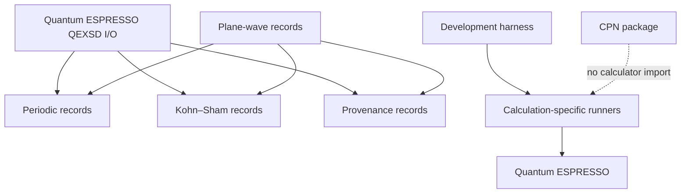

# Architecture v1 repository layout

## Implemented ownership

| Path | Authority or responsibility |
|---|---|
| `harness/archive/task-control-v1/chains/` | Non-operational retained v1 development-chain history |
| `harness/task-selection.json` | Canonical minimal current development selection |
| `.pi/checkpoints/` | Unresolved and resolved human-decision records |
| `.pi/agents/`, `.pi/skills/`, `.agents/skills/` | Durable roles and procedures; not activation authority |
| `.pi/evidence/` | Retained development evidence with declared claim boundaries |
| `harness/tasks/` | Canonical version-3 `HarnessTask` JSON records |
| `harness/state/` | Generated SQLite, SQL, and projection manifest |
| `harness/pi/` | Generic harness resources, schemas, fixtures, and profiles |
| `harness/local/` | Project-local harness composition and resource overlay |
| `calculations/` | Compact calculator inputs, manifests, checksums, provenance, and observations |
| `specification/` | Versioned mathematical, scientific, schema, and wire contracts |
| `python/src/ksdft2effmass/harness/` | Implemented generic and project-local development harness |
| `python/src/ksdft2effmass/workflows/cpn/` | Implemented backend-neutral CPN contract |
| `python/src/ksdft2effmass/io/` | Calculator-format parsing and mechanical translation |
| `python/src/ksdft2effmass/periodic/` | Backend-neutral periodic geometry |
| `python/src/ksdft2effmass/ksdft/` | Representation-neutral Kohn–Sham records |
| `python/src/ksdft2effmass/provenance/` | Artifact, lineage, tool, request, result, and failure records |
| `docs/` | Maintained scientific, computational, user, API, development, and historical documentation |
| `formal/` | Theorem catalog and bounded proof sources |

## Dependency direction

Periodic and Kohn–Sham packages do not depend on calculator packages. The CPN package imports no calculator-specific implementation. Direct runners remain calculation-owned rather than part of a public calculator subpackage.

## Architecture-document organization

Package-owned architecture follows the implemented Python namespace below
`docs/architecture/v1/ksdft2effmass/`. Directory components mirror package and
subpackage components; package-wide diagrams and cross-cutting discussions live
on the nearest package `index.md`, while module-specific architecture belongs on
a page named for that module when separate treatment is needed.

Repository-level direct execution is documented under
`docs/architecture/v1/calculations/` because `calculations/` is not a Python
subpackage in v1. Repository-wide principles, dependency direction, and the
harness/workflow separation remain at the v1 root.

## Documentation and generated state

Maintained Harness architecture is consolidated under
`docs/architecture/v1/ksdft2effmass/harness/`. Generated control artifacts remain
under `harness/state/` and `harness/task-graph.json`; they do not target `docs/`.

## External data

Wavefunctions, densities, restart trees, and dense calculator data remain outside the repository. Git retains compact inputs, software and pseudopotential identities, checksums, manifests, locations, and result summaries.
