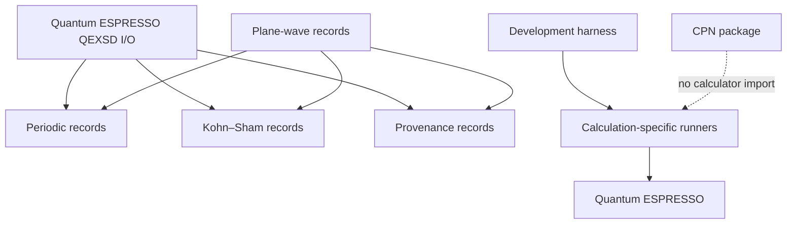

# Architecture v1 repository layout

## Implemented ownership

| Path | Authority or responsibility |
|---|---|
| `.pi/chains/` | Chain membership, active development selection, and retained activation history |
| `.pi/checkpoints/` | Unresolved and resolved human-decision records |
| `.pi/agents/`, `.pi/skills/`, `.agents/skills/` | Durable roles and procedures; not activation authority |
| `.pi/evidence/` | Retained development evidence with declared claim boundaries |
| `harness/tasks/` | Canonical version-3 `HarnessTask` JSON records |
| `harness/state/` | Generated SQLite, SQL, and projection manifest |
| `harness/pi/` | Generic harness resources, schemas, fixtures, and profiles |
| `harness/local/` | Project-local harness composition and resource overlay |
| `calculations/` | Compact calculator inputs, manifests, checksums, provenance, and observations |
| `specification/` | Versioned mathematical, scientific, schema, and wire contracts |
| `python/src/ksdft2effmass/harness/` | Implemented generic and project-local development harness |
| `python/src/ksdft2effmass/workflows/cpn/` | Implemented backend-neutral CPN contract |
| `python/src/ksdft2effmass/io/` | Calculator-format parsing and mechanical translation |
| `python/src/ksdft2effmass/periodic/` | Backend-neutral periodic geometry |
| `python/src/ksdft2effmass/ksdft/` | Representation-neutral Kohn–Sham records |
| `python/src/ksdft2effmass/provenance/` | Artifact, lineage, tool, request, result, and failure records |
| `docs/` | Maintained scientific, computational, user, API, development, and historical documentation |
| `formal/` | Theorem catalog and bounded proof sources |

## Dependency direction

Periodic and Kohn–Sham packages do not depend on calculator packages. The CPN package imports no calculator-specific implementation. Direct runners remain calculation-owned rather than part of a public calculator subpackage.

## Documentation and generated state

V1 historically mixes human-authored harness narrative with generated Task Markdown under `docs/harness/tasks/`. Those generated pages reflect Task JSON and chain state and are not authoritative prose. Other generated control artifacts remain under `harness/state/` and `harness/task-graph.json`.

## External data

Wavefunctions, densities, restart trees, and dense calculator data remain outside the repository. Git retains compact inputs, software and pseudopotential identities, checksums, manifests, locations, and result summaries.
