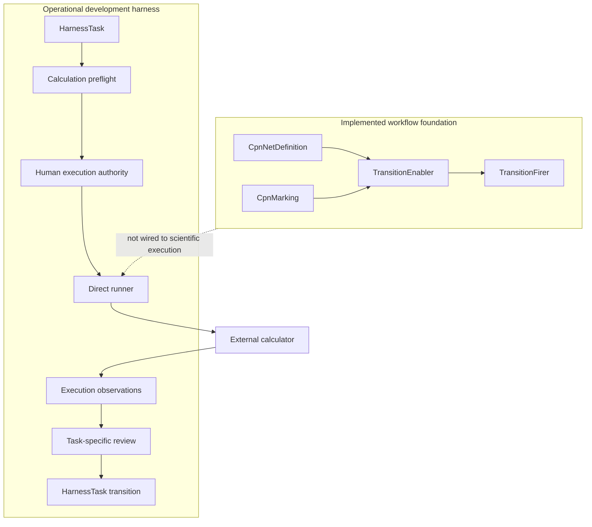
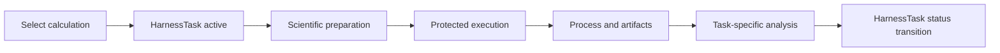

# Separation of harness and workflow in v1

## Implemented boundary

V1 has an operational development harness and an implemented CPN workflow foundation, but scientific calculations are coordinated by development Tasks and direct runners rather than persisted CPN runs.

## Lifecycle coupling

The same development lifecycle carries software scope, protected execution preparation, and scientific review language. V1 has no independent `CampaignRun` state between execution authority and calculator dispatch.

## Cross-component references

The CPN package can represent ordering, guards, token flow, outcomes, retries, and terminality. It contains no external executor, scientific payload, persistence repository, or concrete campaign. Consequently, V1 direct scientific records do not reference an authoritative CPN marking.

## Authority consequence

Development completion does not scientifically validate a result. Calculator success does not close a Task automatically. Human execution authority and human acceptance remain explicit even though their records are distributed across Task, chain, calculation, and documentation surfaces.
