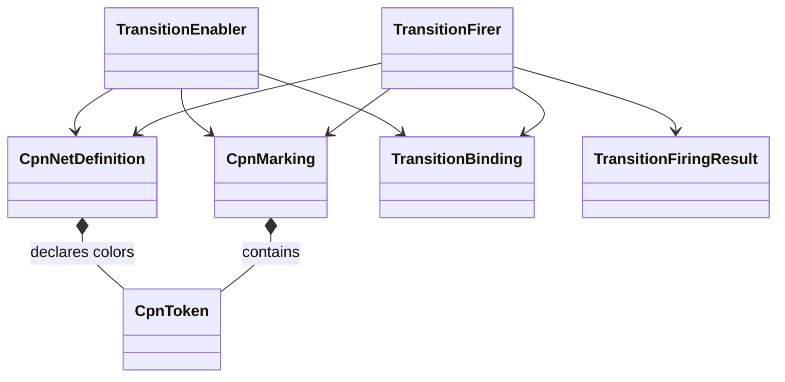

# Campaign and CPN model in v1

## Campaign status

V1 has no implemented public `Campaign` or `CampaignRun`. Scientific sequencing is encoded in direct runners, Task records, and calculation-specific procedures.

## Implemented CPN model

`CpnNetDefinition` represents places, transitions, arcs, colors, inscriptions, and closed guards. `CpnMarking` represents immutable multisets of typed tokens. `TransitionEnabler` determines enabled bindings deterministically. `TransitionFirer` applies one binding and returns an explicit firing result and new marking.

## Contract boundaries

- Guards and expressions operate on closed immutable represented values.
- Read and consume arcs have explicit semantics.
- Outcomes, retries, recovery states, status, scope, and terminality can be represented in tokens.
- Validation returns structured findings.
- No CPN object performs calculator I/O.
- No SNAKES runtime object is exported by the public package.

Schemas and fixtures are versioned under `specification/workflow-cpn/v1/`. Synthetic tests establish software-contract behavior only.

## Missing campaign layer

The package has no object that binds a CPN definition to scientific intent, simulation catalog, external authority, executor composition, persisted marking, artifact lineage, analysis, or disposition. Marking persistence is deferred.

Consequently, accepted calculator executions cannot be reconstructed as V1 CPN runs without inventing state that was not recorded at execution time.
