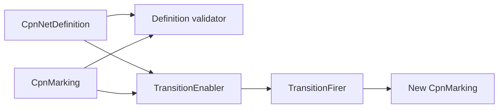

# Scientific workflow foundation in v1

## Implemented workflow model

V1 implements calculator-independent CPN definitions, markings, validation, enablement, and firing under `ksdft2effmass.workflows.cpn`. It does not implement a public scientific `ScientificWorkflow`, `ScientificWorkflowRun`, `Simulation`, executor, or scientific workflow persistence service.

## Implemented objects

| Family | Objects and responsibility |
|---|---|
| Definition | Colors, places, transitions, arcs, inscriptions, token patterns, and `CpnNetDefinition` |
| State | Immutable place multisets, `CpnMarking`, token bindings, and transition bindings |
| Tokens | `ContractValue`, `CpnToken`, outcome scope, status, and terminality |
| Expressions | Closed value expressions, guards, templates, assignments, and `CpnExpressionEvaluator` |
| Validation | Definition and marking validators with structured findings |
| Execution semantics | Deterministic `TransitionEnabler` and `TransitionFirer` |
| Errors | Contract, definition, marking, binding, guard, enablement, and firing errors |

Guards perform no external I/O. Enablement and firing implement multiset CPN semantics rather than a dependency DAG.

## Scientific execution practice

Accepted tutorial and convergence calculations used calculation-specific direct runners. They were not dispatched by CPN transitions and did not persist scientific markings. The CPN package is therefore an implemented workflow foundation, not the V1 scientific execution control plane.

## Detailed pages

- [Simulation model](simulation-model.md)
- [ScientificWorkflow and CPN model](scientific-workflow-and-cpn-model.md)
- [Artifact and provenance model](artifact-and-provenance-model.md)
- [Separation from the development harness](../separation-of-harness-and-workflow.md)
