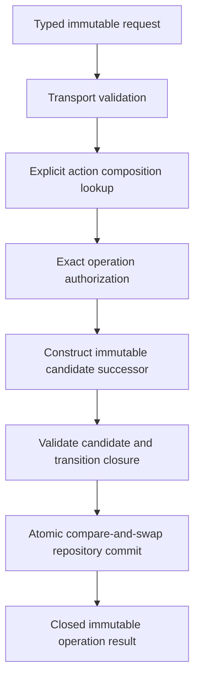

# Deterministic agent actions

## Request boundary

A governed agent submits an immutable typed request. It does not supply shell,
Python, JavaScript, arbitrary paths, or an executable payload. One request
identifies at least the requested operation, request-schema version, operation
and attempt identities, expected predecessor revision, idempotency identity,
and the operation-specific fields required by its domain owner.

The Pi-facing envelope is transport data. Domain-specific request and result
meaning belongs to the applicable package ActionObjects. No generic public
`ActionObject` base, mutable `ActionRegistry`, or policy-owning dispatcher is
selected.

## Operation path

The action composition is fixed and content-identified for one operator
session. Lookup is immutable application composition, not runtime registration
or ambient plugin discovery. The applicable domain ActionObject receives exact
inputs and an affirmative identity-bound authorization result, verifies those
bindings, leaves its inputs unchanged, and returns a closed ResultObject.

## Determinism

Determinism is defined over complete identified inputs and versions, including
where applicable:

- predecessor aggregate and revision identities;
- request and idempotency identities;
- action implementation, schema, and policy versions;
- compiler, normalization, validator, and serialization versions;
- explicit configuration and authority-context identities; and
- exact candidate content identities.

Equivalent identified inputs under the same contracts produce equivalent
candidate state and transition facts. Filesystem order, locale, timezone,
process identity, ambient current directory, mutable environment selection,
network observations, timestamps, and random values do not enter deterministic
outputs unless an owning contract represents them explicitly.

An external effect is not made pure by calling it an ActionObject. Effectful
operations retain explicit request, obligation, attempt, reconciliation, and
indeterminate-outcome semantics under their domain owner.

## Concurrency and persistence

An expected revision is a precondition, not a lock. Authoritative mutation uses
atomic compare-and-swap over one complete candidate successor with one
idempotency identity. Closed outcomes distinguish at least committed,
conflicting or rejected, indeterminate, and operational error according to the
owning repository contract. Ambiguous acknowledgment is never guessed.

State, transition facts, authorization bindings, and required provenance must
share commit closure or be bound by the repository's immutable commit receipt.
A post-effect best-effort audit append is insufficient because a crash could
commit state without its required record.

Pi executes sibling tools concurrently by default. A thin adapter must not
weaken domain concurrency. Pi's per-file mutation queue can prevent one class of
lost update in custom tools, but it is not aggregate transactionality and does
not replace the domain repository.

## Result boundary

A successful process exit is not an operation result. The adapter accepts only
a schema-valid closed result carrying the exact request, operation, attempt,
action-composition, authorization, predecessor, candidate or committed revision,
and provenance identities required by the operation. Rejection, authorization
denial, validation failure, conflict, indeterminate outcome, and execution error
remain distinct.

Output exposed to the model is bounded and sanitized. Full retained diagnostics,
when authorized, remain at an identified artifact location and exclude
credentials, unrestricted environment content, and private payloads.

## CPN relationship

For scientific Workflows, the agent may propose an identified transition and
binding, but generic enablement, deterministic selection, and pure firing remain
owned by `ksdft2effmass.petrinet.colored`. Workflow control constructs records,
handles effects, and commits the complete `WorkflowRun` successor. This analogy
does not introduce a colored-Petri-net lifecycle into the development harness.
