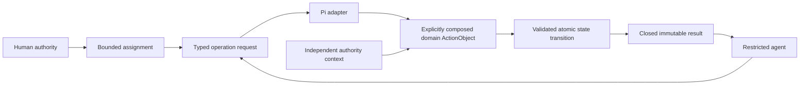

# Architecture v2 agent system

The agent system is a repository-wide development architecture. It governs how
human and model judgment request deterministic project operations without making
Pi runtime state, prompts, or agent output authoritative. Package-owned code
contracts remain under [`ksdft2effmass`](../ksdft2effmass/index.md); the selected
Pi adapter package is
[`ksdft2effmass.pi.agents`](../ksdft2effmass/pi/agents/index.md).

Architecture v1 remains implemented. This V2 agent architecture is prospective
and unimplemented. It authorizes no source creation, launcher, dependency,
operator activation, automatic promotion, scientific execution, or release.

## Governing rule

> Every authoritative mutation has exactly one deterministic executable owner.
> An agent may request that owner's operation but may not reproduce the mutation
> through a lower-level capability.

The execution model is

The model may choose which admissible request to propose. Request selection is
not deterministic merely because the selected operation is deterministic. The
trusted path owns schema validation, exact authorization, candidate-successor
construction, validation, commit closure, and structured observation.

## Roles

| Role | Responsibility | Capability boundary |
|---|---|---|
| Harness developer | Authors candidate deterministic code and tests in an isolated workspace | Bounded general development tools under an exact assignment and authority |
| Harness operator | Requests accepted deterministic operations | Read-only inspection plus a closed operator action set; no general shell or file mutation |
| Reviewer | Inspects exact candidate identities and diffs | Read-only over the reviewed scope |
| Promotion authority | Accepts or rejects a candidate composition at a human-owned boundary | Independent of candidate authorship and operator execution |

A role descriptor, prompt, skill, run, passing test, or review does not grant
authority. The developer may not activate its candidate. The operator may not
modify the mechanism that constrains it.

## Architecture map

- [Deterministic actions](deterministic-actions.md) defines the request,
  authorization, transition, result, concurrency, and provenance path.
- [Capability and isolation](capability-and-isolation.md) defines Pi-tool and
  operating-system boundaries.
- [Self-improvement](self-improvement.md) defines agent-authored candidate code,
  verification, promotion, rollback, and restart.
- [`ksdft2effmass.pi.agents`](../ksdft2effmass/pi/agents/index.md) owns the
  prospective deterministic Pi adapter code contract.
- [Development control](../ksdft2effmass/harness/control-plane.md) owns
  development authority and exact operation authorization.
- [Development persistence](../ksdft2effmass/harness/persistence.md) owns
  domain commit closure over the shared atomic revision store.
- [Pi subagent boundary](../ksdft2effmass/harness/subagents.md) keeps Pi runtime
  lifecycle and artifacts separate from Harness authority.

## Non-goals

The agent architecture introduces no autonomous authority, mutable global action
registry, generic scientific policy, development CPN, runtime self-promotion, or
claim that generated code is correct because an agent wrote or tested it. Human
scientific decisions, protected execution, publication, and release remain
under their existing owners.
