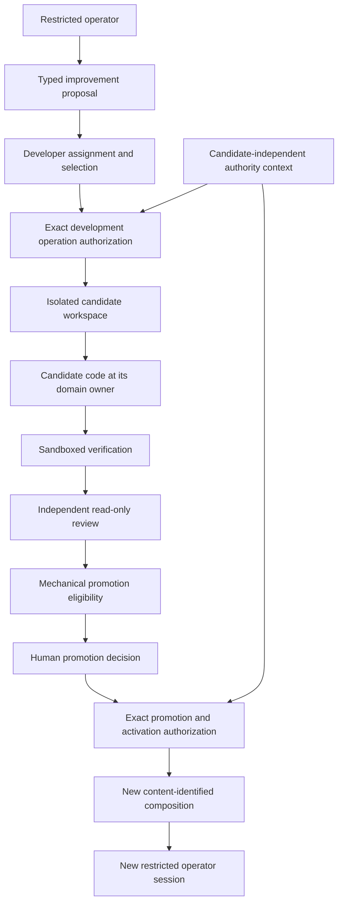

# Agent-authored harness evolution

## Principle

The framework may be self-observing, self-proposing, and self-authoring in an
isolated candidate workspace. It is not self-authorizing, self-registering,
self-promoting, or self-reloading.

> Agent-authored code is provisional candidate source. It becomes available to
> an operator only through a separately authorized future composition.

## Evolution flow

The running operator may report a missing action, unsafe ambiguity, repeated
manual step, or potential deterministic replacement. Its proposal identifies
the observed context and desired contract but grants no development authority.
A separate Harness developer receives an exact assignment, permitted paths,
base revision, validation requirements, and stop conditions. Assignment and
selection grant no authority: candidate-independent authority resolution and an
exact affirmative development-operation authorization are separately required
before the candidate operation begins.

## Code ownership

Generated deterministic code goes to the package that owns the operation:

| Operation | Prospective owner |
|---|---|
| Development control or repository operation | `ksdft2effmass.harness` or another explicitly selected development owner |
| Generic CPN operation | `ksdft2effmass.petrinet.colored` |
| Scientific Workflow operation | `ksdft2effmass.workflows` |
| Calculator integration | Applicable `ksdft2effmass.integration.*` package |
| Pi request/result adaptation | `ksdft2effmass.pi.agents` |

`ksdft2effmass.pi.agents` is not a dumping ground for generated operations. It
exposes accepted explicitly composed actions without taking their domain meaning.

A restricted declarative action or transition definition is preferred when it
can express the required behavior. Arbitrary generated Python or TypeScript is
not deterministic merely because it implements an interface or passes tests and
therefore receives the full applicable source-review and execution-isolation
controls.

## Candidate composition

One candidate composition identifies:

- every exposed action and schema version;
- implementation and dependency identities;
- exact domain owners and adapter mapping;
- operator profile and capability identities;
- required validators and their versions;
- compatibility and migration findings;
- review and promotion-eligibility results; and
- predecessor composition and rollback target.

The composition is immutable. A mutable runtime registry is prohibited. Dynamic
Pi tool registration and hot reload may exist as Pi capabilities, but they are
not used to promote generated actions into a governed session.

## Promotion and rollback

Mechanical eligibility can establish only the declared structural, software,
compatibility, and isolation checks. It grants no promotion authority. A human
promotion decision names the exact candidate composition and permitted target,
but the decision record also grants no operation authority. The promotion and
activation operation separately requires candidate-independent authority
resolution and an exact affirmative authorization bound to that decision,
candidate, predecessor, target, and operation. Only that authorized operation
may start a new operator process or session from the identified composition; the
authoring process cannot activate itself.

Rollback selects a previously accepted complete composition rather than editing
the current composition in place. Rollback authority, compatibility of state
produced by the newer composition, retained audit identities, and any migration
or quarantine requirements must be established before promotion.

## Prohibitions

A governed operator cannot:

- write its adapter, profile, policy, authority source, or active composition;
- register or activate an action it authored;
- weaken tests, validation, review, isolation, or promotion requirements;
- treat reviewer agreement or passing checks as human acceptance;
- promote a candidate through an indirect shell, patch, package, or reload path;
- overwrite or disguise failed or rejected candidates; or
- infer permission from elapsed time, silence, or successful execution.

## Evidence boundary

Retain exact candidate, verification, review, decision, promotion, rollback, and
runtime-composition identities. Generated-code quality, security, determinism,
and scientific validity remain separate claims requiring their own applicable
evidence. No self-improvement claim is made until the identified process is
implemented and tested under a declared threat model.
