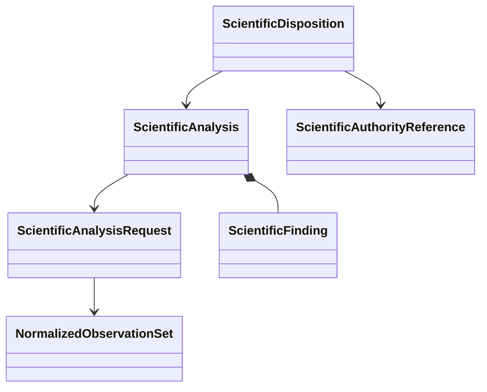

# Analysis and disposition object model

## Objects

| Object | Responsibility |
|---|---|
| `ScientificAnalysisRequest` | Intended analysis, normalized input identities, analyzer identity, and explicit policy |
| `NormalizedObservationSet` | Calculator-independent observations with units, conventions, provenance, and availability |
| `ScientificFinding` | Structured derived value, status, uncertainty or limitation, and evidence references |
| `ScientificAnalysis` | Immutable analyzer result with inputs, algorithm, versions, units, tolerances, and findings |
| `ScientificDisposition` | Separately authorized conclusion for a declared intended use citing analyses |

## Analyzer protocol

Multiple analyzers are composed through a demonstrated structural protocol:

```python
class ScientificAnalyzer(Protocol):
    @property
    def analysis_identity(self) -> ScientificAnalyzerIdentity: ...

    def execute(
        self,
        request: ScientificAnalysisRequest,
    ) -> ScientificAnalysis: ...
```

The protocol supplies no discovery, mutable registry, default tolerance, automatic acceptance, or external execution.

## Authority separation



An analyzer deterministically interprets explicit observations under explicit policy. It cannot produce `ScientificDisposition`. Disposition records an accepted, rejected, inconclusive, or selected conclusion for a declared intended use and cites the responsible authority.

Software verification of an analyzer does not establish scientific validation. Numerical verification, scientific validation, and uncertainty quantification remain explicitly classified in findings and evidence.

## Unresolved issues

- Closed disposition vocabulary and whether parameter selection is a disposition subtype or separate record.
- Representation of tolerance, convergence, and uncertainty policies.
- Analyzer version identity and reproducibility requirements.
- Composition of multiple analyses with conflicting findings.
- Rules for superseding or withdrawing a disposition without rewriting history.
