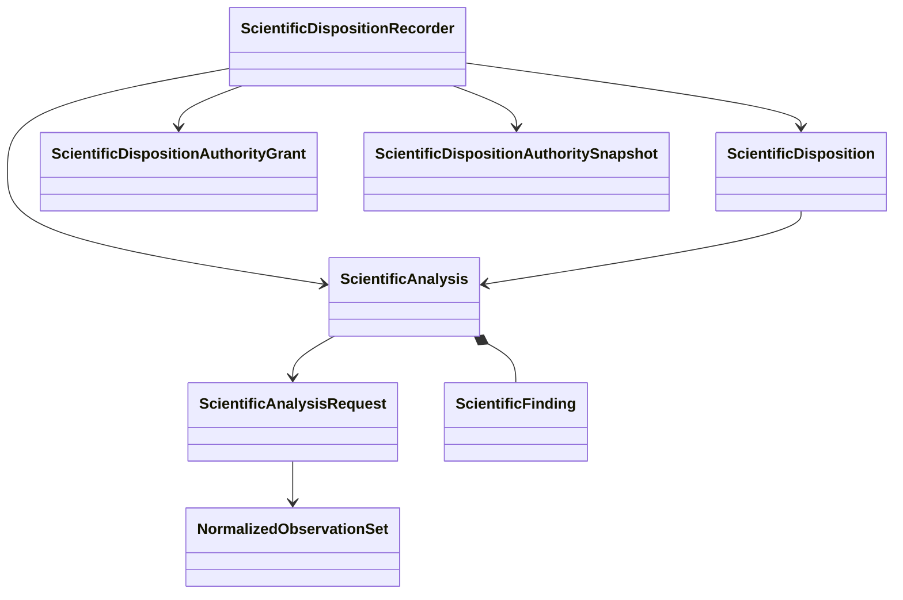

# Analysis and disposition object model

## Objects

| Object | Responsibility |
|---|---|
| `ScientificAnalysisRequest` | Intended analysis, normalized input identities, analyzer identity, and explicit policy |
| `NormalizedObservationSet` | Calculator-independent observations with units, conventions, provenance, and availability |
| `ScientificFinding` | Structured derived value, status, uncertainty or limitation, and evidence references |
| `ScientificAnalysis` | Immutable analyzer result with inputs, algorithm, versions, units, tolerances, and findings |
| `ScientificDisposition` | Immutable disposition/revision, intended-use scope, closed conclusion, exact cited analysis revisions, limitations/evidence, disposition-authority grant/snapshot, and predecessor/supersession identities where applicable |
| `ScientificDispositionRecordingTransaction` | Expected run revision plus already validated disposition/reference append |
| `ScientificDispositionRecordingResult` | Closed `committed`, `rejected`, `persistence_conflict`, or `error` recording outcome |

## Analyzer protocol

Multiple analyzers are composed through a demonstrated structural protocol:

```python
class ScientificAnalyzer(Protocol):
    @property
    def analysis_identity(self) -> ScientificAnalyzerIdentity: ...

    def execute(
        self,
        request: ScientificAnalysisRequest,
    ) -> ScientificAnalysis: ...
```

The protocol supplies no discovery, mutable registry, default tolerance, automatic acceptance, or external execution.

## Authority separation



An analyzer deterministically interprets explicit observations under explicit policy. It cannot produce `ScientificDisposition`. `ScientificDispositionRecorder` receives exact analysis revisions, intended-use scope, proposed closed conclusion, limitations/evidence, exact disposition-authority grant and trusted snapshot, predecessor/supersession information where applicable, and expected `WorkflowRun` revision. It validates every input and predecessor rule, constructs the immutable disposition and an already validated recording transaction, and submits that supplied transaction to `WorkflowRunRepository`. The repository atomically commits the supplied record/reference and never infers or constructs a conclusion. The closed recording result distinguishes `committed`, `rejected`, `persistence_conflict`, and `error`.

Supersession or withdrawal appends a separately authorized disposition record; it never rewrites history. Analyzer output, process success, terminal marking, read model, or repository behavior cannot imply acceptance. Execution-authority and disposition-authority grants are distinct and authorize neither each other nor scientific acceptance.

Software verification of an analyzer does not establish numerical verification or scientific validation. Numerical verification, scientific validation, and uncertainty quantification remain explicitly classified in findings and evidence.

## Unresolved issues

- Exact members of the closed disposition vocabulary and whether parameter selection is a disposition subtype or separate closed conclusion.
- Representation of tolerance, convergence, and uncertainty policies.
- Analyzer version identity and reproducibility requirements.
- Composition of multiple analyses with conflicting findings.
- Exact public wire formats for disposition grants, snapshots, recording transactions, and append-only supersession/withdrawal records.
