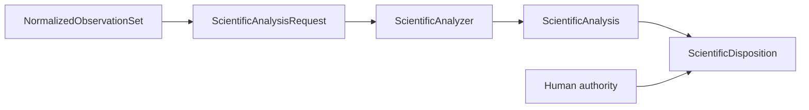

# Scientific analysis architecture

## Responsibility

`ksdft2effmass.analysis` owns deterministic interpretation of normalized observations. It owns algorithms, units, tolerances, numerical policy, findings, and analysis versions. It does not execute calculators or authorize scientific conclusions.

## Pages

- [Analysis and disposition](analysis-and-disposition.md)

## Unresolved issues

- Analysis package subdivision by scientific domain.
- Shared numerical-policy representation across analyzers.
- Whether analyzers operate on immutable in-memory records, artifact references, or both.
- Public registration and composition mechanism; mutable registries remain forbidden.
