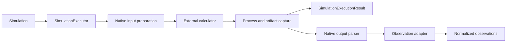

# Calculator architecture

## Responsibility

`ksdft2effmass.calculators` owns calculator-specific simulation payloads, executable configuration, staging, dispatch, process observation, completion contracts, and result capture. It implements workflow-owned `SimulationExecutor` without making `ksdft2effmass.workflow.scientific` depend on a calculator package.

Execution, parsing, semantic adaptation, and scientific analysis have separate owners.

## Shared calculator contracts

| Object | Responsibility |
|---|---|
| `CalculatorFamilyIdentity` | Stable calculator family identity |
| `ExecutableIdentity` | Exact executable, version, and content identity |
| `ExecutionEnvironment` | Sanitized explicit process environment and resource limits |
| `ProcessRequest` | Command, staged inputs, attempt, authority, and output expectations |
| `ProcessObservation` | Exit status, timing, resource use, completion markers, and stream artifacts |
| `CalculatorFailureRecord` | Phase-specific configuration, dispatch, process, completion, or capture failure |

These records do not form a universal electronic-structure calculator base. Each calculator owns its demonstrated payload and mechanical contracts.

## Pages

- [Quantum ESPRESSO](quantum-espresso.md)

## Unresolved issues

- Common process-launch boundary versus calculator-owned launch actions.
- Whether `ExecutionEnvironment` belongs in calculators or an outer application infrastructure package.
- Remote and scheduler adapter contracts.
- Standard resource-observation vocabulary across calculators.
