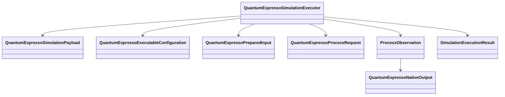
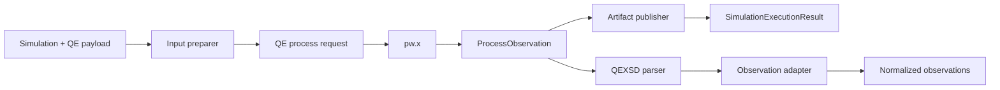

# Quantum ESPRESSO calculator architecture

## Object model

## DataObjects

| Object | Responsibility |
|---|---|
| `QuantumEspressoSimulationPayload` | Typed QE operation kind, model features, native input identity, pseudopotentials, and numerical settings |
| `QuantumEspressoExecutableConfiguration` | Exact program, executable identity, supported version, invocation, and resource policy |
| `QuantumEspressoPreparedInput` | Canonical staged input bytes and referenced artifact identities |
| `QuantumEspressoProcessRequest` | Explicit command, attempt, authority, working root, and expected outputs |
| `QuantumEspressoNativeOutput` | Mechanically parsed native output and QEXSD identities |

The payload is calculator-specific but contains no scientific workflow ordering or scientific disposition.

## ActionObjects

| ActionObject | Operation |
|---|---|
| `QuantumEspressoInputPreparer` | Typed payload and artifacts → canonical staged QE input |
| `QuantumEspressoSimulationExecutor` | `Simulation` with QE payload → `SimulationExecutionResult` |
| `QuantumEspressoOutputParser` | Native stdout or structured output → mechanical native record |
| `ParseQexsdDocument` | QEXSD bytes → mechanically faithful QEXSD record |
| `QuantumEspressoObservationAdapter` | Native records → normalized periodic and Kohn–Sham observations |
| `QuantumEspressoArtifactPublisher` | Complete verified native bytes → artifact identities and manifest entries |

`QuantumEspressoSimulationExecutor` validates calculator family, payload version, input and executable identities, pseudopotential closure, attempt uniqueness, authority, and resource ceiling before dispatch. It records mechanical process observations and artifacts but performs no scientific analysis.

## Execution path

## Failure taxonomy

- `QuantumEspressoConfigurationFailure`;
- `QuantumEspressoInputIdentityFailure`;
- `QuantumEspressoUnsupportedFeatureFailure`;
- `QuantumEspressoDispatchFailure`;
- `QuantumEspressoProcessFailure`;
- `QuantumEspressoCompletionContractFailure`;
- `QuantumEspressoArtifactPublicationFailure`;
- `QuantumEspressoNativeParsingFailure`; and
- `QuantumEspressoObservationNormalizationFailure`.

Every failure references the exact attempt and phase. Retry creates a new attempt.

## Package dependencies

`ksdft2effmass.calculators.quantum_espresso` may depend on workflow contracts and `ksdft2effmass.io.quantum_espresso`. Mechanical I/O may construct neutral periodic and Kohn–Sham observations through explicit adapters. Workflow, periodic, Kohn–Sham, and analysis packages do not import the QE calculator package.

## Unresolved issues

- Structured renderer scope versus retention of exact canonical native input.
- Exact supported `pw.x` operation kinds and feature vocabulary.
- Supported QE and QEXSD version policy.
- MPI launcher, scheduler, and remote-execution composition.
- Completion-marker policy across QE programs and versions.
- `.save` parsing boundary and wavefunction-artifact representation.
- Whether artifact publication is executor-owned or an injected service.
