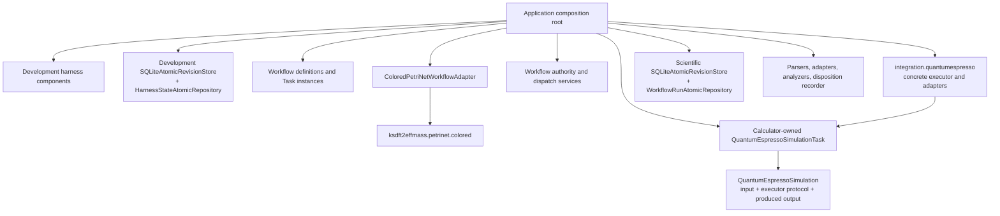

# Architecture v2 application composition root

## Responsibility

`ksdft2effmass.application` assembles explicit immutable definitions, Tasks, Workflow adapters, authority services, calculator executors, parsers, analyzers, artifact services, and repositories. It owns configuration and selection, not their domain behavior.

The root validates configuration and constructs immutable catalogs and explicit ordered implementations. It does not perform ambient plugin discovery, calculate generic enablement itself, inspect scientific results, or create authority.

## Scientific composition

For one execution, the root supplies:

- a Workflow definition with run-scoped Task instances and immutable `TaskStartGateSet` policy;
- `ColoredPetriNetWorkflowAdapter` and generic full-name colored-Petri-net ActionObjects;
- workflow authority, `SimulationDispatchAdapter`, dispatch preparation/reconciliation, `TaskResultIngester`, publication, and disposition services;
- an explicitly configured scientific `SQLiteAtomicRevisionStore` and a `WorkflowRunAtomicRepository` composed with that store, `WorkflowRunSerializer`, and `WorkflowRunTransactionValidator`;
- the calculator-owned `QuantumEspressoSimulationTask`, `QuantumEspressoSimulation`, immutable input/output records, and structural `QuantumEspressoExecutor` consumer protocol where QE is selected;
- the concrete `integration.quantumespresso` executor implementation, exact executable configuration, resource policy, staging/workspace policy, and artifact destinations;
- integration-owned native serializers/parsers and `QuantumEspressoObservationAdapter` with explicit normalization policy; analysis-owned analyzers; and
- immutable artifact and provenance services.

Application composition injects the concrete `integration.quantumespresso` executor into the calculator-owned `QuantumEspressoSimulationTask`; calculators and workflows never import the integration package. Workflow control checks the exact unused grant, TaskActivation, context, and dispatch inputs before constructing the complete successor/grant-reservation/obligation unit. The repository atomically commits only that supplied unit. Immediately before the external effect, the target-first executor checks the same exact reserved grant and inputs. Confirmed `SimulationDispatchOutcome` envelopes the concrete returned ResultObject; `TaskResultIngester` admits it into result state and publication obligations atomically before downstream normalization.

The generic colored-Petri-net package returns only generic enablement, selection, and pure firing values. The Workflow adapter supplies immutable external-output-value bindings through `ColoredPetriNetFiringInput`; adapter and control services create discriminated TaskActivation and replayable WorkflowRun records. Dependency direction remains `workflows → petrinet.colored`; reverse import is forbidden.

## Exact inputs

The root supplies existing exact QE input bytes and pseudopotential artifacts directly under their actual identities and provenance. It does not require rendering, conversion, registration, rerun, or evidence reclassification. It does not infer equivalence from matching labels or settings.

## Harness composition

Development components remain separate: authority-independent compiler, validators, conformance workflow, state repository, protected authority ledger, authority-context resolver, operation authorizer, projectors, candidate validator, synchronizer, immutable-generation reader, and comparator are explicitly composed without gaining scientific Workflow authority. The root supplies exact validation and authorization outcomes to each target operation; target operations verify identity bindings and their own preconditions without rerunning validation or reinterpreting authority policy. The root constructs an explicitly configured development `SQLiteAtomicRevisionStore` and a `HarnessStateAtomicRepository` with the exact harness serializer and transaction validator.

Development and scientific persistence use separate store instances and separate SQLite databases by default. The common implementation supplies no shared physical database, cross-stream transaction, or domain authority. Co-location requires a later explicit decision.

## Unresolved issues

- Concrete configuration and dependency-injection mechanism.
- Process-isolation and scheduler adapters.
- Exact public factory and wire contracts.

This prospective composition claims no implementation, verification, protected execution, equivalence, or human software acceptance.
