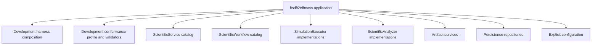

# Application composition root

## Responsibility

`ksdft2effmass.application` is the target composition root. It assembles concrete components for one process or service without owning domain rules.

The composition root validates configuration and constructs immutable catalogs and ordered protocol implementations. For development conformance, it binds an identified `DevelopmentConformanceProfile` to explicit validators and tool adapters; it does not subclass an architecture or inherit authority. It performs no ambient plugin discovery, scientific analysis, CPN semantics, calculator-specific parsing, or persistence policy beyond selecting concrete implementations.

Development and scientific compositions remain separate operation contexts even when created by the same application package.

## Unresolved issues

- Final subpackage name: `application`, `services`, or another explicit root.
- CLI, library, and long-running service entry-point boundaries.
- Configuration wire format and secret-injection mechanism.
- Whether development-harness composition belongs in the same root as scientific workflow composition.
- Dependency-injection mechanism; a framework dependency is not assumed.
