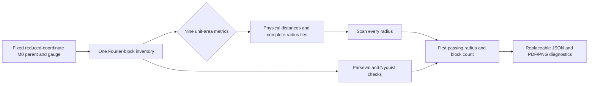

# Schematics

```mermaid
flowchart LR
    A[Fixed reduced-coordinate M0 parent and gauge] --> B[One Fourier-block inventory]
    B --> C{Nine unit-area metrics}
    C --> D[Physical distances and complete-radius ties]
    D --> E[Scan every radius]
    E --> F[First passing radius and block count]
    B --> G[Parseval and Nyquist checks]
    G --> F
    F --> H[Replaceable JSON and PDF/PNG diagnostics]
```

M1 and M2 branch before the Fourier inventory and therefore require separate model
qualification and evidence identities; they are not post-processing corrections to M0.
