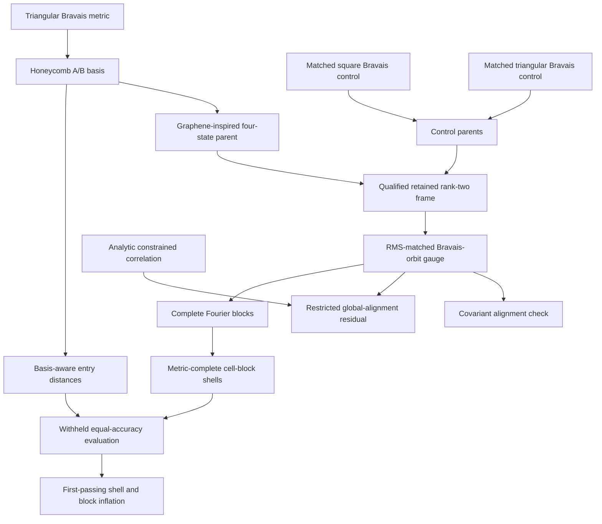

# Schematics

```mermaid
flowchart TD
    TB[Triangular Bravais metric] --> HB[Honeycomb A/B basis]
    HB --> GP[Graphene-inspired four-state parent]
    SQ[Matched square Bravais control] --> CP[Control parents]
    TR[Matched triangular Bravais control] --> CP
    GP --> R2[Qualified retained rank-two frame]
    CP --> R2
    R2 --> GA[RMS-matched Bravais-orbit gauge]
    GA --> CA[Covariant alignment check]
    GA --> GR[Restricted global-alignment residual]
    GA --> FB[Complete Fourier blocks]
    AC[Analytic constrained correlation] --> GR
    FB --> MS[Metric-complete cell-block shells]
    HB --> BD[Basis-aware entry distances]
    MS --> WE[Withheld equal-accuracy evaluation]
    BD --> WE
    WE --> BI[First-passing shell and block inflation]
```

The graphene-inspired parent is synthetic and not a carbon material model. The matched
square comparator is internal to this family; it imports no orthogonal-family evidence.
