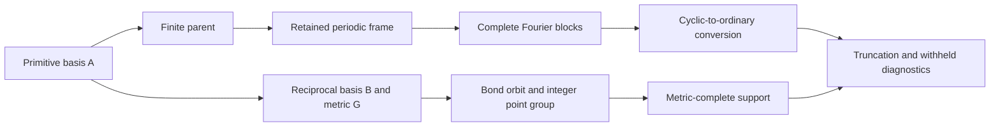

# Schematics

```mermaid
flowchart LR
    A[Primitive basis A] --> BG[Reciprocal basis B and metric G]
    BG --> OP[Bond orbit and integer point group]
    A --> FP[Finite parent]
    FP --> RF[Retained periodic frame]
    RF --> FB[Complete Fourier blocks]
    OP --> MS[Metric-complete support]
    FB --> CC[Cyclic-to-ordinary conversion]
    CC --> TD[Truncation and withheld diagnostics]
    MS --> TD
```

Orthogonal experiment evidence does not flow into this subtree. A matched orthogonal
comparator, when present, is owned by the non-orthogonal experiment that defines it.
