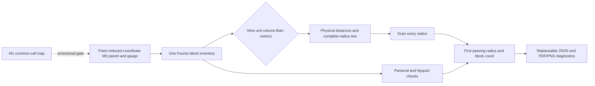

# Schematics

```mermaid
flowchart LR
    A[Fixed reduced-coordinate M0 parent and gauge] --> B[One Fourier-block inventory]
    B --> C{Nine unit-volume Bain metrics}
    C --> D[Physical distances and complete-radius ties]
    D --> E[Scan every radius]
    E --> F[First passing radius and block count]
    B --> G[Parseval and Nyquist checks]
    G --> F
    F --> H[Replaceable JSON and PDF/PNG diagnostics]
    I[M1 common-cell map] -. unresolved gate .-> A
```

M2 would branch before the Fourier inventory and requires a separate model and evidence
identity; it is not a post-processing correction to M0.
