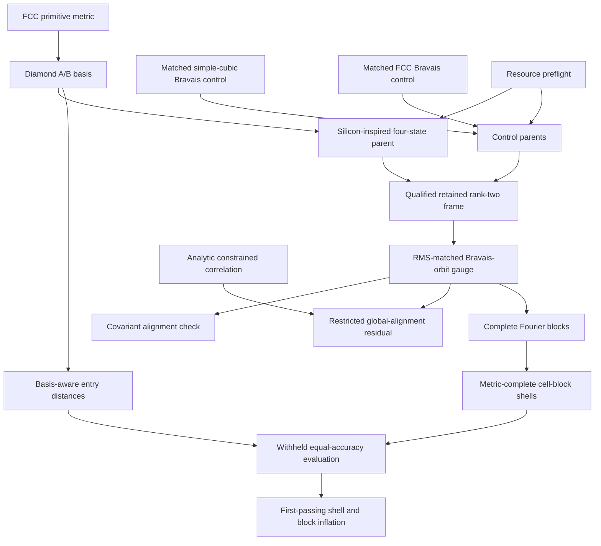

# Schematics

```mermaid
flowchart TD
    FB[FCC primitive metric] --> DB[Diamond A/B basis]
    DB --> SP[Silicon-inspired four-state parent]
    SC[Matched simple-cubic Bravais control] --> CP[Control parents]
    FC[Matched FCC Bravais control] --> CP
    RP[Resource preflight] --> SP
    RP --> CP
    SP --> R2[Qualified retained rank-two frame]
    CP --> R2
    R2 --> GA[RMS-matched Bravais-orbit gauge]
    GA --> CA[Covariant alignment check]
    GA --> GR[Restricted global-alignment residual]
    GA --> HB[Complete Fourier blocks]
    AC[Analytic constrained correlation] --> GR
    HB --> MS[Metric-complete cell-block shells]
    DB --> BD[Basis-aware entry distances]
    MS --> WE[Withheld equal-accuracy evaluation]
    BD --> WE
    WE --> BI[First-passing shell and block inflation]
```

The silicon-inspired parent is synthetic and not the project's material silicon model.
The matched simple-cubic comparator is internal and imports no orthogonal-family
evidence.
