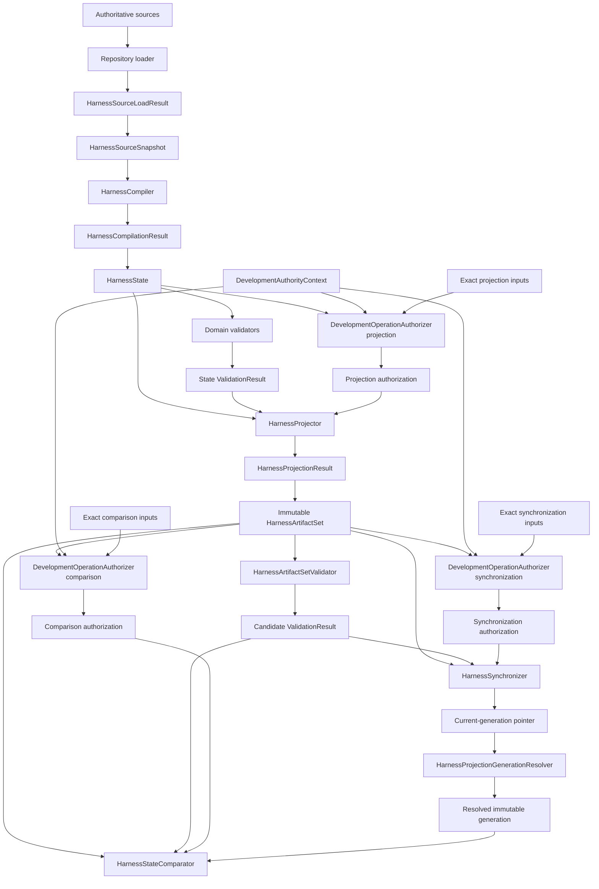
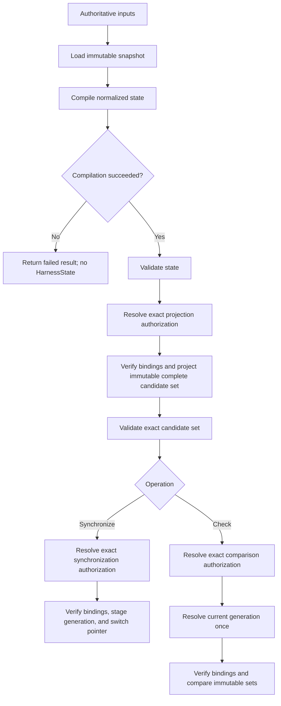
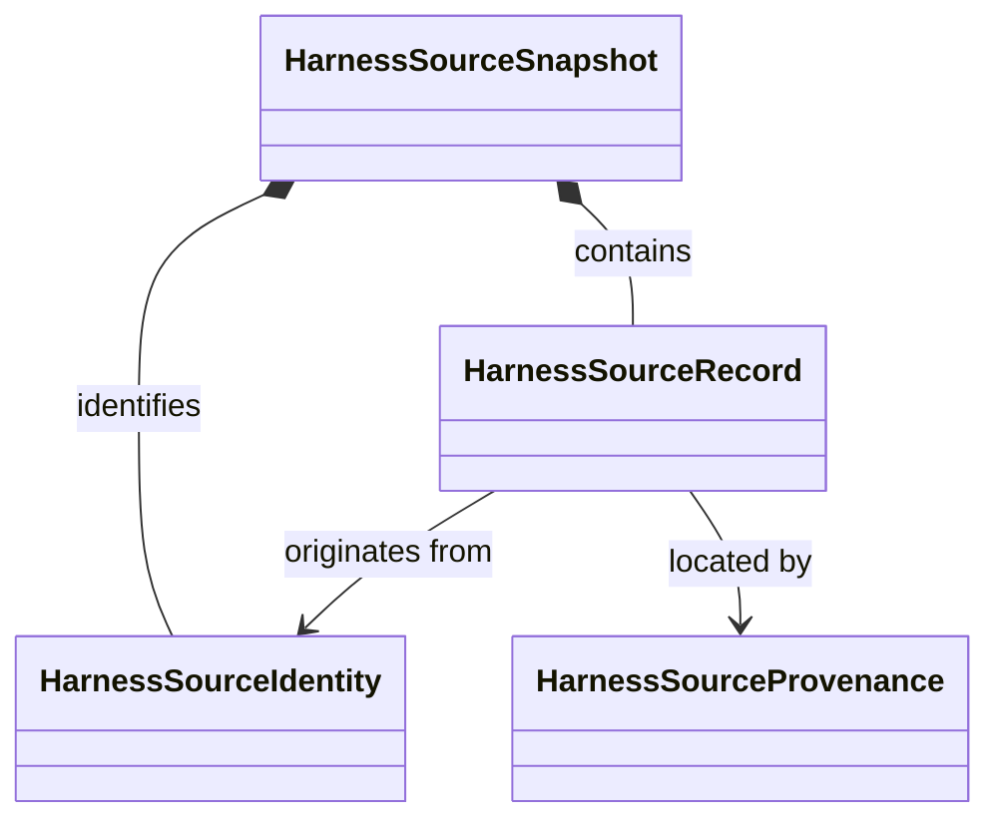
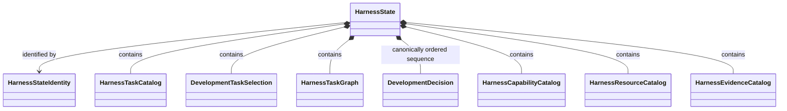
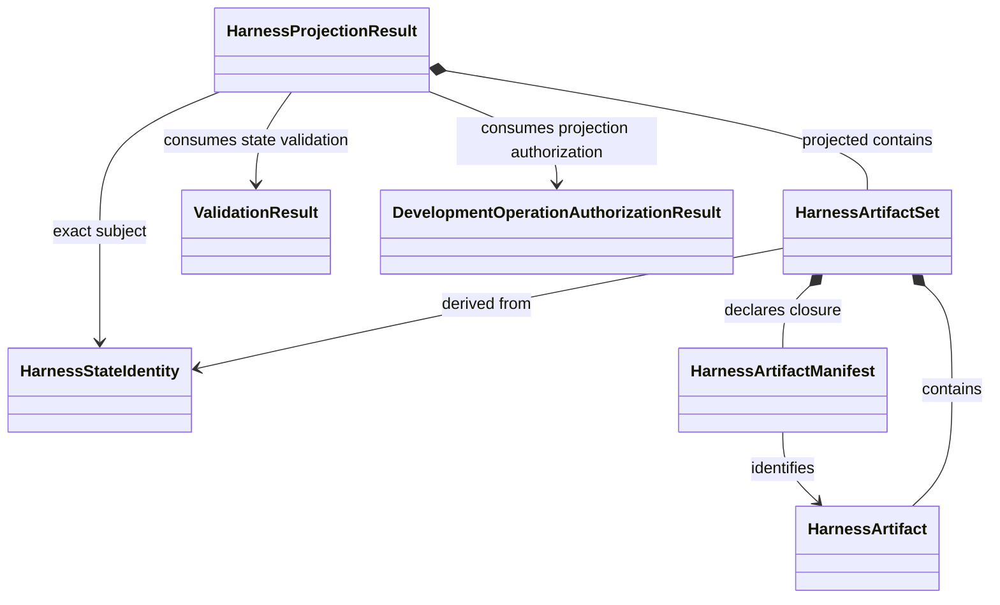
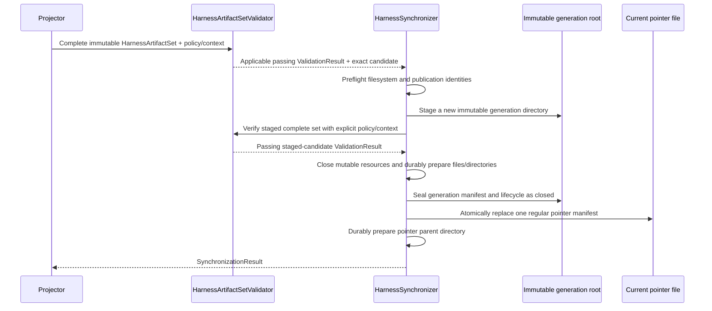

# Compiler architecture

## Purpose

The development-harness compiler converts authoritative repository sources into one normalized model of development state. Validators inspect that model, and projectors derive read-only artifacts from it.

Here, **compiler** means a deterministic source-to-model transformation. It does not mean a Python compiler, a scientific workflow engine, or a calculator input generator.

The compiler architecture has three goals:

1. interpret each authoritative source exactly once;
2. give validation, synchronization, and checking the same normalized state; and
3. prevent generated artifacts from becoming a second source of authority.

## Components



| Component         | Input                                  | Output                  | Responsibility                                                            |
| ----------------- | -------------------------------------- | ----------------------- | ------------------------------------------------------------------------- |
| Repository loader | Explicit root and source contract | `HarnessSourceLoadResult` | Returns one closed snapshot or an identified load failure with no snapshot. |
| Harness compiler  | `HarnessSourceSnapshot` | `HarnessCompilationResult` | Constructs one complete unique normalized state or fails with no state when normalization is unrepresentable. |
| Domain validators | `HarnessState` | `ValidationResult` | Evaluate representable domain rules without changing state. |
| Development-operation authorizer | Exact state and operation identities plus `DevelopmentAuthorityContext` | `DevelopmentOperationAuthorizationResult` | Resolves exact operation authorization without changing state or performing the target operation. |
| Harness projector | State, its applicable passing `ValidationResult`, exact affirmative projection authorization, and explicit projection inputs | `HarnessProjectionResult` | Produces one complete candidate set or a represented blocked outcome without projection. |
| Artifact-set validator | Complete `HarnessArtifactSet` plus explicit `HarnessArtifactValidationPolicy` and `HarnessArtifactValidationContext` | `ValidationResult` | Owns post-projection invariants and binds its result to the exact candidate, policy, context, and validator identities. |
| Synchronizer | Complete candidate, its applicable passing candidate `ValidationResult`, exact affirmative synchronization authorization, and publication policy/context | `SynchronizationResult` | Verifies exact bindings and preconditions, then stages and validates a new immutable generation and atomically replaces the regular current-generation pointer on a supported filesystem; it neither silently validates, authorizes, nor repairs. |
| Generation resolver | Explicit projection target and resolver policy/context | `HarnessProjectionGenerationResolutionResult` | Reads the pointer once, validates pointer and generation closure, and returns one immutable generation or a fail-closed represented outcome. |
| Comparator | Complete candidate, its applicable passing candidate `ValidationResult`, one resolved immutable maintained generation, and exact affirmative comparison authorization | `ComparisonResult` | Verifies exact bindings and preconditions, then reports drift without validation, authorization, writing, or repair; blocked or invalid input yields a represented outcome without comparison. |

## One semantic path

Synchronization and checking share the same loading, compilation, validation, and projection stages:



There is no synchronization-only parser and no check-only interpretation of source authority. If both operations observe the same input identities and versions, they must construct equivalent normalized state and candidate artifacts.

## Object model

The compiler architecture separates immutable state from reusable operations. It does not require a common base class. Three immutable aggregates define the principal boundaries:

```text
HarnessSourceSnapshot
    ↓ HarnessCompiler
HarnessState
    ↓ domain validators
ValidationResult
    ↓ HarnessProjector
HarnessArtifactSet
    ↓ HarnessArtifactSetValidator
candidate ValidationResult
```

Sources are observed in `HarnessSourceSnapshot`, domain meaning is normalized in `HarnessState`, and derived files are packaged in `HarnessArtifactSet`.

### Source model

`HarnessSourceSnapshot` is the complete immutable compiler input.

| Object | Role |
|---|---|
| `HarnessSourceIdentity` | Identifies one source by repository-relative path, source kind, format version, and content identity. |
| `HarnessSourceRecord` | Contains the parsed value from one authoritative source. |
| `HarnessSourceProvenance` | Maps a parsed value or field to its source identity and location. |
| `HarnessSourceSnapshot` | Contains the closed collection of identities, records, and provenance observed together. |



A snapshot is closed: compilation cannot request an additional source after the loader returns it. Source records retain parsed values rather than mutable parser objects or open files.

### Normalized state model

`HarnessState` is the complete immutable repository-derived normalized aggregate. Repository sources remain authoritative. It is not an authority ledger, database, or collection of generated files. Lossless revisioned persistence stores this same aggregate and must not define a competing domain aggregate.

| Object | Role |
|---|---|
| `HarnessStateIdentity` | Identifies the normalized semantic state under an explicit model version. |
| `HarnessTaskCatalog` | Contains normalized development Task definitions. |
| `DevelopmentTaskSelection` | Identifies repository-derived requested/selected work state, if any; grants no authority or permission. |
| `HarnessTaskGraph` | Contains typed parent and prerequisite relationships. |
| `DevelopmentDecision` sequence | Canonically ordered immutable unresolved and resolved/revised development-decision values stored directly in `HarnessState`. |
| `HarnessCapabilityCatalog` | Contains available development capabilities and their identities. |
| `HarnessResourceCatalog` | Contains resource identities and dependency closure. |
| `HarnessEvidenceCatalog` | Contains evidence identities, owners, and claim boundaries. |
| `HarnessState` | Aggregates the normalized development domains and their source provenance. |



Every normalized object retains source provenance. When one complete unique normalized state can be constructed, representable cross-record inconsistencies remain available for deterministic validation with source-correlated findings. Malformed, unsupported, ambiguous, or otherwise unrepresentable source input yields a failed `HarnessCompilationResult` with no `HarnessState`; the compiler never chooses an arbitrary winner.

### Validation model

| Object | Role |
|---|---|
| `ValidationFinding` | Records a stable code, severity, source location, expected condition, and observed condition. |
| `ValidationRuleIdentity` | Identifies one validator, rule, and rule version. |
| `ValidationResult` | One normative leaf-or-composite validator outcome with status, applicability, identities, ordered findings, evidence, affected paths, blocking classification, and claim boundary. |

`ValidationResult` refers to its subject identity; it does not contain a modified copy. Its complete fields are: result identity; validator identity; requirement, rule, and version identities; summary; applicability and not-applicable reason; subject identity; execution-completed indicator; closed status (`pass`, `fail`, `error`, `not_run`, or `not_applicable`); ordered identified findings; error diagnostic; blocking; tool, configuration, and environment identities; evidence references; affected paths; child-result identities for composites; and exact claim boundary. Leaf and composite validators use this same contract.

The valid combinations are closed and status-dependent:

| Status | Required invariant |
|---|---|
| `not_applicable` | If and only if applicability is not applicable, the requirement/profile permits that disposition, and a nonempty not-applicable reason is recorded; execution evidence and applicable failed requirements are absent. |
| `pass` | Applicability is applicable, no not-applicable reason exists, execution completed, no applicable requirement failed, no error diagnostic exists, and no blocking finding exists. |
| `fail` | Applicability is applicable, no not-applicable reason exists, execution completed, and at least one identified applicable requirement failed. |
| `error` | Applicability is applicable, no not-applicable reason exists, validation could not establish pass or fail, and a nonempty error diagnostic is recorded. |
| `not_run` | Applicability is applicable, no not-applicable reason exists, the invocation did not execute or did not complete, and no fabricated success evidence is carried. |

`blocking` is derived deterministically from identified requirement/profile criticality and findings; it is never independently selected. A required `error`, `not_run`, or `fail` blocks its gate. A composite preserves every child identity and finding and derives its status over all applicable child invocations with precedence `error`, then `not_run`, then `fail`, then `pass`; child requirement criticality affects `blocking`, not whether the child's outcome contributes to composite status. Composite `not_applicable` is valid only when the composite requirement itself permits it and no child invocation is applicable. Any contradictory field combination is invalid. The claim boundary states only what the identified invocation established; a pass is not authority, numerical verification, scientific validation, uncertainty quantification, or human acceptance.

### Projection and generation DataObjects

| Object | Role |
|---|---|
| `HarnessArtifact` | Represents one derived file with path, projection kind, format version, bytes, and content identity. |
| `HarnessArtifactManifest` | Declares the complete path, content-identity, format-version, and generating-state closure of a candidate set. |
| `HarnessArtifactSetIdentity` | Identifies the complete immutable candidate set, including its manifest identity. |
| `HarnessArtifactSet` | Forms the immutable candidate unit derived from one validated state. |
| `HarnessProjectionGenerationIdentity` | Identifies one immutable published generation independently of its directory name. |
| `HarnessProjectionGenerationManifest` | Declares generation identity, candidate-set and manifest identities, content closure, generating-state identity, predecessor generation, lifecycle status, and supported projection/format versions. |
| `HarnessProjectionPointerManifest` | Small regular-file value with pointer identity/revision, target identity, generation identity, generation-manifest/content identities, predecessor pointer identity, and pointer format version. |
| `HarnessProjectionRecoveryRecord` | Identifies an incomplete, corrupt, or quarantined generation, observed phase/state, failure identity, candidate/generation identities when known, and recovery-marker/quarantine location; it grants no repair or deletion authority. |



### ResultObjects

| Object | Meaning |
|---|---|
| `HarnessSourceLoadResult` | Closed `loaded` or `failed` source-loading outcome; only loaded contains one closed `HarnessSourceSnapshot`. |
| `HarnessCompilationResult` | Closed succeeded-or-failed normalization outcome; only succeeded contains one complete unique `HarnessState`. |
| `ValidationResult` | Ordered findings and the exact claim boundary of validation. |
| `DevelopmentAuthorityContextResolutionResult` | Closed resolved-or-failed authority-context outcome; only resolved contains one usable `DevelopmentAuthorityContext`. |
| `DevelopmentOperationAuthorizationResult` | Closed `authorized`, `denied`, or `error` outcome for one exact operation and authority context; it grants no broader authority and performs no target operation. |
| `HarnessProjectionResult` | Closed projected-or-blocked outcome; only projected contains one complete immutable `HarnessArtifactSet`. |
| `SynchronizationResult` | Candidate, generation, predecessor, pointer, lifecycle, and publication/reconciliation outcome identities; it never makes the projection authoritative. |
| `HarnessProjectionGenerationResolutionResult` | Closed resolved or rejected result; only `resolved` contains one validated immutable generation, while `rejected` contains identified failures and no artifacts. |
| `HarnessProjectionRecoveryResult` | Records quarantine or recovery-marker handling without changing source authority or conferring deletion authority. |
| `ComparisonResult` | Candidate and resolved-generation identities plus missing, unexpected, byte-different, semantically different, or represented blocked/invalid outcome. |

A result records an operation outcome. It does not repeat or continue the operation.

### Validator protocol

Validator composition is a demonstrated polymorphic requirement because `HarnessStateValidator` applies multiple validators with different domain-rule owners through one deterministic interface. The protocol is domain-specific:

```python
class HarnessDomainValidator(Protocol):
    @property
    def rule_identities(self) -> tuple[ValidationRuleIdentity, ...]: ...

    def execute(self, state: HarnessState) -> ValidationResult: ...
```

Each concrete domain validator returns the complete normative `ValidationResult` for its own leaf invocation. It supplies its validator, requirement, rule, and version identities; applicability; subject identity; execution state and status; ordered identified findings; diagnostics; derived blocking classification; tool, configuration, and environment identities; evidence references; affected paths; and exact claim boundary. A leaf result has no child-result identities and does not contain a modified `HarnessState`. Private intermediate findings may exist during evaluation but do not cross this public boundary.

Concrete implementations include:

| Validator | Principal domain | Responsibility |
|---|---|---|
| `HarnessTaskCatalogValidator` | `HarnessTaskCatalog` | Task identities, fields, and catalog invariants |
| `DevelopmentTaskSelectionValidator` | `DevelopmentTaskSelection` | Selected-Task existence and activation consistency |
| `HarnessTaskGraphValidator` | `HarnessTaskGraph` | Parent and prerequisite references, cycles, and graph closure |
| `HarnessCapabilityCatalogValidator` | `HarnessCapabilityCatalog` | Capability identities and declared relationships |
| `HarnessResourceCatalogValidator` | `HarnessResourceCatalog` | Resource dependencies, closure, and layering |
| `HarnessEvidenceCatalogValidator` | `HarnessEvidenceCatalog` | Evidence identities, ownership, and claim boundaries |

Each implementation may inspect the complete `HarnessState` when its rule needs an explicitly declared cross-reference, but it owns only its named domain rules. The protocol supplies no default rules, registration, discovery, mutation, repair, or authorization.

### ActionObjects

| ActionObject | Transformation |
|---|---|
| `HarnessRepositoryLoader` | explicit source contract → `HarnessSourceLoadResult` |
| `HarnessCompiler` | `HarnessSourceSnapshot` → `HarnessCompilationResult` |
| Concrete `HarnessDomainValidator` | `HarnessState` → leaf `ValidationResult` |
| `HarnessStateValidator` | `HarnessState` plus an explicit ordered validator tuple → `ValidationResult` |
| `DevelopmentAuthorityContextResolver` | explicit trust configuration plus selected authority-ledger snapshot → `DevelopmentAuthorityContextResolutionResult` |
| `DevelopmentOperationAuthorizer` | exact state and operation identities plus resolved `DevelopmentAuthorityContext` → `DevelopmentOperationAuthorizationResult` |
| `HarnessProjector` | state, exact applicable passing `ValidationResult`, exact affirmative projection authorization, and explicit projection inputs → `HarnessProjectionResult` |
| `HarnessArtifactSetValidator` | complete `HarnessArtifactSet` plus explicit validation policy/context → candidate `ValidationResult` |
| `HarnessSynchronizer` | complete candidate plus its applicable passing candidate `ValidationResult`, exact affirmative synchronization authorization, and publication policy/context → `SynchronizationResult` |
| `HarnessProjectionGenerationResolver` | explicit target plus resolver policy/context → `HarnessProjectionGenerationResolutionResult` |
| `HarnessStateComparator` | complete candidate plus its applicable passing candidate `ValidationResult`, exact affirmative comparison authorization, and resolved immutable generation → `ComparisonResult` |

`DevelopmentDecision` owns the intrinsic field and unresolved/resolved variant invariants of one value. Compilation normalization and `HarnessStateValidator` own cross-record decision-identity uniqueness, predecessor/supersession references, other declared references, and canonical sequence ordering directly over `HarnessState`; no decision catalog or decision-specific public validator exists. `HarnessStateValidator` otherwise owns composition rather than domain rules. It records the explicit validator order, applies every validator deterministically, evaluates cross-domain closure, aggregates ordered findings, and returns one `ValidationResult`. It does not discover validators, alter state, repair findings, or authorize actions.

Each ActionObject receives its dependencies explicitly, leaves its inputs unchanged, and returns an immutable object or result. It must not use ambient current-directory discovery, mutable global registries, or hidden fallback sources.

Neither `HarnessState` nor its domain objects perform I/O, validation, projection, publication, or comparison. Those operations belong to the named ActionObjects.

## Authoritative inputs

An operation begins with an explicit source contract. The contract identifies:

- the repository root;
- every permitted source family;
- expected schema or format versions;
- explicit external inputs, if any;
- path and symlink policy;
- required versus optional sources; and
- the ordering rule used when a source family contains multiple records.

The loader may read only sources selected by that contract. Repository scans may implement an explicitly declared source-family rule, but they may not discover new kinds of authority.

Generated projections are never source inputs merely because they are present. If a generated file disagrees with authoritative input, checking reports drift; the loader does not merge the two values or choose the generated value as a fallback.

## Repository loading

`HarnessRepositoryLoader` owns repository I/O and source-format decoding. It performs the following bounded steps:

1. validate the explicit repository root;
2. resolve each declared source beneath that root;
3. enforce path, exact-case, file-type, and symlink rules;
4. read each selected file once into the operation snapshot;
5. decode it according to its declared format version;
6. record its content identity and source provenance; and
7. close every file and parser resource before returning.

`HarnessSourceSnapshot` contains no open files, database connections, parser objects with mutable state, temporary paths, process handles, or credentials. `HarnessSourceLoadResult` is closed: `loaded` contains exactly one snapshot and no blocking loading diagnostic; `failed` contains no snapshot and at least one identified blocking loading diagnostic. A source that changes during loading causes a failed result rather than a mixed-revision snapshot.

## Compilation

`HarnessCompiler` performs the pure transformation

```text
HarnessSourceSnapshot → HarnessCompilationResult
```

The compiler receives no development-authority context, requested operation, permitted-path scope, or authority-ledger identity. Its success and state identities depend only on the closed source snapshot and identified compiler, model, and normalization versions.

`DevelopmentTaskSelection` remains repository-derived requested/selected work state and supplies no authority. After compilation and validation, `DevelopmentOperationAuthorizer` receives the exact state and operation identities plus an independently resolved candidate-independent `DevelopmentAuthorityContext`. It returns one immutable `DevelopmentOperationAuthorizationResult`: `authorized` identifies the exact matching unrevoked `TaskAuthorization`; `denied` records an established missing, stale, exhausted, revoked, or mismatched authorization; and `error` records that authorization or denial could not be established. A `HarnessTask`, selection, candidate decision, validation result, or target operation cannot authorize itself.

Compilation owns structural normalization, including:

- canonical identifier representation;
- deterministic record and relationship ordering, including the canonical `DevelopmentDecision` sequence;
- resolution of declared aliases;
- construction of typed relationships;
- normalization of equivalent source encodings;
- attachment of source provenance to normalized values; and
- calculation of the normalized-state identity.

Compilation does **not**:

- read files or invoke command-line programs;
- load, authenticate, or interpret the protected authority ledger;
- apply publication or rollback policy;
- authorize development work;
- infer approval or resolve a human decision;
- silently repair contradictory sources;
- import maintained projections as missing source state; or
- interpret scientific results.

Normalization may remove representation-only variation, such as irrelevant input ordering when the owning contract defines a canonical order. It must not erase a meaningful distinction, invent a missing value, or convert a conflict into an arbitrary winner.

## Provenance and diagnostics

Every normalized record and relationship retains enough provenance to identify its source. A diagnostic can therefore report:

- compiler phase;
- stable finding code;
- source identity and repository-relative path;
- record or field location;
- normalized object identity, when available;
- concise expected and observed conditions; and
- severity and claim boundary.

Diagnostics use deterministic ordering. They must not expose credentials, private payloads, environment secrets, or unrestricted source contents.

## Outcome retention and reconstruction

Each loader, compiler, validator, authority-context resolver, authorizer, and target operation returns its own immutable identity-bearing result to explicit application composition. No generic harness-operation report, quarantine aggregate, or second `HarnessState` repository is selected. When an applicable conformance profile requires durable evidence, the existing `ValidationReport` references the exact result and immutable input-artifact identities; its reporting and future serializer boundary own that retained representation. Otherwise, Architecture v2 does not require durable persistence of every read-only failed attempt merely because it is represented in memory.

Replay or reconstruction requires the same immutable source-snapshot, authority-ledger-snapshot, trust-configuration, policy, operation-input, and implementation-version identities applicable to the result. Changed inputs define a new operation rather than reconstruction of the prior result. Durable synchronization authority-to-outcome linkage remains separately open under V2-ISSUE-032.

## Validation

Validation occurs after compilation so every validator sees the same normalized model. Domain validators own rules for their domains, such as:

- development Task records and active selection;
- Task prerequisites and dependency relationships;
- aggregate-level `DevelopmentDecision` identity uniqueness, predecessor/supersession and other declared references, and canonical sequence ordering, owned directly by `HarnessStateValidator`; intrinsic field and unresolved/resolved variant invariants remain owned by each `DevelopmentDecision`;
- capability and resource closure;
- evidence identities and ownership; and
- source-owned destination policy and normalized-state destination invariants.

A validation coordinator may order validators and evaluate cross-domain closure, but it must not become a fallback owner for domain rules.

Validators are read-only. They return the single normative `ValidationResult` contract and do not repair `HarnessState`, rewrite sources, publish artifacts, or grant authority. Trusted in-process state validation may inspect the normalized candidate state before operation authorization; candidate-controlled commands, plugins, and effectful conformance validators remain subject to their separate authorization and bounded-execution contracts. `PromotionEligibilityEvaluator` remains the sole mechanical promotion gate.

A structural pass establishes only conformance to those rules. It does not establish software-test success, numerical verification, scientific validation, uncertainty quantification, protected-execution authority, or human acceptance.

## Projection

`HarnessProjector` receives one `HarnessState`, its exact applicable passing `ValidationResult`, an exact affirmative `DevelopmentOperationAuthorizationResult` for projection, and explicit projection inputs. It verifies subject, state, operation, authority-context, revision, and permitted-path bindings plus its projection-specific preconditions. It never reruns validation, resolves authority, or broadens authorization. A successful `HarnessProjectionResult` contains one complete `HarnessArtifactSet`; a blocked result contains no candidate and performs no projection.

A projected artifact declares:

- its repository-relative destination;
- projection kind and format version;
- deterministic bytes;
- content identity;
- generating state identity; and
- whether its format uses byte-exact or semantic comparison.

Projection formats may include SQLite, deterministic SQL, graphs, indexes, manifests, and generated harness views. Generated views live outside `docs/`; `docs/` contains human-authored documentation.

A projector performs no source discovery and writes no maintained destination. Format-specific projectors are output strategies over the same `HarnessState`, not separate authority models. The artifact-set manifest lists the complete candidate closure before publication. Projection creates this immutable complete set before any post-projection invariant is evaluated. Replacement and historical retention are publication-policy concerns rather than mutations of the candidate.

## Candidate validation

`HarnessArtifactSetValidator` is the target-first owner of candidate validation. It consumes the complete immutable `HarnessArtifactSet` and applicable explicit `HarnessArtifactValidationPolicy` and `HarnessArtifactValidationContext`, then returns the single normative `ValidationResult` bound to the exact candidate-set, manifest, policy, context, validator, and rule-version identities. It confirms only post-projection facts:

- unique, root-confined destination paths;
- complete manifest closure;
- supported projection and format versions;
- agreement between declared and observed content identities;
- relational integrity for structured projections;
- deterministic SQL where required;
- absence of SQLite WAL, SHM, or journal sidecars;
- closed mutable resources; and
- agreement between every artifact, the manifest, and the generating `HarnessStateIdentity`.

Destination-policy and normalized-state invariants remain owned by `HarnessStateValidator` and its domain validation; the artifact-set validator does not reinterpret source authority. The synchronizer and comparator require an applicable `pass` for the exact complete candidate and applicable policy/context plus an exact affirmative authorization result for their respective operation. They verify identity binding and target-specific preconditions but do not rerun validation, resolve or reinterpret authority, accept a result for another identity, repair a candidate, or proceed on denied, erroneous, non-passing, incomplete, or contradictory input. Those cases produce represented outcomes and no publication or comparison.

## Synchronization

`HarnessSynchronizer` is the only component that writes maintained projections. It requires the complete immutable candidate, an applicable passing candidate `ValidationResult` for the exact candidate/policy/context identities, and an exact affirmative `DevelopmentOperationAuthorizationResult` covering synchronization and the candidate's complete destination closure. It verifies those bindings and publication-specific preconditions without reinterpreting validation or authority. Denied, erroneous, incomplete, invalid, mismatched, or non-passing input returns a represented `SynchronizationResult` without staging or writing.

For input whose exact validation, authorization, identity-binding, and publication preconditions pass, the synchronizer preflights a supported local filesystem whose generation root, staging location, and regular current-generation pointer file permit same-filesystem atomic replacement and whose declared adapter supplies the required file and directory durability operations. It then performs this bounded protocol:



The generation manifest identifies the generation, candidate set and manifest, complete content closure, generating state, predecessor, lifecycle status, and versions. Generation lifecycle is closed: `staging` exists only in synchronizer/recovery records and is unreadable; `closed` is immutable and reader-eligible; `quarantined` and `corrupt` are fail-closed recovery dispositions and are never current-reader candidates. The regular pointer manifest identifies exactly that generation and its manifest/content identities. It is not a symlink and the contract does not require symlink support.

Failure before pointer replacement leaves the previous generation current and records an incomplete/corrupt recovery marker or quarantines the orphan candidate under explicit policy. Successful replacement makes the complete closed generation current. If interruption makes commit outcome ambiguous, reconciliation rereads the pointer and checks its generation and manifest identities; it never guesses from staging state. Rollback is a new, separately represented atomic pointer switch to a retained, validated closed generation, never restoration of multiple files. Generation retention and garbage collection are later explicit policy and confer no deletion authority.

The synchronizer does not recompile sources, alter candidate contents, silently validate, or repair. Unrelated files and human-authored documentation are outside its ownership. Unsupported or network filesystem semantics fail preflight; a future separately selected adapter may define another proven boundary, but this contract makes no universal atomicity or durability claim.

## Comparison

`HarnessProjectionGenerationResolver` is the target-first reader boundary. Given an explicit target and resolver policy/context, it reads the regular current-generation pointer once, validates its pointer identity and format, resolves only the named immutable generation, and validates generation identity, lifecycle, manifest closure, versions, and content identities. Missing, malformed, unsupported, non-closed, incomplete, corrupt, or identity-mismatched pointer/generation state returns a rejected `HarnessProjectionGenerationResolutionResult`. It never scans for a latest directory, falls back to another generation, follows ambient state, or mixes files across generations.

`HarnessStateComparator` checks one such resolved immutable generation without writing. It consumes a complete candidate, its applicable passing candidate `ValidationResult`, an exact affirmative `DevelopmentOperationAuthorizationResult` for comparison, and the resolved immutable generation. It verifies exact bindings and comparison-specific preconditions without reinterpreting validation or authority. Denied, erroneous, incomplete, invalid, mismatched, non-passing, or unresolved input returns a represented outcome without comparison. A permitted comparison classifies differences as:

| Difference | Meaning |
|---|---|
| Missing | A candidate artifact has no maintained counterpart |
| Unexpected | A projector-owned maintained artifact is absent from the candidate closure |
| Byte drift | Bytes differ for a canonical-byte format |
| Semantic drift | Normalized represented content differs |
| Physical-only variation | Bytes differ where the format permits equivalent physical representations |
| Version mismatch | Schema, projection, or format identities disagree |

The comparator applies exact-byte comparison only where the format contract requires canonical bytes. For formats such as SQLite, semantic agreement may be the governing rule unless canonical physical bytes are explicitly part of the contract.

The comparator reports drift; it never repairs it, invokes synchronization, or changes the exit status based on an undeclared tolerance.

## Determinism

Compiler and projector determinism is defined over:

- the complete source identities;
- source schema and format versions;
- compiler and normalization-rule versions;
- validator and rule-set versions;
- projector and output-format versions; and
- explicit operation configuration.

Equivalent inputs under those versions produce equivalent `HarnessState` and candidate artifacts. Sources of incidental variation—filesystem enumeration order, locale, timezone, process ID, temporary paths, timestamps, random values, and host-specific SQLite state—must not enter deterministic outputs unless an owning contract represents them explicitly.

A normalized semantic digest identifies represented state, not arbitrary file layout. A raw artifact digest identifies exact bytes. The architecture keeps those identities separate.

## Concurrency and consistency

One compilation observes one closed source snapshot. Concurrent source mutation must be detected before publication. Synchronization verifies that its source snapshot is still applicable at the publication boundary; if not, it fails and requires a new load-and-compile operation.

Only one synchronizer may own a projection target at a time. On a supported filesystem, atomic replacement of the small regular pointer file selects either the previous complete closed generation or the new complete closed generation. Each reader reads that pointer once through `HarnessProjectionGenerationResolver` and remains bound to the selected immutable generation; it never rediscovers individual files. Comparison may run concurrently only against that resolved immutable generation.

## Failure model

| Phase | Example failure | Required outcome |
|---|---|---|
| Loading | Missing source, invalid path, changing file | No snapshot returned |
| Compilation | Duplicate canonical identity, ambiguous alias, or another unrepresentable normalization | Failed `HarnessCompilationResult`; no normalized state |
| Validation | Broken prerequisite, graph cycle, selection inconsistency, or resource closure | Findings returned with normalized state retained; target operations reject non-passing validation |
| Projection | Unsupported format, nondeterministic output, or failed projection precondition | Blocked `HarnessProjectionResult`; no `HarnessArtifactSet` returned |
| Candidate validation | Manifest mismatch, unsupported version, open mutable resource, or SQLite sidecar | Identified candidate `ValidationResult`; no publication or comparison |
| Authorization | Missing, stale, exhausted, revoked, erroneous, or mismatched exact operation authorization | Target operation returns its represented blocked result; no target effect |
| Publication preflight | Unsupported/network filesystem or unavailable durability guarantee | Represented failure; no staging or pointer replacement |
| Generation staging | Incomplete write, close/fsync failure, or corrupt closure | Old pointer remains current; orphan is marked or quarantined; exact state reported |
| Pointer replacement | Failure or ambiguous acknowledgement | Reconcile by rereading pointer and exact generation identity; never multi-file rollback |
| Generation resolution | Missing/malformed pointer, non-closed generation, unsupported version, or identity/closure mismatch | Fail-closed resolution result; no fallback or mixed read |
| Comparison | Missing or divergent artifact in the resolved generation | Read-only drift result returned |

A failure in any phase grants no authority and activates no recovery workflow by itself. Retry is an explicit caller decision using a new operation context.

## Security and path safety

All repository and destination paths are explicit, repository-relative, and root-confined. Loaders and synchronizers reject traversal, unexpected symlinks, unsupported file types, and destinations outside their declared ownership. Compiler state and diagnostics contain no credentials. External data transmission is not part of this architecture.

## Extension rules

A new source family requires an explicit source contract, format identity, loader support, normalized owner, validation rules, and provenance mapping. A new projection format requires a format identity, deterministic projection contract, candidate validation, comparison semantics, and publication ownership.

Neither extension may introduce a parallel compiler path, hidden registry, ambient discovery, or independent interpretation of development authority.

## Authority limits

This compiler architecture belongs exclusively to the development harness. It may represent development Tasks, decisions, capabilities, evidence, and derived control views. It does not:

- load or advance a scientific `WorkflowRun`;
- compile a Workflow into calculator work;
- execute a calculator;
- interpret numerical observations;
- create `ScientificAnalysis`; or
- record `ScientificDisposition`.

Any scientific workflow compiler requires a separate contract under the scientific workflow architecture. It may reuse generic deterministic techniques, but it cannot inherit development-harness state authority implicitly.

## Unresolved issues

- Exact public field contracts for source snapshots, normalized state, and artifact sets.
- Compiler and normalization-rule version identities.
- Source-snapshot consistency mechanism under concurrent repository mutation.
- Whether format-specific projectors are public ActionObjects or private strategies.
- Concrete supported-local-filesystem matrix and durability adapter tests.
- Retention and garbage-collection policy for immutable projection generations.
- Canonical semantic-digest representation.

## Compilation result discriminant

`HarnessCompilationResult` is a closed discriminated union. Both variants carry source-snapshot identity, compiler and normalization-version identities, and deterministically ordered diagnostics. Neither variant carries development-authority-context, authority-ledger, authorization, requested-operation, or permitted-path identity.

- `succeeded` contains exactly one `HarnessState` and contains no blocking compilation diagnostic.
- `failed` contains no `HarnessState` and contains at least one blocking compilation diagnostic.

The variants cannot represent partial, contradictory, or nullable success. Authority-ledger and authorization identities affect only their own results and the exact target-operation provenance that consumes them. They do not affect compilation-result or `HarnessState` identity, and authority records are not copied into `HarnessState` as repository-derived domain data.
