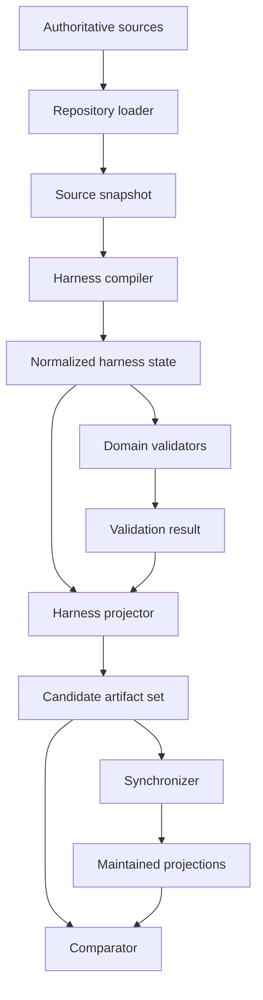
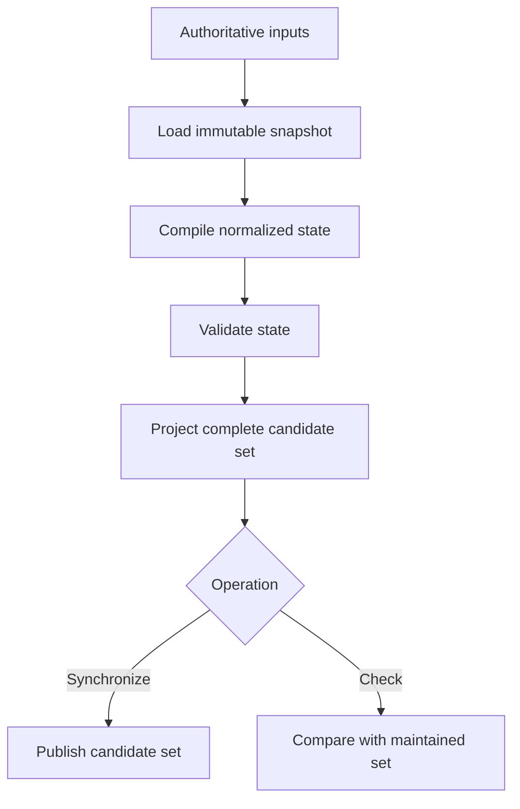
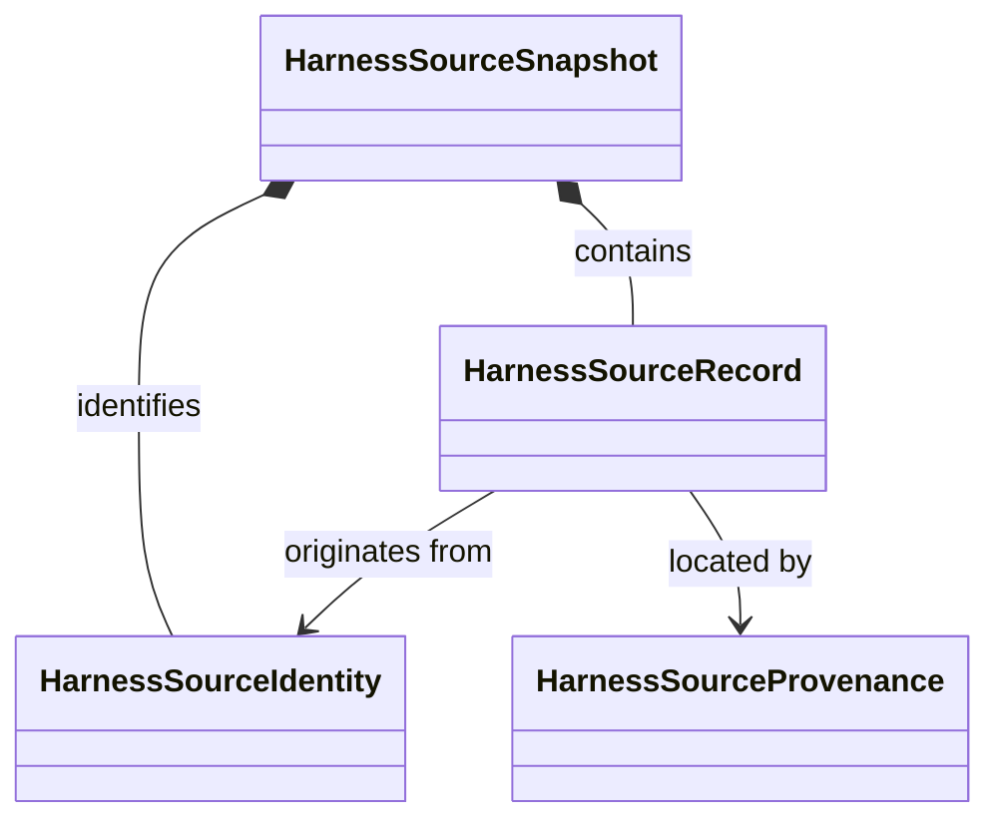
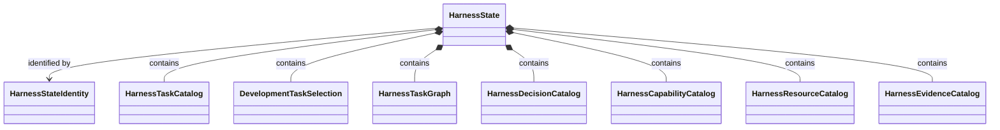
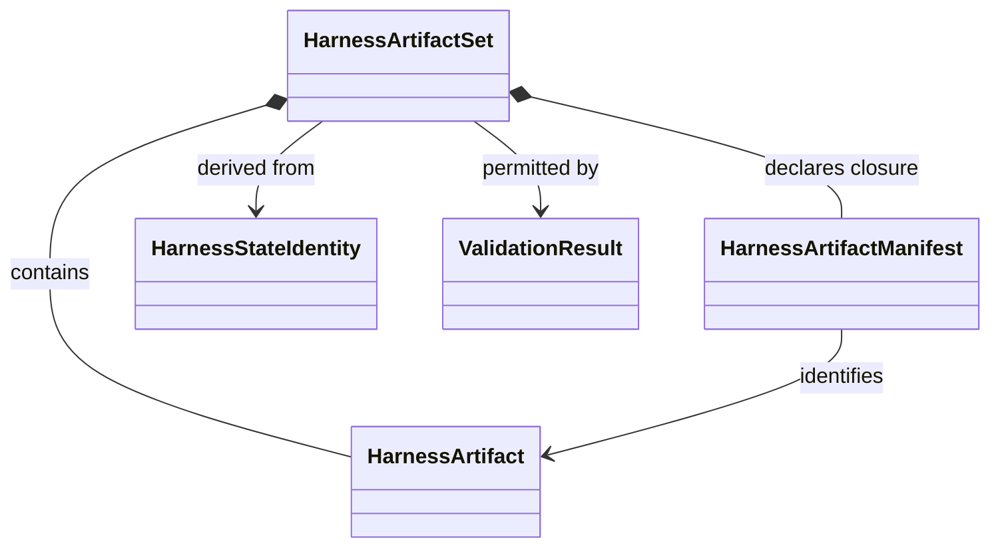
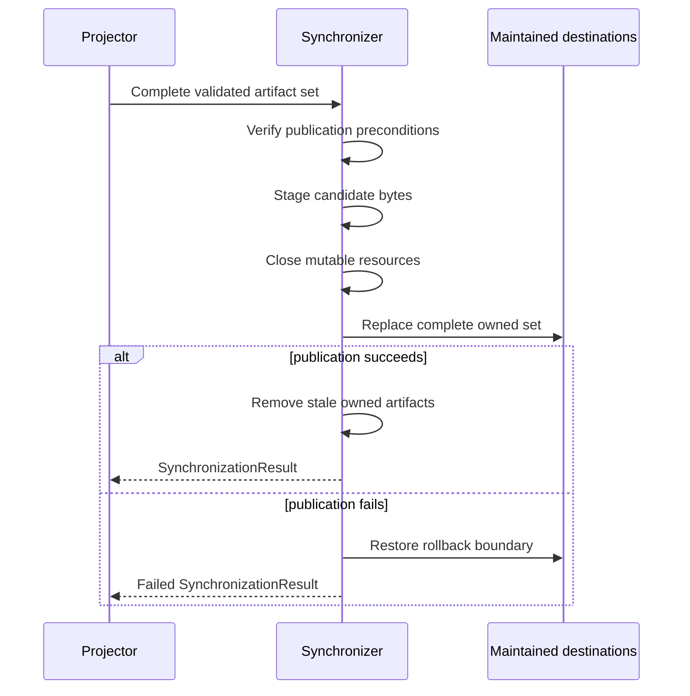

# Compiler architecture

## Purpose

The development-harness compiler converts authoritative repository sources into one normalized model of development state. Validators inspect that model, and projectors derive read-only artifacts from it.

Here, **compiler** means a deterministic source-to-model transformation. It does not mean a Python compiler, a scientific workflow engine, or a calculator input generator.

The compiler architecture has three goals:

1. interpret each authoritative source exactly once;
2. give validation, synchronization, and checking the same normalized state; and
3. prevent generated artifacts from becoming a second source of authority.

## Components



| Component         | Input                                  | Output                  | Responsibility                                                            |
| ----------------- | -------------------------------------- | ----------------------- | ------------------------------------------------------------------------- |
| Repository loader | Explicit root and source contract      | `HarnessSourceSnapshot` | Reads declared authoritative files and records their identities.          |
| Harness compiler  | `HarnessSourceSnapshot`                | `HarnessState`          | Normalizes records, identifiers, relationships, and ordering.             |
| Domain validators | `HarnessState`                         | `ValidationResult`      | Evaluate domain rules without changing state.                             |
| Harness projector | Validated `HarnessState`               | `HarnessArtifactSet`    | Produces a complete candidate set of derived artifacts.                   |
| Synchronizer      | Validated `HarnessArtifactSet`         | `SynchronizationResult` | Publishes the complete set atomically within a defined rollback boundary. |
| Comparator        | Candidate and maintained artifact sets | `ComparisonResult`      | Reports drift without writing or repairing files.                         |

## One semantic path

Synchronization and checking share the same loading, compilation, validation, and projection stages:



There is no synchronization-only parser and no check-only interpretation of source authority. If both operations observe the same input identities and versions, they must construct equivalent normalized state and candidate artifacts.

## Object model

The compiler architecture separates immutable state from reusable operations. It does not require a common base class. Three immutable aggregates define the principal boundaries:

```text
HarnessSourceSnapshot
    ↓ HarnessCompiler
HarnessState
    ↓ domain validators
ValidationResult
    ↓ HarnessProjector
HarnessArtifactSet
```

Sources are observed in `HarnessSourceSnapshot`, domain meaning is normalized in `HarnessState`, and derived files are packaged in `HarnessArtifactSet`.

### Source model

`HarnessSourceSnapshot` is the complete immutable compiler input.

| Object | Role |
|---|---|
| `HarnessSourceIdentity` | Identifies one source by repository-relative path, source kind, format version, and content identity. |
| `HarnessSourceRecord` | Contains the parsed value from one authoritative source. |
| `HarnessSourceProvenance` | Maps a parsed value or field to its source identity and location. |
| `HarnessSourceSnapshot` | Contains the closed collection of identities, records, and provenance observed together. |



A snapshot is closed: compilation cannot request an additional source after the loader returns it. Source records retain parsed values rather than mutable parser objects or open files.

### Normalized state model

`HarnessState` is the compiler's principal output. It is a normalized model of development-control state, not a database and not a collection of generated files.

| Object | Role |
|---|---|
| `HarnessStateIdentity` | Identifies the normalized semantic state under an explicit model version. |
| `HarnessTaskCatalog` | Contains normalized development Task definitions. |
| `DevelopmentTaskSelection` | Identifies the explicit active development selection, if any. |
| `HarnessTaskGraph` | Contains typed parent and prerequisite relationships. |
| `HarnessDecisionCatalog` | Contains normalized unresolved and resolved development decisions. |
| `HarnessCapabilityCatalog` | Contains available development capabilities and their identities. |
| `HarnessResourceCatalog` | Contains resource identities and dependency closure. |
| `HarnessEvidenceCatalog` | Contains evidence identities, owners, and claim boundaries. |
| `HarnessState` | Aggregates the normalized development domains and their source provenance. |



Every normalized object retains source provenance. Conflicting sources remain explicit findings; the compiler does not choose an arbitrary winner.

### Validation model

| Object | Role |
|---|---|
| `ValidationFinding` | Records a stable code, severity, source location, expected condition, and observed condition. |
| `ValidationRuleIdentity` | Identifies one validator, rule, and rule version. |
| `ValidationResult` | Associates a state identity with applied rules, ordered findings, and an exact claim boundary. |

`ValidationResult` refers to the validated `HarnessState`; it does not contain a modified copy. A finding refers to normalized objects and their source provenance without mutating either.

### Projection model

| Object | Role |
|---|---|
| `HarnessArtifact` | Represents one derived file with path, projection kind, format version, bytes, and content identity. |
| `HarnessArtifactManifest` | Declares the complete path and identity closure of a candidate set. |
| `HarnessArtifactSet` | Forms the immutable publication unit derived from one validated state. |



### ResultObjects

| Object | Meaning |
|---|---|
| `ValidationResult` | Ordered findings and the exact claim boundary of validation. |
| `SynchronizationResult` | Published artifact identities, removals, and publication outcome. |
| `ComparisonResult` | Missing, unexpected, byte-different, and semantically different artifacts. |

A result records an operation outcome. It does not repeat or continue the operation.

### Validator protocol

Validator composition is a demonstrated polymorphic requirement because `HarnessStateValidator` applies multiple validators with different domain-rule owners through one deterministic interface. The protocol is domain-specific:

```python
class HarnessDomainValidator(Protocol):
    @property
    def rule_identities(self) -> tuple[ValidationRuleIdentity, ...]: ...

    def execute(self, state: HarnessState) -> DomainValidationResult: ...
```

`DomainValidationResult` contains the validator's rule identities and ordered `ValidationFinding` objects. It does not contain a modified `HarnessState`.

Concrete implementations include:

| Validator | Principal domain | Responsibility |
|---|---|---|
| `HarnessTaskCatalogValidator` | `HarnessTaskCatalog` | Task identities, fields, and catalog invariants |
| `DevelopmentTaskSelectionValidator` | `DevelopmentTaskSelection` | Selected-Task existence and activation consistency |
| `HarnessTaskGraphValidator` | `HarnessTaskGraph` | Parent and prerequisite references, cycles, and graph closure |
| `HarnessDecisionCatalogValidator` | `HarnessDecisionCatalog` | Decision identities and resolution-state consistency |
| `HarnessCapabilityCatalogValidator` | `HarnessCapabilityCatalog` | Capability identities and declared relationships |
| `HarnessResourceCatalogValidator` | `HarnessResourceCatalog` | Resource dependencies, closure, and layering |
| `HarnessEvidenceCatalogValidator` | `HarnessEvidenceCatalog` | Evidence identities, ownership, and claim boundaries |

Each implementation may inspect the complete `HarnessState` when its rule needs an explicitly declared cross-reference, but it owns only its named domain rules. The protocol supplies no default rules, registration, discovery, mutation, repair, or authorization.

### ActionObjects

| ActionObject | Transformation |
|---|---|
| `HarnessRepositoryLoader` | Explicit sources → `HarnessSourceSnapshot` |
| `HarnessCompiler` | `HarnessSourceSnapshot` → `HarnessState` |
| Concrete `HarnessDomainValidator` | `HarnessState` → `DomainValidationResult` |
| `HarnessStateValidator` | `HarnessState` plus an explicit ordered validator tuple → `ValidationResult` |
| `HarnessProjector` | Validated `HarnessState` → `HarnessArtifactSet` |
| `HarnessSynchronizer` | Validated candidate set → `SynchronizationResult` |
| `HarnessStateComparator` | Candidate and maintained sets → `ComparisonResult` |

`HarnessStateValidator` owns composition rather than domain rules. It records the explicit validator order, applies every validator deterministically, evaluates cross-domain closure, aggregates ordered findings, and returns one `ValidationResult`. It does not discover validators, alter state, repair findings, or authorize actions.

Each ActionObject receives its dependencies explicitly, leaves its inputs unchanged, and returns an immutable object or result. It must not use ambient current-directory discovery, mutable global registries, or hidden fallback sources.

Neither `HarnessState` nor its domain objects perform I/O, validation, projection, publication, or comparison. Those operations belong to the named ActionObjects.

## Authoritative inputs

An operation begins with an explicit source contract. The contract identifies:

- the repository root;
- every permitted source family;
- expected schema or format versions;
- explicit external inputs, if any;
- path and symlink policy;
- required versus optional sources; and
- the ordering rule used when a source family contains multiple records.

The loader may read only sources selected by that contract. Repository scans may implement an explicitly declared source-family rule, but they may not discover new kinds of authority.

Generated projections are never source inputs merely because they are present. If a generated file disagrees with authoritative input, checking reports drift; the loader does not merge the two values or choose the generated value as a fallback.

## Repository loading

`HarnessRepositoryLoader` owns repository I/O and source-format decoding. It performs the following bounded steps:

1. validate the explicit repository root;
2. resolve each declared source beneath that root;
3. enforce path, exact-case, file-type, and symlink rules;
4. read each selected file once into the operation snapshot;
5. decode it according to its declared format version;
6. record its content identity and source provenance; and
7. close every file and parser resource before returning.

`HarnessSourceSnapshot` contains no open files, database connections, parser objects with mutable state, temporary paths, process handles, or credentials. A source that changes during loading causes a loading failure rather than a mixed-revision snapshot.

## Compilation

`HarnessCompiler` performs the pure transformation

```text
HarnessSourceSnapshot → HarnessState
```

Compilation owns structural normalization, including:

- canonical identifier representation;
- deterministic record and relationship ordering;
- resolution of declared aliases;
- construction of typed relationships;
- normalization of equivalent source encodings;
- attachment of source provenance to normalized values; and
- calculation of the normalized-state identity.

Compilation does **not**:

- read files or invoke command-line programs;
- apply publication or rollback policy;
- authorize development work;
- infer approval or resolve a human decision;
- silently repair contradictory sources;
- import maintained projections as missing source state; or
- interpret scientific results.

Normalization may remove representation-only variation, such as irrelevant input ordering when the owning contract defines a canonical order. It must not erase a meaningful distinction, invent a missing value, or convert a conflict into an arbitrary winner.

## Provenance and diagnostics

Every normalized record and relationship retains enough provenance to identify its source. A diagnostic can therefore report:

- compiler phase;
- stable finding code;
- source identity and repository-relative path;
- record or field location;
- normalized object identity, when available;
- concise expected and observed conditions; and
- severity and claim boundary.

Diagnostics use deterministic ordering. They must not expose credentials, private payloads, environment secrets, or unrestricted source contents.

## Validation

Validation occurs after compilation so every validator sees the same normalized model. Domain validators own rules for their domains, such as:

- development Task records and active selection;
- Task prerequisites and dependency relationships;
- unresolved human decisions;
- capability and resource closure;
- evidence identities and ownership; and
- generated-artifact path and manifest closure.

A validation coordinator may order validators and evaluate cross-domain closure, but it must not become a fallback owner for domain rules.

Validators are read-only. They return findings and do not repair `HarnessState`, rewrite sources, publish artifacts, or grant authority. A `ValidationResult` states the source-snapshot identity, normalized-state identity, validators and rule versions applied, ordered findings, and exact claim boundary.

A structural pass establishes only conformance to those rules. It does not establish software-test success, numerical verification, scientific validation, uncertainty quantification, protected-execution authority, or human acceptance.

## Projection

`HarnessProjector` maps one validated `HarnessState` to one complete `HarnessArtifactSet`.

A projected artifact declares:

- its repository-relative destination;
- projection kind and format version;
- deterministic bytes;
- content identity;
- generating state identity; and
- whether its format uses byte-exact or semantic comparison.

Projection formats may include SQLite, deterministic SQL, graphs, indexes, manifests, and generated harness views. Generated views live outside `docs/`; `docs/` contains human-authored documentation.

A projector performs no source discovery and writes no maintained destination. Format-specific projectors are output strategies over the same `HarnessState`, not separate authority models. The artifact-set manifest lists the complete candidate closure before publication, including artifacts that replace or remove previous projector-owned paths.

## Candidate validation

Before publication or comparison, candidate validation confirms:

- unique, root-confined destination paths;
- complete manifest closure;
- supported projection and format versions;
- agreement between declared and observed content identities;
- relational integrity for structured projections;
- deterministic SQL where required;
- absence of SQLite WAL, SHM, or journal sidecars;
- closed mutable resources; and
- agreement between each artifact and the normalized-state identity.

An incomplete candidate set is never presented as current state.

## Synchronization

`HarnessSynchronizer` is the only component that writes maintained projections. It accepts a complete validated artifact set and publishes it as one bounded operation:



Publication policy defines ownership of destinations, replacement order, rollback scope, stale-artifact removal, and interruption behavior. The synchronizer does not recompile sources or change projection contents. Unrelated files and human-authored documentation are outside its ownership.

## Comparison

`HarnessStateComparator` checks maintained projections without writing them. It classifies differences as:

| Difference | Meaning |
|---|---|
| Missing | A candidate artifact has no maintained counterpart |
| Unexpected | A projector-owned maintained artifact is absent from the candidate closure |
| Byte drift | Bytes differ for a canonical-byte format |
| Semantic drift | Normalized represented content differs |
| Physical-only variation | Bytes differ where the format permits equivalent physical representations |
| Version mismatch | Schema, projection, or format identities disagree |

The comparator applies exact-byte comparison only where the format contract requires canonical bytes. For formats such as SQLite, semantic agreement may be the governing rule unless canonical physical bytes are explicitly part of the contract.

The comparator reports drift; it never repairs it, invokes synchronization, or changes the exit status based on an undeclared tolerance.

## Determinism

Compiler and projector determinism is defined over:

- the complete source identities;
- source schema and format versions;
- compiler and normalization-rule versions;
- validator and rule-set versions;
- projector and output-format versions; and
- explicit operation configuration.

Equivalent inputs under those versions produce equivalent `HarnessState` and candidate artifacts. Sources of incidental variation—filesystem enumeration order, locale, timezone, process ID, temporary paths, timestamps, random values, and host-specific SQLite state—must not enter deterministic outputs unless an owning contract represents them explicitly.

A normalized semantic digest identifies represented state, not arbitrary file layout. A raw artifact digest identifies exact bytes. The architecture keeps those identities separate.

## Concurrency and consistency

One compilation observes one closed source snapshot. Concurrent source mutation must be detected before publication. Synchronization verifies that its source snapshot is still applicable at the publication boundary; if not, it fails and requires a new load-and-compile operation.

Only one synchronizer may own a maintained destination set at a time. Readers must observe either the previous complete set or the new complete set, never an intentional mixture. Comparison may run concurrently only against an immutable maintained view.

## Failure model

| Phase | Example failure | Required outcome |
|---|---|---|
| Loading | Missing source, invalid path, changing file | No snapshot returned |
| Compilation | Duplicate identity, contradictory authority | No normalized state returned |
| Validation | Broken prerequisite or resource closure | Findings returned; no projection publication |
| Projection | Unsupported format or nondeterministic output | No complete artifact set returned |
| Candidate validation | Manifest mismatch or open SQLite sidecar | Candidate rejected |
| Publication | Replacement or rollback failure | Failure reported with exact publication state |
| Comparison | Missing or divergent maintained artifact | Read-only drift result returned |

A failure in any phase grants no authority and activates no recovery workflow by itself. Retry is an explicit caller decision using a new operation context.

## Security and path safety

All repository and destination paths are explicit, repository-relative, and root-confined. Loaders and synchronizers reject traversal, unexpected symlinks, unsupported file types, and destinations outside their declared ownership. Compiler state and diagnostics contain no credentials. External data transmission is not part of this architecture.

## Extension rules

A new source family requires an explicit source contract, format identity, loader support, normalized owner, validation rules, and provenance mapping. A new projection format requires a format identity, deterministic projection contract, candidate validation, comparison semantics, and publication ownership.

Neither extension may introduce a parallel compiler path, hidden registry, ambient discovery, or independent interpretation of development authority.

## Authority limits

This compiler architecture belongs exclusively to the development harness. It may represent development Tasks, decisions, capabilities, evidence, and derived control views. It does not:

- load or advance a scientific `CampaignRun`;
- compile a CPN campaign into calculator work;
- execute a calculator;
- interpret numerical observations;
- create `ScientificAnalysis`; or
- record `ScientificDisposition`.

Any scientific workflow compiler requires a separate contract under the scientific workflow architecture. It may reuse generic deterministic techniques, but it cannot inherit development-harness state authority implicitly.

## Unresolved issues

- Exact public field contracts for source snapshots, normalized state, validation results, and artifact sets.
- Compiler and normalization-rule version identities.
- Source-snapshot consistency mechanism under concurrent repository mutation.
- Whether format-specific projectors are public ActionObjects or private strategies.
- Publication rollback guarantees across supported filesystems.
- Canonical semantic-digest representation.
