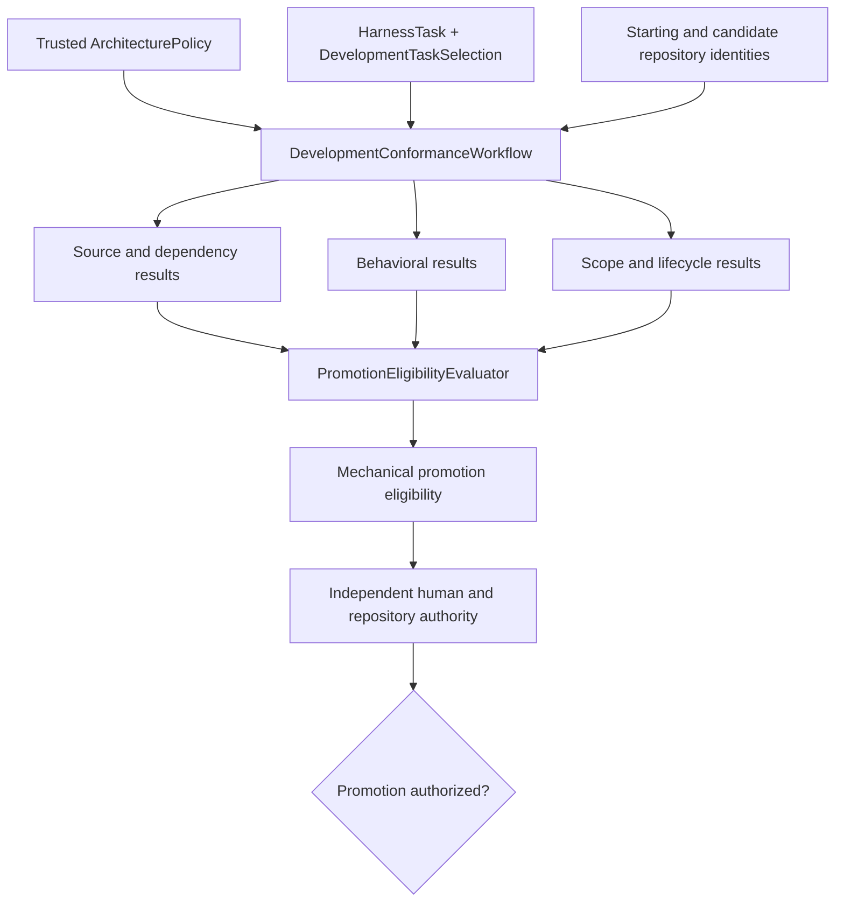

# Repository-wide development conformance

## Purpose

Development conformance evaluates whether one identified repository change
satisfies the applicable architecture policy, selected Harness Task, software
contracts, scope constraints, and mechanical promotion requirements. Its subject
is the whole repository, including the development harness, scientific workflow,
colored-Petri-net, calculator, analysis, test, fixture, and documentation
surfaces.

The development harness owns conformance composition and result contracts. It
does not thereby own the meaning of every contract it checks. Scientific
specifications, package contracts, Harness Task rules, test-evidence contracts,
and documentation policy remain with their authoritative domains.

Conformance does not execute a scientific workflow, advance a
`ScientificWorkflowRun`, perform calculator execution, or establish numerical
verification, scientific validation, scientific disposition, or human
acceptance merely because software checks pass.

## Relationship to harness-state validation

[Development validation](validation.md) evaluates one coherent
`HarnessStateSnapshot`. Repository-wide conformance has a broader subject: an
identified proposed repository change and all checks required by the exact
selected Task and architecture policy.

A `HarnessStateValidator` result may be one conformance input. It is not itself a
repository-wide promotion decision. The two layers use distinct result types so
aggregate state findings are not confused with tool execution, scope,
environment, or promotion eligibility.

## Architectural flow



For the checks required by the selected Task and policy, mechanical eligibility
is

$$
E(C,A,T)=\bigwedge_{i\in R(A,T)}G_i(C,A,T),
$$

where $C$ is the identified change, $A$ is the identified architecture policy,
$T$ is the exact selected `HarnessTask` revision and
`DevelopmentTaskSelection`, and $R(A,T)$ is the applicable required-check set.

Actual promotion additionally requires independently represented human and
repository authority:

$$
P(C,A,T,H)=E(C,A,T)\land H.
$$

The deterministic conformance workflow calculates $E$. It does not manufacture
$H$, write a maintained projection, merge code, or record human acceptance.

## Core records

The target uses immutable or operationally immutable records:

| Record | Responsibility |
|---|---|
| `ArchitecturePolicy` | Identified package boundaries, public interfaces, object-role rules, lifecycle rules, and available gate definitions |
| `RepositorySnapshotIdentity` | Exact repository, revision or tree, and applicable source identity |
| `RepositoryChangeSet` | Added, modified, deleted, renamed, mode-changed, symlink, and other represented repository changes |
| `ConformanceRequirement` | Stable rule identity, version, applicability, severity, and blocking behavior |
| `ConformanceCheckResult` | One validator invocation with status, findings, environment, and evidence references |
| `DevelopmentConformanceProfile` | Complete policy identity, ordered validator and requirement identities, required gates, and tool-configuration identities for one evaluation |
| `PromotionEligibilityResult` | Mechanical aggregate outcome and complete required-result identities |
| `DevelopmentConformanceReport` | Machine-readable evidence and input to human-readable reporting |

Task scope, starting revision, exclusions, completion criteria, review
requirements, and authority are not duplicated into a separate conformance Task
record. They are consumed from the exact `HarnessTask`,
`DevelopmentTaskSelection`, decision and authority references, and related
records owned by [Harness Tasks](tasks/index.md).

A `PromotionEligibilityResult` is not called a promotion decision. It contains
no human conclusion and performs no repository mutation.

## Check outcomes

`ConformanceCheckResult` uses the closed outcome vocabulary:

```text
pass
fail
error
not_run
not_applicable
```

For a required check:

- `pass` satisfies the represented requirement;
- `fail` records a detected contract violation;
- `error` records that the validator could not establish an outcome;
- `not_run` records omitted execution; and
- `not_applicable` is accepted only when the requirement explicitly permits it.

The eligibility evaluator fails closed. Every applicable required check must
pass. Infrastructure failure and omitted execution do not become conformance.

Each result identifies at least:

```text
validator_identity
requirement_identities
status
summary
ordered_findings
affected_paths
tool_identity
configuration_identity
environment_identity
evidence_references
```

Blocking behavior is owned by the trusted `ConformanceRequirement`; a check
result does not restate or override it. `PromotionEligibilityEvaluator` resolves
each result through its exact requirement identity.

Raw tool output may be retained evidence, but it is not the architectural
interface.

## Retention boundary

`ConformanceCheckResult` and `PromotionEligibilityResult` are development
evidence records. Their authoritative retention belongs to the applicable
evidence repository, and `HarnessEvidenceCatalog` retains their exact identities,
claim boundaries, and source references. `DevelopmentConformanceReport` is a
derived presentation and does not replace those evidence records. Ephemeral
local checks that are not required evidence are identified as such and cannot
satisfy a required gate after the operation ends.

The conformance workflow does not make evidence authoritative merely by
producing it, and the compiled `HarnessStateSnapshot` contains catalog references
rather than mutable runtime validator objects or raw tool processes.

## ActionObject and Workflow ownership

Reusable operations belong to explicit ActionObjects:

```text
RepositoryChangeInspector
SourceConformanceValidator
DependencyConformanceValidator
BehavioralConformanceValidator
TaskScopeValidator
ArtifactPromotionValidator
PromotionEligibilityEvaluator
DevelopmentConformanceReporter
```

`DevelopmentConformanceWorkflow` is the genuine reusable composition of
inspection, validation, and mechanical eligibility evaluation. It receives a
complete `DevelopmentConformanceProfile`, exact repository identities, and the
applicable Harness Task records. It does not discover ambient policy, repair the
candidate, mutate authoritative Task state, publish projections, record human
approval, or merge code.

ActionObjects may hold immutable configuration and explicit tool adapters.
Statelessness means that they own no hidden or evolving domain state; it does not
require empty instances.

## Composition instead of architecture subclassing

A project specializes conformance by supplying immutable policy and explicit
validator composition. It does not subclass a nominal
`BaseConformanceArchitecture`, override inherited rules, or acquire authority
through inheritance.

Conceptually:

```python
profile = DevelopmentConformanceProfile(
    architecture_policy_identity=architecture_policy.identity,
    validator_identities=(
        source_validator.identity,
        dependency_validator.identity,
        behavioral_validator.identity,
        scope_validator.identity,
        promotion_validator.identity,
    ),
    required_gates=required_gates,
    tool_configuration_identities=tool_configuration_identities,
)

workflow = DevelopmentConformanceWorkflow(
    validators=(
        source_validator,
        dependency_validator,
        behavioral_validator,
        scope_validator,
        promotion_validator,
    ),
)

result = workflow.execute(
    starting_repository=starting_repository,
    candidate_repository=candidate_repository,
    task=harness_task,
    selection=development_task_selection,
    profile=profile,
)
```

Concrete validators may satisfy a narrow structural protocol when multiple
implementations demonstrate polymorphic need:

```python
class DevelopmentConformanceValidator(Protocol):
    @property
    def requirement_identities(
        self,
    ) -> tuple[ConformanceRequirementIdentity, ...]: ...

    def execute(
        self,
        context: DevelopmentConformanceContext,
    ) -> ConformanceCheckResult: ...
```

No nominal validator or architecture base class exists solely to label an
implementation. The profile contains identities and immutable configuration,
not executable validator or tool objects. `DevelopmentConformanceWorkflow`
receives the corresponding concrete implementations separately and verifies
that their identities exactly match the profile before execution. Explicit
composition therefore keeps effective policy, validator order, rule versions,
and tool configuration inspectable and identity-bearing.

## Enforcement planes

### Source-conformance plane

This plane checks properties represented in the source tree:

- formatting and ordinary lint requirements;
- declared typing requirements;
- DataObject, ResultObject, and ActionObject structural rules;
- package boundaries, public interfaces, and dependency cycles;
- maintained test organization where required; and
- explicitly prohibited imports and constructs.

Ruff, mypy, Tach, and a narrow project AST adapter may provide these checks.
AST rules must be syntactically precise and must not claim to prove general
purity, semantic ownership, scientific correctness, or absence of all mutable
behavior.

### Behavioral-conformance plane

This plane invokes applicable software, property, integration, serialization,
state-machine, and numerical-contract checks. The authoritative meaning and
acceptance rule of each check remain with its owning contract.

Passing software tests establishes only the represented software contract.
Numerical-verification, scientific-validation, and
uncertainty-quantification claims require their separately classified evidence
and authority.

### Authorization and scope plane

This plane evaluates whether the proposed change falls within represented
development authority independently of implementation correctness. It checks at
least:

- exact `HarnessTask` and selection revisions;
- starting and candidate repository identities;
- allowed and prohibited paths;
- architecture-policy identity;
- required-check completeness;
- protected architecture and control records; and
- declared deviations.

Repository operations not represented by a Git tree difference require explicit
event or audit metadata. A `RepositoryChangeSet` accounts for additions,
deletions, renames, file-mode changes, symlink changes, and other supported Git
change classes rather than only changed text lines.

### Governance plane

Local hooks provide feedback but are not authoritative. Required CI statuses,
repository rulesets, protected branches, `CODEOWNERS`, and represented human
review provide governance outside the deterministic evaluator. Individual
adapter results remain diagnostic; only the identified aggregate eligibility
result supplies the mechanical promotion status.

## Trusted-input boundary

A candidate change cannot authorize itself. Before candidate-controlled code is
executed, conformance establishes immutable identities for:

- the trusted starting revision;
- the candidate revision or tree;
- the selected architecture policy and content identity;
- the exact Task, selection, and relevant authority revisions;
- validator implementations and configuration;
- required checks; and
- the execution environment and toolchain.

Policy and authority inputs come from a protected base revision, protected domain
repository, signed record, or another explicitly trusted source selected by the
application composition. A candidate may propose changes to those records, but
its proposed records do not govern their own acceptance.

The safe execution order is:

```text
trusted policy, Task, selection, and authority references
→ repository identity and change inspection
→ scope and starting-revision validation
→ static source and dependency validation
→ bounded behavioral validation
→ mechanical eligibility aggregation
→ independent human and repository authorization
→ report and required status
```

## Domain delegation

Conformance cuts across the stack without reversing runtime dependencies:

| Contract | Meaning owner | Conformance adapter |
|---|---|---|
| Package dependency direction | Architecture policy | Dependency validator |
| DataObject and ActionObject structure | Object-model policy | AST validator |
| Harness Task scope and selection | `harness.tasks` | Task-scope validator |
| Colored-Petri-net behavior | `petrinet.colored` | Petri-net software-verification tests |
| Scientific-workflow behavior | `workflow.scientific` | Workflow software-verification tests |
| Numerical algorithm behavior | Applicable specification | Numerical-verification tests |
| Public API and serialization behavior | Owning package and schema | Compatibility and integration tests |
| Documentation structure and links | Documentation policy | Documentation checks |

Scientific packages do not import the development harness merely because the
harness evaluates them. The application composition root supplies declared
adapters and explicit inputs to the conformance workflow.

## Architecture and policy promotion

Draft, spike, implementation, and production classification must be represented
explicitly when applicable, not guessed only from paths. A promotion evaluation
identifies the artifact or contract, current and requested classification,
governing policy, required evidence, affected public contracts, and required
authority.

Changes to conformance policy or evaluator behavior require a bootstrap-safe
route:

1. evaluate the proposal under the currently trusted policy;
2. evaluate the proposed policy in nonauthoritative diagnostic or dual-run mode;
3. report differences explicitly; and
4. require applicable architecture review before the new policy becomes trusted.

The proposed evaluator or policy cannot certify itself into authority.

## ProjectKoios extraction boundary

Architecture v2 does not require an installed ProjectKoios dependency. The local
target preserves explicit generic seams without claiming that they have already
been extracted. A later move into `projectkoios.bootstrap` is justified only when
local implementation demonstrates stable project-independent records,
validator protocols, aggregation, and reporting behavior and separate human
acceptance authorizes the dependency and migration.

Concrete `ksdft2effmass` architecture policy, domain rules, and adapters remain
project-owned after any generic extraction. Project specialization continues
through explicit policy and composition rather than an inherited conformance
architecture.

## Explicit non-goals

Development conformance does not:

- decide whether a scientific model is physically appropriate;
- replace human architectural or scientific judgment;
- execute or advance scientific workflows;
- infer authorization from an agent prompt or passing test;
- repair candidate code silently;
- treat a draft ADR or spike as production approval;
- prove general program purity from source structure; or
- make an external calculator deterministic merely by invoking it through a
  validator.

## Principle

> Human authority defines the permitted state space and the requirements for
> promotion. Deterministic validators establish mechanical eligibility against
> identified policy, Task, selection, repository, and toolchain inputs.
> Repository controls and represented human decisions determine whether an
> eligible change is authorized for promotion.

## Unresolved issues

- Exact public fields and wire formats of the conformance records.
- Exact authoritative source for Architecture v2 policy in local and CI runs.
- Validator process-isolation and bounded-execution contracts.
- Compatibility policy for validator, rule, report, and environment identities.
- Durable publication-request, authority, outcome, and recovery records.
- Which locally demonstrated components eventually qualify for ProjectKoios
  extraction.
