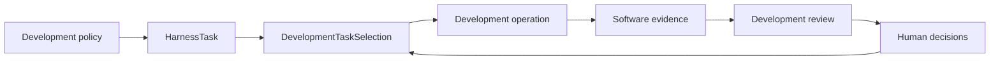

# Development control plane

## Responsibility

The development control plane governs software and documentation work. It owns:

- `HarnessTask` definitions;
- `DevelopmentTaskSelection`;
- development authorization;
- unresolved development decisions;
- software capabilities and resources;
- software-verification and repository-conformance findings;
- mechanical promotion-eligibility results; and
- development review and acceptance state.

It may reference immutable scientific contract or implementation identities. It does not store `ScientificWorkflowRun`, `CpnMarking`, calculator execution, scientific analysis, or scientific disposition state.

## Authority model

Evidence supports a claim but grants no authority. Capability states what an implementation can do; selection and applicable human decisions state what may be done. [Repository-wide development conformance](conformance.md) calculates mechanical eligibility from identified policy, Task, selection, repository, and toolchain inputs; it does not create a human decision or promote a repository change. Required conformance results and eligibility outcomes are retained as identified evidence through the applicable evidence repository and referenced by `HarnessEvidenceCatalog`; human-readable reports remain derived.

## Explicit context

Repository-sensitive operations receive an explicit repository root, source identities, starting revision, permitted paths, operation requirements, architecture-policy identity, and conformance-profile identity. Ambient current-directory discovery is not authority, and candidate-controlled policy cannot authorize the candidate that changes it.

## Selection invariants

- At most one development selection is active within one declared control scope.
- Selection references an existing eligible `HarnessTask` revision.
- Automatic successor activation is explicit and disabled by default.
- An unresolved human-owned decision prevents the affected transition.
- Generated projections cannot create or change selection.

## Human authority

Architecture, scope, dependencies, protected repository actions, and development acceptance remain human-owned where policy requires them. Silence, passing checks, reviewer agreement, elapsed time, or Task ordering does not provide a human decision.

## Unresolved issues

- Final wire format for `DevelopmentTaskSelection`.
- Whether selection is persisted with Task records or in a separate development control repository.
- Exact closed lifecycle vocabulary for routine versus reviewed development work.
- Whether multiple independent repository scopes may have concurrent selections.
