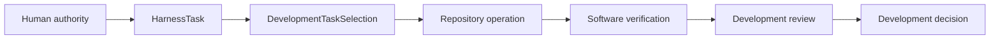
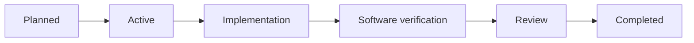

# Development harness

## Purpose

The development harness governs changes to software and human-authored documentation. It combines immutable work definitions, explicit selection and authority, repository operations, validation, persistence, and derived views without making those concerns interchangeable.

## Responsibility

| Concern | Owner |
|---|---|
| Work definition | `HarnessTask` |
| Active work | `DevelopmentTaskSelection` |
| Normalized state | `HarnessState` |
| Source compilation | `HarnessCompiler` |
| Domain validation | Concrete `HarnessDomainValidator` implementations |
| Validation composition | `HarnessStateValidator` |
| Persistence | `DevelopmentStateRepository` |
| Derived views | `HarnessProjector`, `HarnessSynchronizer`, and `HarnessStateComparator` |
| Human conclusion | Development decision or acceptance record |

The harness may reference immutable scientific contract and implementation identities when developing or verifying them. It does not store or advance `CampaignRun`, execute a calculator as scientific workflow work, create `ScientificAnalysis`, or record `ScientificDisposition`.

## Core boundaries

A `HarnessTask` defines bounded work, prerequisites, completion criteria, and exclusions. `DevelopmentTaskSelection` identifies work permitted to proceed. Capability does not imply selection, and selection does not imply human acceptance.

`HarnessState` is the immutable normalized aggregate used by validation and projection. Persistence stores authoritative development state. Projections are recoverable read-only views and never replace authority.

Repository operations receive explicit roots, source identities, permitted paths, and requirements. Ambient current-directory discovery, mutable plugin registries, and silent implementation fallback are forbidden.

## Lifecycle

The exact route is proportional to risk. Human-owned and protected boundaries remain explicit. Automatic successor activation is disabled unless an explicit accepted contract enables it.

## Pages

- [Object model](object-model.md)
- [Development harness model](development-harness.md)
- [Compiler architecture](compiler-architecture.md)
- [Validation](validation.md)
- [Control plane](control-plane.md)
- [Persistence](persistence.md)
- [Projections](projections.md)
- [Separation from the scientific workflow](../separation-of-harness-and-workflow.md)

## Unresolved issues

- Final submodule boundaries within `ksdft2effmass.harness`.
- Closed development lifecycle and selection wire contracts.
- Development-state storage technology.
- Which generated development views remain maintained.
- Whether reusable repository-operation infrastructure belongs in the harness or application composition package.
