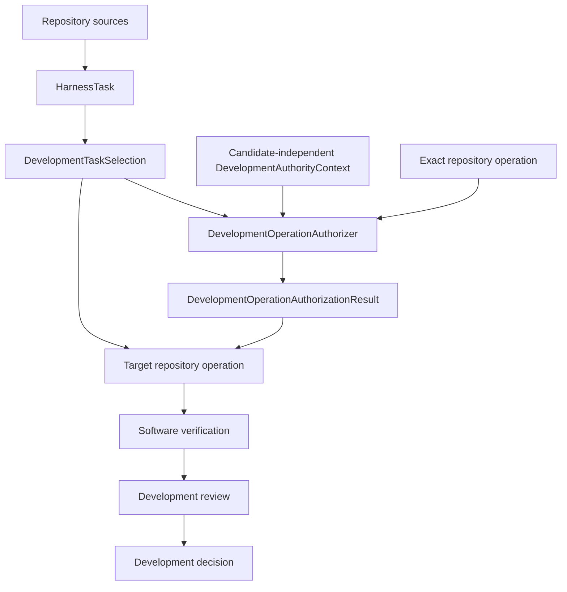
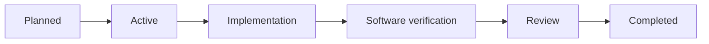

# Development harness

## Purpose

The development harness governs changes to software and human-authored documentation. It combines immutable work definitions, explicit selection and authority, repository operations, validation, persistence, and derived views without making those concerns interchangeable.

## Responsibility

The harness may reference immutable scientific contract and implementation identities when developing or verifying them. It does not store or advance `WorkflowRun`, execute a calculator as scientific workflow work, create `ScientificAnalysis`, or record `ScientificDisposition`.

| Concern | Owner |
|---|---|
| Work definition | `HarnessTask` |
| Active work | `DevelopmentTaskSelection` |
| Normalized state | `HarnessState` |
| Source compilation | `HarnessCompiler` |
| Authority-context reconstruction | `DevelopmentAuthorityContextResolver` |
| Exact operation authorization | `DevelopmentOperationAuthorizer` |
| Domain validation | Concrete `HarnessDomainValidator` implementations |
| Normalized-state validation composition | `HarnessStateValidator` |
| Repository-wide development conformance | `DevelopmentConformanceWorkflow` |
| Mechanical promotion eligibility | `PromotionEligibilityEvaluator` |
| Persistence | Domain-owned `HarnessStateRepository`; concrete `HarnessStateAtomicRepository` composed with shared `AtomicRevisionStore`, exact serializer, and validator |
| Derived views | `HarnessProjector`, `HarnessSynchronizer`, and `HarnessStateComparator` |
| Human conclusion | Immutable `DevelopmentDecision` unresolved/resolved variant or revision |
## Core boundaries

A `HarnessTask` defines bounded requested work, prerequisites, completion criteria, and exclusions. `DevelopmentTaskSelection` is repository-derived requested/selected work state; it is neither authority nor permission. Capability and selection do not authorize an operation or imply human acceptance. `DevelopmentAuthorityContextResolver` reconstructs and verifies the candidate-independent `DevelopmentAuthorityContext`; `DevelopmentOperationAuthorizer` returns an affirmative result only for a matching unrevoked `TaskAuthorization` covering the exact selection and Task revisions, candidate and starting revisions, operation, and permitted paths. A target operation verifies that result's exact bindings without reinterpreting authority policy. Neither a `HarnessTask`, selection, validation result, nor candidate-controlled decision can authorize itself.

`HarnessState` is the immutable normalized aggregate used by validation and projection. It contains the one `DevelopmentDecision` model described by [human decisions](../human-decisions.md) directly as an immutable canonically ordered sequence of unresolved and resolved variants/revisions. A pending decision blocks only its declared development transition and scope. Persistence stores lossless revisions of that same repository-derived aggregate. The initial realization composes `HarnessStateAtomicRepository` with an explicitly configured standard-library SQLite shared store; it does not introduce a domain SQLite subclass. Projections are recoverable read-only views and never replace authority.

Development conformance is owned by the harness but evaluates the entire repository stack. The applicable package, specification, test contract, or documentation policy retains ownership of the meaning being checked. Scientific packages do not import the harness merely because the harness invokes their declared checks.

Repository operations receive explicit roots, source identities, permitted paths, and requirements. Ambient current-directory discovery, mutable plugin registries, inherited architecture-policy subclasses, and silent implementation fallback are forbidden.

## Lifecycle

The exact route is proportional to risk. Human-owned and protected boundaries remain explicit. Automatic successor activation is disabled unless an explicit accepted contract enables it.

## Pages

- [Object model](object-model.md)
- [Development harness model](development-harness.md)
- [Compiler architecture](compiler-architecture.md)
- [Normalized-state validation](validation.md)
- [Repository-wide development conformance](conformance.md)
- [Control plane](control-plane.md)
- [Persistence](persistence.md)
- [Shared revision persistence](../persistence/index.md)
- [Projections](projections.md)
- [Pi subagent boundary](subagents.md)
- [Human decisions](../human-decisions.md)
- [Separation from the scientific workflow](../separation-of-harness-and-workflow.md)

## Unresolved issues

- Final submodule boundaries within `ksdft2effmass.harness`.
- Exact conformance policy, profile, result, and report wire contracts.
- Closed development lifecycle and selection wire contracts.
- Exact HarnessState wire bytes and SQLite schema/operational policy; standard-library SQLite is selected only as the initial shared-store realization.
- Which generated development views remain maintained.
- Whether reusable repository-operation infrastructure belongs in the harness or application composition package.

## First-cohort reconciled contracts

Repository sources are the source of truth for requested work state and compile independently of authority to the complete immutable `HarnessState`; they do not grant operation authority. Unrepresentable normalization produces a failed closed-discriminant compilation result with no state, while representable cross-record defects remain available for validation. A separate protected `DevelopmentAuthorityLedger` is supplied through explicit candidate-independent context, and `DevelopmentOperationAuthorizer` returns the exact authorization outcome after compilation. One complete `ValidationResult` contract serves leaf and composite validation. Projector, comparator, and synchronizer verify exact validation and authorization bindings plus their own preconditions without a public harness-operation eligibility result; `PromotionEligibilityEvaluator` alone gates mechanical promotion. These are prospective documentation contracts, not implemented capabilities.
