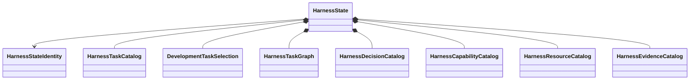

# Development harness object model

## Aggregate

`HarnessState` is the immutable normalized development-control aggregate. Every component retains source provenance. It is not a database or generated artifact set.

## Primary records

| Object | Responsibility |
|---|---|
| `HarnessTask` | Bounded development work definition |
| `HarnessTaskCatalog` | Unique versioned Task definitions |
| `DevelopmentTaskSelection` | Explicit selected development work |
| `HarnessTaskGraph` | Typed parent and prerequisite relationships |
| `DevelopmentDecision` | Explicit unresolved or resolved human decision |
| `HarnessCapabilityCatalog` | Available development operations |
| `HarnessResourceCatalog` | Versioned resources and dependency closure |
| `HarnessEvidenceCatalog` | Evidence identities, owners, and claim boundaries |

Records own intrinsic invariants only. Loading, cross-object validation, serialization, persistence, selection, and projection belong to ActionObjects.

## Results and actions

`ValidationResult`, `SynchronizationResult`, `ComparisonResult`, and persistence results are immutable outcomes. The loader, compiler, validators, projector, synchronizer, comparator, serializers, and repositories are explicit ActionObjects.

## Unresolved issues

- Exact field contracts for `HarnessStateIdentity` and source provenance.
- Whether resolved decisions remain in the live aggregate or a separate history repository.
- Closed status vocabulary for `HarnessTask`.
- Whether capabilities and resources are separate catalogs or one composed immutable capability model.
