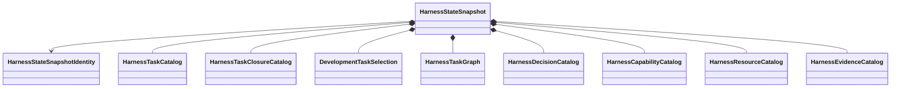

# Development harness object model

## Snapshot aggregate

`HarnessStateSnapshot` is an immutable coherent read snapshot compiled from exact authoritative domain-repository revisions. Every component retains its repository revision and source provenance. The snapshot is not a database, transaction boundary, generated artifact set, or owner of domain behavior.

Authoritative writes occur through the applicable domain repository. The next compiler observation produces a new snapshot; the existing snapshot is never mutated.

## Primary records

| Object | Responsibility |
|---|---|
| `HarnessTask` | Immutable bounded development work definition owned by `harness.tasks` |
| `HarnessTaskCatalog` | Exact versioned Task definitions |
| `HarnessTaskClosureCatalog` | Immutable dispositions ending exact selections |
| `DevelopmentTaskSelection` | Explicit selected development work |
| `HarnessTaskGraph` | Typed Task relationships |
| `DevelopmentDecision` | Explicit unresolved or resolved human decision |
| `HarnessCapabilityCatalog` | Available development operations |
| `HarnessResourceCatalog` | Versioned resources and dependency closure |
| `HarnessEvidenceCatalog` | Evidence identities, owners, and claim boundaries |

Records own intrinsic invariants only. Domain serialization, persistence, validation, selection, transitions, completion, and acceptance belong to their domain ActionObjects. Snapshot assembly and aggregate validation do not acquire those rules.

## Results and actions

`ValidationResult`, `SynchronizationResult`, `ComparisonResult`, and persistence results are immutable outcomes.

- `HarnessSourceSnapshotLoader` observes one coherent set of authoritative revisions.
- `HarnessStateCompiler` assembles those revisions into `HarnessStateSnapshot`.
- Domain validators retain their domain-rule ownership.
- `HarnessStateValidator` evaluates aggregate closure over explicitly supplied validators.
- `HarnessStateProjector`, `HarnessSynchronizer`, and `HarnessStateComparator` own derived-view operations.

## Unresolved issues

- Exact field contracts for `HarnessStateSnapshotIdentity` and source provenance.
- Snapshot consistency boundary across multiple domain repositories.
- Whether resolved decisions remain in the live snapshot or a separate history repository.
- Whether capabilities and resources are separate catalogs or one composed immutable capability model.
- Exact distinction between repository revision identity and semantic content identity.
