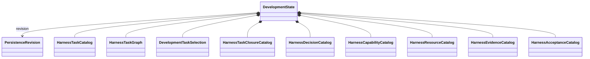

# Development persistence

## Purpose

Development persistence preserves authoritative domain records across process boundaries. It owns durable representation, revisioning, consistency, migration, and recovery. It does not own scientific workflow state, derived views, Task eligibility, or human authority.

`HarnessStateSnapshot` is compiled from exact persistence revisions for aggregate validation and projection. It is not an authoritative write model.

## Authoritative aggregate

`DevelopmentState` is one consistent immutable persistence revision. Domain objects retain their domain owners. Task selection and one closure per ended selection replace a general Task status or transition log.

## Persistence objects

| Object | Purpose |
|---|---|
| `DevelopmentStateIdentity` | Stable identity of one logical development state |
| `DevelopmentStateRevision` | Immutable revision, predecessor, and content identity |
| `DevelopmentStateSnapshot` | Consistent selected persistence revision and its records |
| `DevelopmentStateTransaction` | Complete requested writes with expected prior revisions |
| `DevelopmentPersistenceConflict` | Expected-versus-observed revision conflict |
| `DevelopmentPersistenceWriteResult` | Created revisions and resulting snapshot identity |
| `DevelopmentPersistenceMigrationResult` | Input/output versions, identities, and findings |

## ActionObjects

| ActionObject | Operation |
|---|---|
| Domain serializers | Domain records ↔ versioned wire representations |
| `DevelopmentStateTransactionValidator` | Validate write closure and expected revisions |
| Domain repositories | Read and append records owned by one domain |
| `DevelopmentStateRepository` | Load a coherent aggregate snapshot and commit validated cross-domain transactions when required |
| `DevelopmentStateSchemaMigrator` | Perform one explicit version migration |
| `DevelopmentStateIntegrityVerifier` | Verify identities, references, versions, and storage integrity |

A repository is a narrow authoritative storage boundary. It does not authorize work, resolve decisions, evaluate Task eligibility, run validation tools, generate projections, or expose storage tables as the public object model. The compiler never writes through a repository.

## Consistency and migration

A transaction commits one declared consistency unit. Conflicting revisions fail closed; they are not merged silently. Every representation declares its schema version. Migration is deterministic and retains input identity, output identity, and findings. Migration never changes selection, closure, authority, or acceptance implicitly.

Current V1 Task status values are migration inputs and retained history. They are not copied into a V2 lifecycle vocabulary.

## Security

Persisted state excludes credentials, private keys, unrestricted environment content, and external scientific payloads. Cross-plane references use immutable identities rather than shared mutable rows.

## Unresolved issues

- Concrete storage technology and transaction implementation.
- Whether source files, a database, or separate domain repositories provide the primary durable representations.
- Transaction boundary across selection, closure, evidence, and acceptance records.
- Revision-retention and compaction policy.
- Recovery behavior after an interrupted multi-record development-state write.
