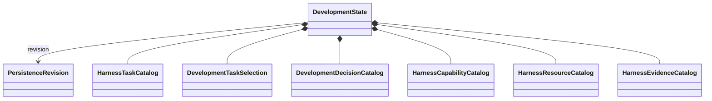

# Development persistence

## Purpose

Development persistence preserves authoritative development state across process boundaries. It owns durable representation, revisioning, consistency, migration, and recovery. It does not own scientific workflow state or derived views.

## Persisted aggregate

`DevelopmentState` is a consistent immutable persistence boundary. Its domain objects remain owned by the development harness.

## Persistence objects

| Object | Purpose |
|---|---|
| `DevelopmentStateIdentity` | Stable identity of one logical development state |
| `DevelopmentStateRevision` | Immutable revision, predecessor, and content identity |
| `DevelopmentStateSnapshot` | Consistent selected revision and its records |
| `DevelopmentStateTransaction` | Complete requested writes with expected prior revisions |
| `DevelopmentPersistenceConflict` | Expected-versus-observed revision conflict |
| `DevelopmentPersistenceWriteResult` | Created revisions and resulting snapshot identity |
| `DevelopmentPersistenceMigrationResult` | Input/output versions, identities, and findings |

## ActionObjects

| ActionObject | Operation |
|---|---|
| `DevelopmentStateSerializer` | Development records ↔ versioned wire representation |
| `DevelopmentStateTransactionValidator` | Validate write closure and expected revisions |
| `DevelopmentStateRepository` | Load snapshots and commit validated transactions |
| `DevelopmentStateSchemaMigrator` | Perform one explicit version migration |
| `DevelopmentStateIntegrityVerifier` | Verify identities, references, versions, and storage integrity |

The repository is a narrow storage boundary. It does not authorize work, resolve decisions, run validation tools, generate projections, or expose storage tables as the public object model.

## Consistency and migration

A transaction commits one declared consistency unit. Conflicting revisions fail closed; they are not merged silently. Every representation declares its schema version. Migration is deterministic and retains input identity, output identity, and findings. Migration never changes authority or acceptance implicitly.

## Security

Persisted state excludes credentials, private keys, unrestricted environment content, and external scientific payloads. Cross-plane references use immutable identities rather than shared mutable rows.

## Unresolved issues

- Concrete storage technology and transaction implementation.
- Whether source files or a database are the primary durable representation.
- Revision-retention and compaction policy.
- Canonical byte contract, if any, for database representations.
- Recovery behavior after an interrupted multi-artifact development-state write.
