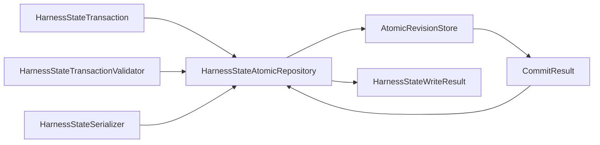

# Development persistence

## Purpose

Harness persistence is lossless, revisioned storage of the same complete repository-derived `HarnessState`. Repository sources remain authoritative. Persistence provides reconstruction and concurrency control; it does not define another domain aggregate or authorize development work. The shared storage boundary is defined by [shared revision persistence](../persistence/index.md).

## Domain contract

| Object | Responsibility |
|---|---|
| `HarnessStateIdentity` | Identity of the complete normalized aggregate derived from repository sources and normalization versions, excluding authority-ledger and operation identities |
| `HarnessStateSnapshot` | One consistently selected complete revision |
| `HarnessStateTransaction` | Expected revision plus one complete candidate successor and binding identities |
| `HarnessStateWriteResult` | Domain outcome mapped from the closed generic commit result without weakening aggregate closure |
| `HarnessStateSerializer` | Aggregate to or from the domain's versioned wire representation |
| `HarnessStateTransactionValidator` | Validate the exact transaction, candidate identity, revision, and aggregate closure |
| `HarnessStateRepository` | Domain-owned structural repository protocol |
| `HarnessStateAtomicRepository` | Concrete repository composed with the shared store, serializer, and validator |

A round trip must preserve every normalized value, relationship, ordering rule, and source-provenance identity required by the aggregate contract, including the canonically ordered sequence of every immutable `DevelopmentDecision` variant/revision and its predecessor/supersession history. Storage layout and physical bytes need not be equal unless the later wire contract requires canonical bytes.

## Composed repository

`HarnessStateAtomicRepository` is not a passive DAO. It invokes the exact `HarnessStateTransactionValidator` and `HarnessStateSerializer`, binds their subject and bytes to the candidate aggregate, identities, expected revision, and idempotency identity, and only then submits one complete opaque revision. Detached validation cannot validate different bytes or another candidate. The shared store sees only identities and immutable payload bytes.

The repository performs domain transaction-to-bytes/identity binding and preserves aggregate-specific commit closure. `AtomicRevisionStore` performs compare-and-swap, idempotency, durable identity/content closure, atomic single-stream commit, consistent reads, and generic committed/conflict/indeterminate/error outcome handling. Conflicts are never merged silently, and an indeterminate outcome is never guessed.

The repository does not choose authority, normalize repository sources, interpret a human response, create a `DevelopmentDecision`, run unrelated domain validators, project views, or repair a successor. Authority-context, authorization-result, requested-operation, and permitted-path identities neither change `HarnessStateIdentity` nor enter the aggregate merely because an authorized operation persists it.

## Storage selection and separation

The initial concrete store is prospective `SQLiteAtomicRevisionStore`, implemented with Python standard-library `sqlite3` and explicit constructor configuration. There is no `HarnessStateSQLiteRepository`; the domain repository composes the shared store structurally.

The development `HarnessState` store/database is separate by default from the scientific `WorkflowRun` store/database. Shared implementation does not imply shared physical storage or cross-stream transactions.

`DevelopmentAuthorityLedger` and `DevelopmentOperationAuthorizationResult` remain separate protected control-plane state and operation evidence with their own identities, authentication/content-verification, and reconstruction requirements. Ordinary shared SQLite revision storage is not selected as its trusted persistence. Immutable projection generations, current-generation pointer publication, recovery markers, and quarantine records are also separate derived publication state and never `HarnessState` revisions or reconstruction sources.

Conflicting revisions fail closed and are never merged silently. V1 Task status values remain migration inputs and historical evidence; they are not copied into a new lifecycle vocabulary. If a later migration is selected, it must be explicit and deterministic and retain input identity, output identity, and findings without implicitly changing selection, authority, or acceptance.

Persisted harness state excludes credentials, private keys, unrestricted environment content, and external scientific payloads. Cross-plane references use immutable identities rather than shared mutable rows.

## Deferred issues

- Exact HarnessState wire schema and whether canonical bytes are required.
- Exact SQLite schema, connection lifetime, locking/isolation/busy behavior, and failure encoding.
- Backup, recovery, retention, compaction, and maximum aggregate size.
- Protected `DevelopmentAuthorityLedger` storage, signing, and transport mechanisms.

No migration class, integrity-verifier class, public SQLite configuration/initializer hierarchy, domain SQLite subclass, or extra persistence module split is selected. This prospective contract claims no implementation, software verification, protected authority, or human acceptance.
