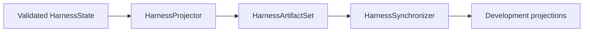

# Development projections

## Purpose

A development projection is a deterministic read-only view derived from validated `DevelopmentState` or compiled `HarnessState`. It supports inspection, documentation, queries, and recovery checks without becoming authority.

The [compiler architecture](compiler-architecture.md) defines loading, compilation, candidate validation, synchronization, and comparison.

## Formats

Development projections may include:

- SQLite read models;
- deterministic SQL exports;
- Task and decision indexes;
- dependency graphs;
- generated harness views outside `docs/`; and
- projection manifests.

Human-authored files under `docs/` are not projections.

## Publication

Each `HarnessArtifact` declares destination, projection kind, format version, generating state identity, content identity, and comparison semantics. One `HarnessArtifactSet` declares complete path closure before publication.

The synchronizer stages and validates the complete set, closes mutable resources, replaces its owned destinations within a rollback boundary, and removes stale projector-owned artifacts. It never owns unrelated files.

Maintained SQLite is immutable after publication. WAL, SHM, and journal files belong only to temporary runtime copies.

## Comparison

`HarnessStateComparator` reports missing, unexpected, byte-different, semantically different, and version-incompatible views. Exact-byte comparison is used only for formats with a canonical-byte contract. Comparison never repairs drift.

A projection cannot activate a Task, resolve a decision, grant capability, or override authoritative development state.

## Unresolved issues

- Which projection formats remain necessary after human-authored documentation is fully separated from generated views.
- Final destination for generated Task inspection pages.
- Whether SQLite requires semantic-only or canonical-byte comparison.
- Projection retention policy across development-state revisions.
- Whether a query API replaces some maintained file projections.
