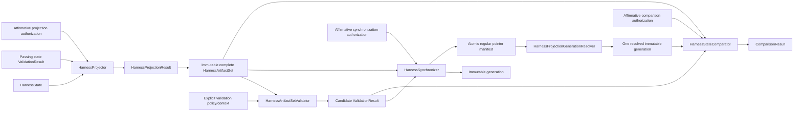

# Development projections

## Purpose

A development projection is a deterministic read-only view derived only from a validated `HarnessState`, the complete repository-derived aggregate. It supports inspection, queries, and recovery checks without becoming authority. Human-authored files under `docs/` are not projections.

The [compiler architecture](compiler-architecture.md) defines loading, compilation, the complete object/result contracts, candidate validation, generation publication, resolution, synchronization, and comparison.

## Formats and candidate validation

Development projections may include SQLite read models, deterministic SQL exports, Task and decision indexes, dependency graphs, generated harness views outside `docs/`, and projection manifests.

Each `HarnessArtifact` declares destination, projection kind, format version, generating-state identity, content identity, and comparison semantics. One immutable `HarnessArtifactSet` and its manifest declare complete path and content closure before candidate validation. `HarnessArtifactSetValidator` consumes that complete target plus explicit applicable `HarnessArtifactValidationPolicy` and `HarnessArtifactValidationContext`. Its normative `ValidationResult` covers only post-projection root confinement/destination uniqueness, manifest closure, supported versions, declared-versus-observed content identity, structured relational integrity, deterministic SQL where applicable, closed mutable resources, forbidden SQLite WAL/SHM/journal sidecars, and generating-state identity agreement.

Source-owned destination policy and normalized-state invariants remain with `HarnessStateValidator`. The synchronizer and comparator require a passing candidate result whose candidate, manifest, policy, context, validator, and rule-version identities match exactly plus exact affirmative authorization for their respective operation. They verify identity bindings and target-specific preconditions but do not silently validate, reinterpret authority policy, or repair. Denied, erroneous, incomplete, mismatched, or non-passing input produces the target operation's represented blocked outcome and no write or comparison.

## Immutable-generation publication

A synchronizer with exact passing candidate validation, exact affirmative synchronization authorization, matching identities, and satisfied publication preconditions preflights a supported local filesystem, stages the complete candidate as a new immutable generation directory on that same filesystem, verifies the staged set through `HarnessArtifactSetValidator`, closes mutable resources, durably prepares its files and directories under the selected filesystem contract, seals a closed generation manifest, and atomically replaces one small regular current-generation pointer manifest. Symlinks are neither required nor assumed.

The generation manifest identifies the generation, candidate set and artifact manifest, complete content closure, generating `HarnessStateIdentity`, predecessor generation, lifecycle status, and projection/format versions. Lifecycle is closed: `staging` is represented only in synchronization/recovery state and is unreadable; `closed` is immutable and reader-eligible; `quarantined` and `corrupt` are fail-closed recovery dispositions. The pointer carries pointer identity/revision, target identity, exact closed generation and manifest/content identities, predecessor pointer identity, and pointer format version. Projection generations and publication recovery records do not replace or enter `HarnessState` persistence.

Failure before pointer replacement leaves the old generation current and writes a `HarnessProjectionRecoveryRecord` marker or quarantines the orphan/incomplete/corrupt candidate under explicit policy. That record identifies the observed phase/state, failure, candidate/generation identities when known, and marker/quarantine location, but grants no repair or deletion authority. Successful pointer replacement makes the complete new generation current. An ambiguous commit is reconciled by rereading the pointer and checking the exact generation identity. Rollback is a separately represented pointer switch to a retained validated generation, never multi-file restoration.

The supported boundary is same-filesystem atomic replacement of the regular pointer file plus explicitly supplied file/directory durability guarantees. Unsupported or network filesystem semantics fail preflight. A future separately selected adapter may establish another boundary; this architecture does not claim universal atomicity. Generation retention and garbage collection remain explicit later policy and confer no deletion authority.

## Reader and comparison behavior

`HarnessProjectionGenerationResolver` receives an explicit target and resolver policy/context and returns closed `HarnessProjectionGenerationResolutionResult`: only `resolved` contains one closed immutable generation and its pointer/generation/manifest/content identities; `rejected` contains identified failures and no artifacts. It reads the current pointer once, validates pointer identity and format, and reads only the named immutable generation after validating generation identity, lifecycle, versions, manifest closure, and content identities. Missing, malformed, non-closed, corrupt, unsupported, or identity-mismatched pointer/generation state fails closed. Readers never discover a latest directory, fall back ambiently, or mix files across generations.

`HarnessStateComparator` compares the validated complete candidate with one resolved immutable generation. It reports missing, unexpected, byte-different, semantically different, and version-incompatible views. Exact-byte comparison applies only to formats with a canonical-byte contract. Comparison never repairs drift.

A projection cannot activate a Task, resolve a decision, grant capability, or override authoritative development state.

## Target-operation preconditions

`HarnessProjector`, `HarnessStateComparator`, and `HarnessSynchronizer` each consume exact applicable validation and authorization outcomes, verify that those outcomes bind the supplied state, candidate, operation, revisions, authority context, and permitted paths, and evaluate only their own target-specific preconditions. They do not rerun validation, reconstruct authority, reinterpret validation or authorization policy, or broaden scope.

`HarnessProjector` returns closed `HarnessProjectionResult`: `projected` contains one complete immutable `HarnessArtifactSet`; `blocked` contains no candidate and performs no projection. `HarnessStateComparator` and `HarnessSynchronizer` use their existing operation-specific results to represent blocked input without comparison, staging, or writing. A private domain helper may implement repeated binding checks but owns no public policy, result, authority, or retained state.

These target checks are not repository-promotion gates. Only `PromotionEligibilityEvaluator` determines mechanical repository-promotion eligibility, and separate promotion authorization remains required.

## Unresolved issues

- Which projection formats remain necessary after human-authored documentation is fully separated from generated views.
- Final destination for generated Task inspection pages.
- Whether SQLite requires semantic-only or canonical-byte comparison.
- Concrete supported-filesystem/durability adapter matrix.
- Generation retention and garbage-collection policy.
- Whether a query API replaces some maintained file projections.
