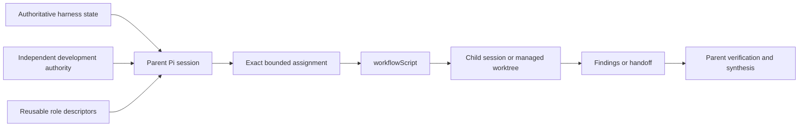

# Pi subagent boundary

## Responsibility

Pi owns child-session construction, `workflowScript` execution, runtime supervision, managed-worktree mechanics, and runtime artifacts. The project owns reusable role descriptors, exact assignments, repository authority, path ownership, acceptance requirements, and interpretation of returned work.

A role, run, mission, receipt, gate result, review, or handoff does not select or authorize a `HarnessTask`, resolve a human decision, authorize a protected action, establish acceptance, or mutate `HarnessState`.

## Descriptors and assignments

A project descriptor defines reusable role behavior and a capability ceiling. It may define a tool allowlist, selected skills, and an acceptance role, but it contains no mutable Task scope, current selection, owned paths, one-run instructions, or ambient authority.

The parent reconstructs the applicable repository state and authority before delegation. Its explicit assignment identifies the goal, subject revision or workspace, permitted paths and operations, success criteria, validation, output, and stop conditions. An assignment may narrow existing authority but cannot expand it. Fresh-context review inspects authoritative files and exact diffs rather than relying on a writer's reasoning.

## Execution and ownership

All child orchestration uses `workflowScript`, whether it launches one child, a sequence, or bounded parallel work. Pi runtime lifecycle is separate from harness lifecycle.

One writer owns one checkout or worktree at a time. Concurrent writers require distinct managed worktrees and non-overlapping path ownership. The parent does not edit a worktree while an asynchronous child writer owns it. Read-only reviewers do not mutate the reviewed scope.

Ordinary children do not delegate further. Only an explicitly configured bounded fanout role may do so within its assigned capability and nesting limit.

## Handoffs and review

A mutation-capable child returns a verifiable handoff identifying its assignment, workspace, base and resulting state, changed paths, validation, and unresolved findings. Managed-worktree output also identifies the applicable durable patch and cleanup artifacts. The parent verifies the handoff against authoritative repository state before integration.

A reviewer returns findings against an exact subject and remains read-only. Reviewer agreement does not provide authority, acceptance, or permission to integrate. The parent owns consolidated disposition, any permitted correction pass, final verification, and escalation of unresolved human-owned decisions.

## Runtime state and retention

Pi may retain run status, events, output, sessions, missions, receipts, and managed-worktree artifacts for observation and recovery. The harness may reference immutable runtime-artifact identities as evidence, but it never imports Pi lifecycle state as development authority.

Retained runtime data excludes credentials, private keys, scheduler secrets, restricted scientific data, and unnecessary environment content. External transmission, destructive cleanup, dependency changes, protected execution, and release actions remain separately governed. Recovery never silently resumes stopped work, discards a preserved worktree, or treats a completed child run as accepted work.

## V1 relationship and status

Architecture v1 records the implemented project descriptors, Pi runtime boundary, orchestration, ownership, and artifact behavior under [`v1/harness/subagents/`](../../v1/harness/subagents/index.md). The [migration crosswalk](../../migration/v1-to-v2/pi-harness-subagents.md) preserves their disposition. This v2 page consolidates the prospective project boundary without reimplementing or duplicating Pi runtime documentation.

This architecture introduces no new subagent runtime, launcher abstraction, chain language, Task-context public object, Task-closure model, or authority mechanism. Exact long-term retention policy for nonessential Pi runtime artifacts remains deferred.
