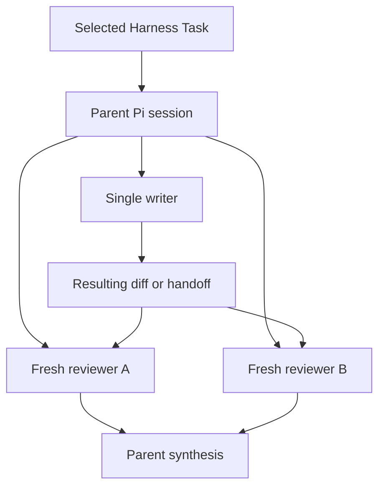

# Pi subagent delegation and ownership

## Minimal delegation

Ordinary single-agent work requires no fabricated assignment object or ownership manifest. The selected Harness Task and parent session remain sufficient when one writer owns the current checkout.

Durable ownership is required when:

- multiple agents write concurrently;
- implementation and independent verification ownership must be separated;
- the selected Task explicitly requires a manifest; or
- path ownership would otherwise conflict.

## Ownership invariants

- One writer owns one checkout or worktree at a time.
- Concurrent writers use separate worktrees and non-overlapping path assignments.
- A reviewer is read-only with respect to the reviewed scope.
- A parent does not edit the same active worktree while an asynchronous child writer is mutating it.
- Child assignments identify the exact Task, workspace, starting revision, owned paths, and expected output.
- Ownership validates structural separation only; it does not activate work or establish correctness.

## Isolated writers

When intentionally parallel writers are justified, each receives a managed worktree and a distinct ownership lane. The parent consumes each durable handoff separately and verifies it against current authoritative repository state before integration.

Parallelism should normally apply to inspection, research, review, and validation rather than writes. A broad task is split into serial milestones when path ownership cannot be made genuinely independent.

## Cross-project delegation

A child targeting another repository receives an explicit `cwd`, repository identity, authority boundary, and durable output location. Several repositories may run concurrently only when each has independent ownership. Merge, publication, and release decisions remain serial and project-owned.

## Unresolved issues

- Whether ownership manifests should reference Pi run identities before launch or be correlated afterward.
- Exact integration procedure for multiple managed-worktree handoffs.
- Whether read-only reviewers need declared path ownership or only an exact review subject.
- Retention period for abandoned or partially preserved worktrees.
- Conditions under which parent-side edits may resume after an interrupted writer.
