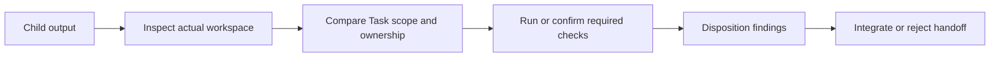

# Pi subagent handoffs and review

## Writer result

A mutation-capable child returns a concise handoff identifying:

- selected Task and assignment;
- agent role and Pi run identity when available;
- workspace and starting revision;
- resulting revision or uncommitted state;
- owned and changed paths;
- commands run and observed results;
- validation evidence;
- unresolved findings, risks, and decisions; and
- activation and successor state preserved by the work.

A managed-worktree handoff also identifies durable patch and cleanup artifacts. The parent verifies the handoff against the workspace and authoritative repository state rather than trusting prose alone.

## Review result

A read-only reviewer returns:

- exact Task, revision, paths, and evidence reviewed;
- concrete findings with severity and file or line references;
- validation observed or independently rerun;
- public-contract and authority-boundary assessment; and
- residual limitations.

Review findings are advisory evidence. The parent synthesizes overlapping or conflicting findings and decides which deterministic corrections are in scope. A reviewer does not edit the subject, resolve human-owned decisions, close the Task, or provide human acceptance.

## Parent verification

The parent confirms changed paths, diff content, starting and resulting revisions, required checks, unrelated changes, and residual risks. A child-reported successful command is evidence; a host gate or parent rerun is required when the acceptance contract demands independent runtime verification.

## Correction bound

The ordinary managed flow permits one consolidated correction pass after consolidated independent review. If material disagreement or an unapproved architecture, scope, dependency, scientific, or protected-action choice remains, the parent stops and escalates rather than creating an unbounded child loop.

## No Task closure authority

A child handoff or clean review does not itself create `HarnessTaskClosure`. The parent may submit verified facts to the Task closure evaluation after reconciling the final repository state. Human acceptance remains separate when required.

## Unresolved issues

- Canonical minimum handoff fields for unmanaged versus managed workspaces.
- Whether review finding codes need a project-wide vocabulary.
- When child-reported validation must be rerun by the parent or a host gate.
- Durable representation of reviewer disagreement and parent disposition.
- Retention policy for superseded handoffs after correction.
