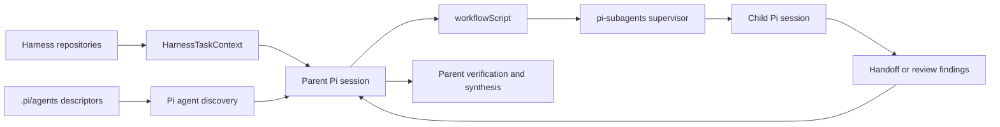

# Pi harness subagent architecture

## Purpose

The V2 agent architecture governs project-specific Pi subagents used to implement, document, test, inspect, and review selected Harness Tasks. It is an integration architecture over Pi and the `pi-subagents` extension, not a general-purpose agent framework and not a Python package under `ksdft2effmass`.

The parent session owns orchestration and remains responsible for reconciling child output with authoritative repository state. A subagent role, run, mission, receipt, passing gate, or handoff does not activate a Harness Task, resolve a human decision, close work, or provide human acceptance.

## Architecture map

- [Agent descriptors](agent-descriptors.md)
- [Parent orchestration](parent-orchestration.md)
- [Delegation and ownership](delegation-and-ownership.md)
- [Execution and isolation](execution-and-isolation.md)
- [Handoffs and review](handoffs-and-review.md)
- [Runtime state and artifacts](runtime-state-and-artifacts.md)

## Core rules

- The parent reconstructs the selected Harness Task before delegation.
- The parent calls subagents only through discovered executable, non-disabled agent descriptors.
- `workflowScript` is the execution surface for one child, sequences, and parallel fanout.
- One writer owns one checkout or worktree at a time.
- Parallel writers require separate worktrees and non-overlapping ownership.
- Reviewers are read-only with respect to the reviewed scope.
- Ordinary children do not orchestrate further children.
- Child output is provisional evidence; the parent verifies it before integration or reporting.
- Pi runtime lifecycle state is not Harness Task lifecycle state.

## Existing V1 relationship

Project roles already exist under `.pi/agents/`, and Pi supplies discovery, child sessions, workflow execution, managed worktrees, artifacts, supervision, and control. Architecture v2 narrows and documents how those capabilities relate to Harness Tasks. It does not claim that Pi runtime implementation belongs to this repository.

## Unresolved issues

- Exact descriptor families retained after legacy task-specific roles are removed.
- Whether descriptor validation belongs in harness resource validation or a dedicated Pi-integration validator.
- Which delegated runs require durable missions rather than ordinary runtime artifacts.
- Retention policy for Pi run and handoff artifacts.
- Whether a small project-local launcher profile is needed beyond direct `workflowScript` use.
