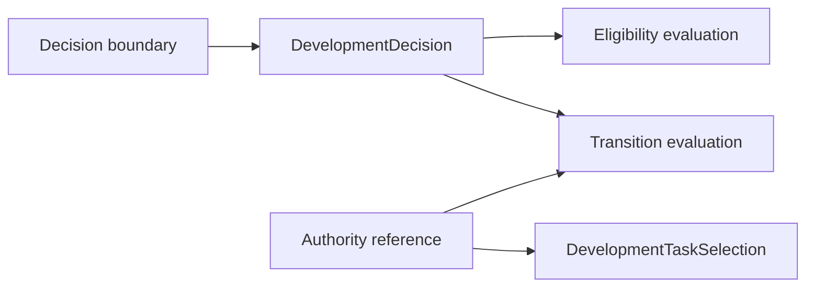

# Harness Task decisions and authority

## Boundary

Human-owned decisions and development authority are referenced by Task lifecycle records; they are not embedded as mutable fields in `HarnessTask`.

A decision record identifies its boundary, exact human response where required, normalized disposition, affected Task or transition, and durable provenance. An unresolved decision blocks only the affected operation.

## Authority rules

- Capability describes what an implementation can do; it grants no authority.
- Eligibility describes whether preconditions are represented as satisfied; it grants no authority.
- Selection records development authority for one exact Task revision and scope.
- Protected repository, dependency, release, and publication actions require their applicable explicit authority.
- Silence, elapsed time, passing checks, reviewer agreement, Task ordering, and projection state are not decisions.
- A checkpoint cannot activate work or expand scope beyond its controlling Task.

## Operations

| ActionObject | Responsibility |
|---|---|
| `DevelopmentDecisionValidator` | Validate intrinsic and supplied cross-reference contracts |
| `HarnessTaskAuthorityEvaluator` | Evaluate whether represented authority covers a requested Task operation |
| `DevelopmentDecisionResolver` | Normalize an explicit human response under the applicable decision contract |

These operations return structured ResultObjects and preserve exact input identities. Human-owned meaning is not inferred from agent agreement.

## Unresolved issues

- Exact relationship between generic decision records and checkpoint wire formats.
- Whether authority references are separate records or typed decision references.
- Representation of authority expiry, revocation, or scope narrowing.
- Which routine transitions require no separate human authority beyond active selection.
- Whether acceptance uses the same decision contract or a dedicated acceptance record.
