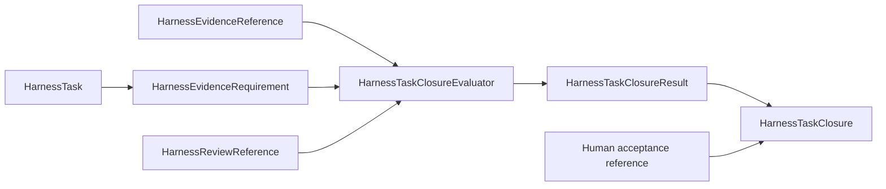

# Harness Task evidence and review

## Evidence references

A Task definition states evidence and review requirements. Runtime records reference immutable evidence and review outcomes; they do not embed mutable test execution state.

## Evidence classes

The architecture preserves separate meanings for:

- software verification;
- numerical verification;
- scientific validation;
- uncertainty quantification;
- independent review; and
- human acceptance.

A Task requests only the classes applicable to its claims and process class. Passing software checks does not establish scientific correctness, and review does not provide human acceptance.

## Closure evaluation

`HarnessTaskClosureEvaluator` receives an exact Task revision, selection, evidence references, review references, decisions, and proposed disposition. It returns `HarnessTaskClosureResult` with requirement-by-requirement findings.

For a proposed `completed` disposition, the evaluator may establish structural satisfaction of documented completion requirements. It does not rerun evidence producers, reinterpret scientific evidence, or manufacture acceptance.

## Review boundary

A `HarnessReviewReference` identifies an immutable review subject, reviewer role, findings, and disposition. Reviewers remain read-only with respect to the reviewed scope. A permitted correction attempt is represented separately and does not overwrite the original review.

## Unresolved issues

- Exact evidence-reference identity and integrity fields.
- Representation of waived requirements and who may authorize a waiver.
- Whether closure records can be revised or only superseded.
- How one consolidated correction pass is represented.
- Exact separation between development acceptance and protected-action authorization.
