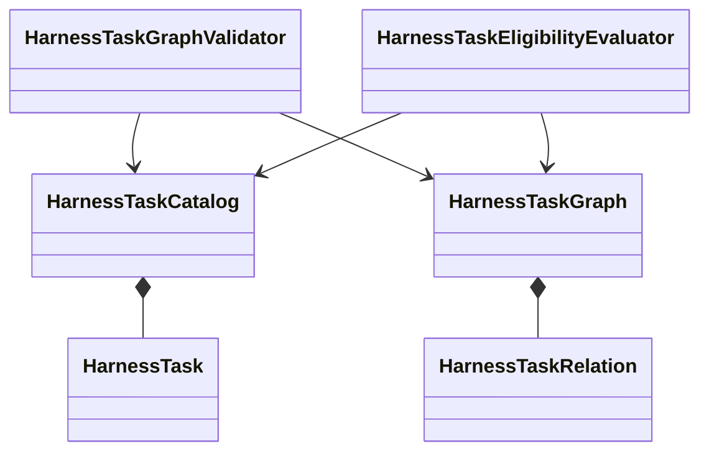

# Harness Task graph and dependencies

## Graph model

`HarnessTaskGraph` is an immutable DataObject containing typed relations among exact Task identities or revisions. It does not select work or perform transitions.

## Relation vocabulary

The initial closed relation candidates are:

| Relation | Meaning |
|---|---|
| `parent` | Structural decomposition or coordinating parent |
| `prerequisite` | Required prior state or accepted disposition |
| `supersedes` | New definition replaces an earlier definition for future selection |
| `successor` | Recommended or ordered continuation without activation authority |

Relations must not overload structural grouping, eligibility, and authority. Parentage does not imply a prerequisite. Successorship does not activate work.

## Validation

`HarnessTaskGraphValidator` checks, at minimum:

- referenced Task identities exist;
- relation types are closed and valid;
- duplicate relations are absent;
- prerequisite and supersession cycles are rejected where forbidden;
- revision references obey the selected version policy; and
- graph structure does not imply unauthorized automatic activation.

`HarnessTaskGraphValidationResult` contains structured findings only. A passing result establishes structural conformance, not Task eligibility, completion, or acceptance.

## Unresolved issues

- Whether relations target stable Task identities or exact revisions by relation type.
- Whether parent and successor relations are required in the authoritative graph.
- Cycle rules for structural parent relations.
- Representation of external prerequisites outside the Task catalog.
- Compatibility with the current split between Task-local references and `harness/task-graph.json`.
