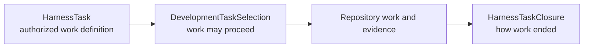

# Harness Task lifecycle

## No general state machine

Architecture v2 does not assign a mutable lifecycle status to `HarnessTask`. Development phases such as implementation, verification, review, and correction are procedural actions required when applicable; they are not authoritative Task states.

Three records are sufficient:



## HarnessTaskClosure

One immutable closure terminates one exact selection. Its disposition is:

| Disposition | Meaning |
|---|---|
| `completed` | Completion criteria are represented as satisfied |
| `deferred` | Work intentionally stops pending an explicit condition or decision |
| `superseded` | A replacement Task definition governs any future work |
| `cancelled` | Authority explicitly ends the work without completion |

A closure records the Task and selection identities, resulting revision or workspace state, concise disposition, required evidence references, unresolved findings, and an acceptance reference only when acceptance is separately required and available.

## Derived state

Eligibility, active selection, prerequisite satisfaction, completion, acceptance, and suggested continuation are derived by read-only inspectors. They are not copied into a mutable status field.

```text
selected + no closure = authorized work
closure exists = stop
missing or conflicting authority = report and stop
```

A blocker is a finding explaining why work cannot continue. It becomes a durable `deferred` closure only when an explicit deferral is required. Ordinary failed checks and correction work do not create lifecycle transitions.

## Agent behavior

An agent reads `HarnessTaskContext`, performs work within the exact selection, and returns evidence or findings. It does not move through persisted implementation, verification, or review phases. The parent creates or records closure only after reconciling final repository state and applicable evidence.

## V1 migration

The current V1 `status` field is opaque lifecycle text containing historical and project-specific values. Migration interprets it as legacy input and retained history; it does not promote that vocabulary into the V2 contract.

## Unresolved issues

- Exact `HarnessTaskClosure` wire fields and content identity.
- Whether one selection may be replaced without first recording closure.
- Authority required for deferred, superseded, and cancelled dispositions.
- Representation of completion pending separately required human acceptance.
- Migration mapping for current opaque V1 status values.
