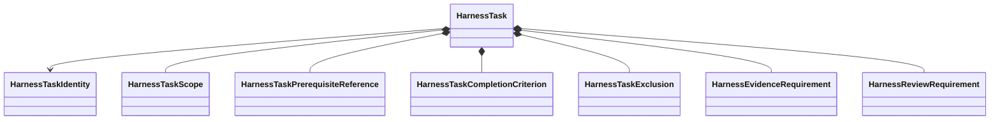

# Harness Task definition

## HarnessTask

`HarnessTask` is an immutable DataObject defining one bounded development outcome. It describes permitted work and completion obligations without recording execution or lifecycle state.

## Fields and intrinsic invariants

A Task definition contains:

- stable Task identity and definition revision;
- title and objective;
- authorized paths and operation classes;
- prerequisite references;
- completion criteria;
- explicit exclusions;
- required evidence classes;
- review requirements;
- whether explicit activation is required; and
- optional relation references whose meaning is defined by the Task graph.

A Task owns only intrinsic invariants among its fields, such as nonempty identity, unique normalized path references, and absence of contradictory inclusion and exclusion entries. Eligibility, repository existence, graph consistency, evidence satisfaction, and authority are cross-object concerns.

## Excluded state

`HarnessTask` contains no:

- active, blocked, deferred, completed, or accepted state;
- attempt or execution logs;
- repository client or runtime process;
- mutable evidence or review result;
- embedded human decision;
- scientific workflow marking;
- calculator observation; or
- automatic activation behavior.

## Operations

| ActionObject | Responsibility |
|---|---|
| `HarnessTaskValidator` | Validate one Task plus explicitly supplied cross-record context |
| `HarnessTaskSerializer` | Own versioned wire fields and deterministic serialization |
| `HarnessTaskDefinitionComparator` | Compare exact Task revisions without choosing authority |

`HarnessTaskValidationResult` and comparison results are immutable ResultObjects containing structured findings.

## Unresolved issues

- Exact public field names and scalar contracts.
- Whether authorized paths and authorized operation classes are separate records.
- Whether successor references belong in Task definitions or exclusively in `HarnessTaskGraph`.
- Canonical Task-definition identity and revision-generation strategy.
- Wire compatibility with schema-version-3 Task JSON.
