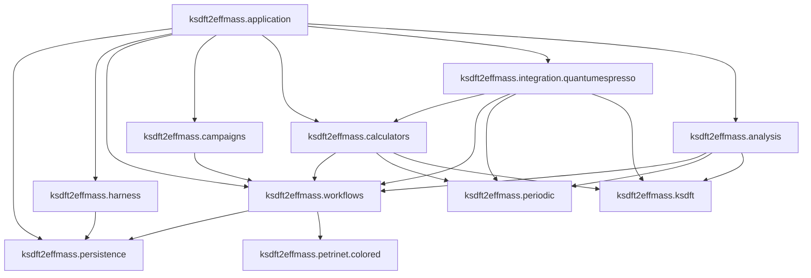

# Architecture v2

Architecture v2 is the normative prospective architecture for deterministic scientific operations and their supporting development lifecycle. Architecture v1 remains implemented; the migration page alone owns cross-version status.

## System overview

The reverse `petrinet.colored → workflows` dependency is forbidden.

## Components

| Component | Subpackage | Responsibility |
|---|---|---|
| Application composition | `ksdft2effmass.application` | Assembles explicit immutable definitions, Tasks, executors, analyzers, stores, repositories, and configuration |
| Shared revision persistence | `ksdft2effmass.persistence` | Owns opaque immutable revision storage and the standard-library SQLite realization, not domain repository meaning |
| Development harness | `ksdft2effmass.harness` | Governs software-development work independently of scientific Workflow state |
| Scientific workflow | `ksdft2effmass.workflows` | Owns ResultObject/Task/Workflow contracts, TaskStartGateSet, discriminated TaskActivation, adapter, replayable WorkflowRun, dispatch envelopes, result ingress, and control |
| Generic colored Petri net | `ksdft2effmass.petrinet.colored` | Owns generic colors, places, transitions, markings, deterministic selection, and pure firing |
| Project composition definitions | `ksdft2effmass.campaigns` | Supplies project-specific composition inputs without owning generic workflow semantics |
| Calculator contracts | `ksdft2effmass.calculators` | Owns project-facing SimulationTasks, Simulation composites, immutable exact inputs/outputs, executable configuration, process records, and consumer-owned executor protocols |
| Quantum ESPRESSO integration | `ksdft2effmass.integration.quantumespresso` | Owns concrete QE serialization, staging, workspace/process invocation, mechanical capture, artifact discovery, native parsing, failure mapping, and observation adaptation |
| Scientific observations | `ksdft2effmass.periodic`, `.ksdft` | Owns neutral geometry and Kohn–Sham observation invariants |
| Scientific analysis | `ksdft2effmass.analysis` | Owns deterministic algorithms, tolerances, and numerical policy |

## Selected scientific model

`ResultObject` is an immutable workflow-facing category. `Task` consumes already-bound ResultObjects and explicit operation context and returns ResultObjects. `Workflow` implements Task and may be nested. Run-scoped Task instances, Workflow-owned `TaskStartGateSet` (`any_of` or `all_of`), and immutable discriminated `TaskActivation` are distinct. No/empty gates mean no automatic activation; direct invocation records no gate identities. `any_of` selects one gate by stable priority then identity; `all_of` selects the canonical compatible complete tuple. Parent/child membership and ResultObject dependency are orthogonal.

`ColoredPetriNetWorkflowAdapter` maps Workflow gates and supplied values to the generic package, constructs TaskActivation only for Task-origin work, and remains effect-free while workflow control/dispatch invokes Tasks through accepted authority. For no-Task scientific-decision ingress it only maps a supplied `ScientificDecisionResolution` for the exact request-identified transition/binding. Pure generic firing evaluates output inscriptions, validates produced tokens, and returns successor plus audit facts; workflow control constructs task-origin records and `ScientificDecisionRecorder` constructs scientific-decision-origin records.

`Simulation` is structural. Calculator-owned `QuantumEspressoSimulationTask` contains or uses the `QuantumEspressoSimulation` input/executor/output composite. `QuantumEspressoInput` identifies exact native input and pseudopotential artifacts, the consumer-owned structural `QuantumEspressoExecutor` protocol defines the required target-first effect, and application composition injects its concrete `integration.quantumespresso` implementation. `QuantumEspressoOutput` is the calculator-owned immutable ResultObject returned by `QuantumEspressoSimulationTask`, with mechanical output/provenance identities and no convergence or acceptance claim. Confirmed `SimulationDispatchOutcome` is its correlation envelope, and `TaskResultIngester` admits that exact object; no separate execution-result object exists.

## Preserved control contracts

- One exact grant authorizes one exact dispatch; retry requires new operation, activation, request, attempt, and grant identities.
- Workflow control and the executor boundary independently check the same immutable authority and dispatch inputs.
- WorkflowRun uses exact initial/current marking snapshots plus canonical ordered transition records and explicit Task/activation/attempt/request/failure/result/dependency/authority/outcome/obligation/decision records; each transition has exactly one `task` or `scientific_decision` origin, and deterministic replay of the common ordered history must equal current state.
- Domain repositories bind their exact validators and serializers to supplied WorkflowRun successors and obligations; the shared store commits one complete opaque revision atomically in one stream. Neither selects gates, invokes Tasks, fires generic transitions, computes policy, or creates authority; replay-computation ownership remains unresolved.
- Confirmed, rejected, and indeterminate outcomes remain distinct; uncertainty is never guessed to be success.
- Confirmed result ingress atomically includes obligation disposition and every required publication obligation or explicit no-publication disposition.
- Scientific analysis and disposition remain separate, and disposition remains separately authorized.
- Existing external, retained, authored, and bounded legacy artifacts retain actual provenance without fabricated Task lineage or recalculation.
- Passing checks, process success, and terminal markings do not imply scientific or human acceptance.

## Architecture map

### Development harness

- [Overview](harness/index.md)
- [Object model](harness/object-model.md)
- [Development Task model](harness/development-harness.md)
- [Compiler architecture](harness/compiler-architecture.md)
- [Normalized-state validation](harness/validation.md)
- [Repository-wide development conformance](harness/conformance.md)
- [Control plane](harness/control-plane.md)
- [Persistence](harness/persistence.md)
- [Projections](harness/projections.md)
- [Pi subagent boundary](harness/subagents.md)

### Scientific workflow and generic semantics

- [Workflow overview](workflow/index.md)
- [Task, Workflow, and colored-Petri-net adapter](workflow/task-and-colored-petri-net-adapter.md)
- [Generic colored Petri net](petrinet/colored.md)
- [WorkflowRun object model](workflow/workflow-run.md)
- [Simulation Task model](workflow/simulation-task-model.md)
- [Control plane](workflow/control-plane.md)
- [Persistence](workflow/persistence.md)
- [Artifact and provenance model](workflow/artifact-and-provenance-model.md)
- [Read models](workflow/read-models.md)

### Calculators, analysis, and composition

- [Calculator architecture](calculators/index.md)
- [Quantum ESPRESSO](calculators/quantum-espresso.md)
- [Scientific analysis architecture](analysis/index.md)
- [Analysis and disposition](analysis/analysis-and-disposition.md)
- [Application composition root](composition-root.md)
- [Repository layout and dependency direction](repository-layout.md)

### Shared contracts

- [Shared revision persistence](persistence/index.md)
- [Human decisions](human-decisions.md)
- [Architecture principles](principles.md)
- [Identity, version, and failure contracts](identity-version-and-failure-contracts.md)
- [Separation of harness and workflow](separation-of-harness-and-workflow.md)

## Reading paths

### Whole system

1. [Architecture principles](principles.md)
2. [Repository layout](repository-layout.md)
3. [Shared revision persistence](persistence/index.md)
4. [Separation of harness and workflow](separation-of-harness-and-workflow.md)
5. [Human decisions](human-decisions.md)
6. [Application composition root](composition-root.md)

### Scientific execution

1. [Workflow overview](workflow/index.md)
2. [Generic colored Petri net](petrinet/colored.md)
3. [Task and adapter model](workflow/task-and-colored-petri-net-adapter.md)
4. [WorkflowRun object model](workflow/workflow-run.md)
5. [Simulation Task model](workflow/simulation-task-model.md)
6. [Quantum ESPRESSO](calculators/quantum-espresso.md)
7. [Analysis and disposition](analysis/analysis-and-disposition.md)

## Related versioned documentation

- [Architecture v1](../v1/index.md) describes the implemented snapshot.
- [Migration from v1 to v2](../migration/v1-to-v2/index.md) owns cutover comparisons.
- [Architecture v2 live issue register](issues/index.md) lists current material contradictions and missing contracts required for semantic closure.

## Open issues and claim boundary

The [live issue register](issues/index.md) is the sole list of the 11 current issues: selection identity (007); scientific authority grants (010); Workflow replay ownership (020); persistence commit, read, and reconciliation (021); scientific-decision trust, provenance, and correction (022); Task, nested Workflow, and simulation invocation (023); publication policy, store behavior, and reconciliation (024); scientific-disposition ownership and semantics (029); bounded conformance execution (030); durable harness-publication authority and outcome (032); and target-operation identity binding without policy reinterpretation (033). The register does not imply issue order, precedence, or an accepted outcome.

The selected prospective persistence architecture remains domain-neutral atomic revision storage with an initial standard-library SQLite realization and domain-owned composed repositories; exact wire and SQLite schemas remain deferred where they are not required for current semantic closure. [Human decisions](human-decisions.md) are explicit external inputs to two domain-separated, deterministically processed systems; their records grant no authority. The current filesystem is prospective and unimplemented. This is not implementation, software verification, numerical verification, calculation or recalculation, protected-execution authority, scientific validation, uncertainty quantification, equivalence, or human software acceptance.
