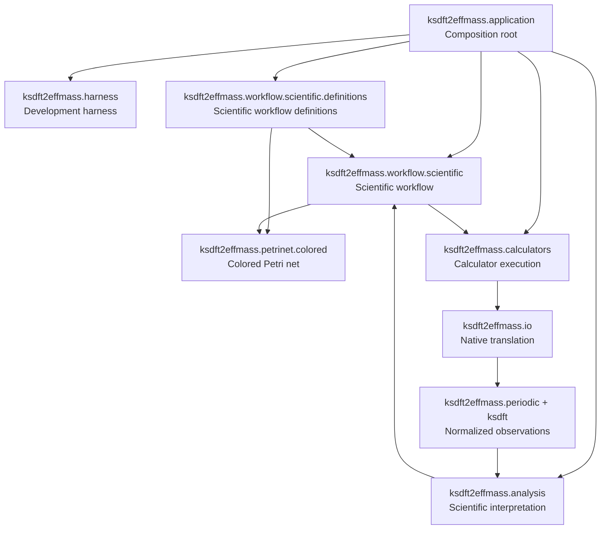

# Architecture v2

Architecture v2 is the normative target architecture for deterministic scientific operations and their supporting software-development lifecycle. Cross-version status and cutover conditions are maintained only in the migration crosswalk.

## System overview

## Components

| Component | Subpackage | Responsibility |
|---|---|---|
| Application composition | `ksdft2effmass.application` | Assembles explicit catalogs, executors, analyzers, stores, repositories, and configuration. |
| Development harness | `ksdft2effmass.harness` | Governs software-development work and changes to the scientific workflow. |
| Scientific workflow | `ksdft2effmass.workflow.scientific` | Defines scientific workflows, run state, and calculator/analysis coordination while referencing Petri-net contracts. |
| Colored Petri net | `ksdft2effmass.petrinet.colored` | Owns domain-independent colored-net definitions, markings, validation, enablement, and firing. |
| Scientific workflow definitions | `ksdft2effmass.workflow.scientific.definitions` | Defines project-specific scientific workflows, colored-net references, and simulation selections. |
| Calculator execution | `ksdft2effmass.calculators` | Performs bounded calculator-specific numerical effects and captures mechanical results. |
| Native translation | `ksdft2effmass.io` | Renders and parses calculator-native representations. |
| Scientific observations | `ksdft2effmass.periodic` and `ksdft2effmass.ksdft` | Represents calculator-independent geometry and Kohn–Sham observations. |
| Scientific analysis | `ksdft2effmass.analysis` | Interprets normalized observations under explicit algorithms and numerical policy. |

## Authority boundaries

- `HarnessTask` and `DevelopmentTaskSelection` govern development work only.
- `ScientificWorkflow` defines scientific workflow semantics and references versioned colored-net definitions and markings; it does not own their types or firing semantics.
- `ksdft2effmass.petrinet.colored` owns colored-Petri-net structure and execution semantics independently of scientific workflow.
- `Simulation` specifies an operation; `SimulationExecutionResult` records mechanical execution observations.
- Calculator execution, native parsing, observation normalization, scientific analysis, and scientific disposition have separate owners.
- `ScientificAnalysis` is deterministic interpretation. `ScientificDisposition` is a separately authorized conclusion for a declared intended use.
- Development and scientific state use separate control, persistence, and projection contracts.
- Passing checks, process success, and terminal CPN markings do not imply scientific or human acceptance.

See [Separation of harness and workflow](separation-of-harness-and-workflow.md) for the complete lifecycle boundary.

## Architecture map

### Development harness

The development harness compiles and validates explicit repository state, governs selected development work, evaluates repository-wide development conformance, persists authoritative development records, and publishes derived development views. Conformance is development-owned in composition, cross-cutting in scope, and delegated to authoritative domain contracts for meaning.

- [Overview](harness/index.md)
- [Object model](harness/object-model.md)
- [Harness Tasks architecture](harness/tasks/index.md)
- [Pi harness subagent architecture](harness/subagents/index.md)
- [Development Task model](harness/development-harness.md)
- [Compiler architecture](harness/compiler-architecture.md)
- [Snapshot validation](harness/validation.md)
- [Repository-wide development conformance](harness/conformance.md)
- [Control plane](harness/control-plane.md)
- [Persistence](harness/persistence.md)
- [Projections](harness/projections.md)

### Scientific workflow

The scientific workflow references and advances domain-independent colored-Petri-net state, correlates bounded calculator requests and results, persists run history, and exposes derived scientific read models.

- [Overview](workflow/index.md)
- [Scientific service model](workflow/service-model.md)
- [Simulation model](workflow/simulation-model.md)
- [Scientific workflow model](workflow/scientific/index.md)
- [ScientificWorkflowRun object model](workflow/scientific/scientific-workflow-run.md)
- [Control plane](workflow/control-plane.md)
- [Persistence](workflow/persistence.md)
- [Artifact and provenance model](workflow/artifact-and-provenance-model.md)
- [Read models](workflow/read-models.md)

### Colored Petri nets

The colored-Petri-net package owns generic represented net structure and pure state-transition semantics. It has no scientific-workflow or calculator dependency.

- [Petri-net architecture](petrinet/index.md)
- [Colored Petri net architecture](petrinet/colored/index.md)

### Calculator integrations

Calculator packages own typed payloads, executable configuration, staging, dispatch, process observation, completion contracts, and calculator-specific normalization adapters.

- [Calculator architecture](calculators/index.md)
- [Quantum ESPRESSO](calculators/quantum-espresso.md)

### Scientific analysis

Analysis packages own deterministic algorithms, units, tolerances, numerical policy, and findings. Disposition remains separately authorized.

- [Scientific analysis architecture](analysis/index.md)
- [Analysis and disposition](analysis/analysis-and-disposition.md)

### Application composition

The application layer assembles concrete implementations without taking ownership of their domain behavior.

- [Application composition root](composition-root.md)
- [Repository layout and dependency direction](repository-layout.md)

### Shared contracts

Cross-cutting contracts apply consistently across subsystem boundaries.

- [Architecture principles](principles.md)
- [Identity, version, and failure contracts](identity-version-and-failure-contracts.md)
- [Separation of harness and workflow](separation-of-harness-and-workflow.md)

## Reading paths

### Understand the whole system

1. [Architecture principles](principles.md)
2. [Separation of harness and workflow](separation-of-harness-and-workflow.md)
3. [Repository layout and dependency direction](repository-layout.md)
4. [Application composition root](composition-root.md)

### Understand development control

1. [Development harness overview](harness/index.md)
2. [Object model](harness/object-model.md)
3. [Harness Tasks architecture](harness/tasks/index.md)
4. [Pi harness subagent architecture](harness/subagents/index.md)
5. [Compiler architecture](harness/compiler-architecture.md)
6. [Snapshot validation](harness/validation.md)
7. [Repository-wide development conformance](harness/conformance.md)
8. [Control plane](harness/control-plane.md)
9. [Persistence](harness/persistence.md)
10. [Projections](harness/projections.md)

### Understand scientific execution

1. [Scientific workflow overview](workflow/index.md)
2. [Scientific service model](workflow/service-model.md)
3. [Simulation model](workflow/simulation-model.md)
4. [Colored Petri net architecture](petrinet/colored/index.md)
5. [Scientific workflow model](workflow/scientific/index.md)
6. [ScientificWorkflowRun object model](workflow/scientific/scientific-workflow-run.md)
7. [Quantum ESPRESSO calculator architecture](calculators/quantum-espresso.md)
8. [Analysis and disposition](analysis/analysis-and-disposition.md)

## Related versioned documentation

- [Architecture v1](../v1/index.md) describes the implemented system snapshot.
- [Migration from v1 to v2](../migration/v1-to-v2/index.md) owns responsibility and cutover comparisons.
- [Architecture v2 issues](issues/index.md) records review findings without activating implementation or selecting unresolved architecture alternatives.

## Unresolved issues

- Final spelling of internal submodules and the application composition package.
- Public wire formats and persistence technologies.
- Asynchronous service and external-execution interfaces.
- Stable identity-generation strategies.
- Optional external workflow and scheduler adapters.
