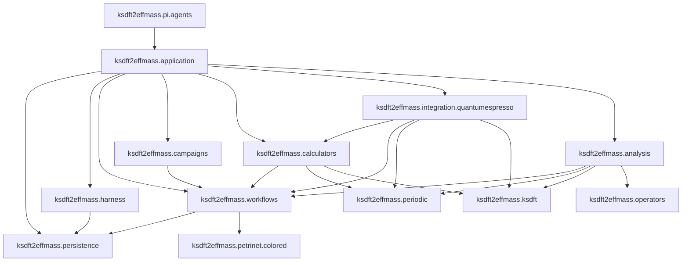

# Architecture v2

Architecture v2 is the normative target architecture for deterministic scientific operations and their supporting development lifecycle. Selected foundations are implemented incrementally while most aggregate and scientific-execution surfaces remain prospective. Architecture v1 remains the latest complete implemented architecture; the migration page alone owns exact cross-version status. Package-owned pages follow the [prospective `ksdft2effmass` namespace](ksdft2effmass/index.md); repository-wide contracts and live issues remain at this root.

## System overview

The reverse `petrinet.colored → workflows` dependency is forbidden.

## Components

| Component | Subpackage | Responsibility |
|---|---|---|
| Application composition | `ksdft2effmass.application` | Assembles explicit immutable definitions, Tasks, executors, analyzers, stores, repositories, and configuration |
| Shared revision persistence | `ksdft2effmass.persistence` | Owns opaque immutable revision storage and the standard-library SQLite realization, not domain repository meaning |
| Development harness | `ksdft2effmass.harness` | Governs software-development work independently of scientific Workflow state |
| Scientific workflow | `ksdft2effmass.workflows` | Owns ResultObject/Task/Workflow contracts, TaskStartGateSet, discriminated TaskActivation, adapter, replayable WorkflowRun, dispatch envelopes, result ingress, and control |
| Generic colored Petri net | `ksdft2effmass.petrinet.colored` | Owns generic colors, places, transitions, markings, deterministic selection, and pure firing |
| Project composition definitions | `ksdft2effmass.campaigns` | Supplies project-specific composition inputs without owning generic workflow semantics |
| Calculator contracts | `ksdft2effmass.calculators` | Owns project-facing SimulationTasks, Simulation composites, immutable exact inputs/outputs, executable configuration, process records, and consumer-owned executor protocols |
| Quantum ESPRESSO integration | `ksdft2effmass.integration.quantumespresso` | Currently owns loose grouped `pw.x` input representation/writing and QEXSD native parsing; prospective staging, process invocation, capture, discovery, failure mapping, and observation adaptation remain separate downstream responsibilities |
| Scientific observations | `ksdft2effmass.periodic`, `.ksdft` | Owns neutral geometry and Kohn–Sham observation invariants |
| Represented operators | `ksdft2effmass.operators` | Owns finite represented-operator records, serialization, exact compatibility, and narrowly fixed-representation operations |
| Scientific analysis | `ksdft2effmass.analysis` | Owns higher-level deterministic scientific algorithms, tolerances, numerical policy, and findings; consumes but does not redefine the represented-operator kernel |
| Pi agent adapter | `ksdft2effmass.pi.agents` | Owns outer typed request/result adaptation to explicitly composed application operations |

## Contract ownership

Each exact cross-cutting contract has one authoritative page. Package pages state
how they consume these contracts rather than redefining them.

| Contract | Authoritative page |
|---|---|
| Package ownership and dependency direction | [Repository layout](repository-layout.md) |
| Development/scientific lifecycle separation | [Separation of harness and workflow](separation-of-harness-and-workflow.md) |
| Human-decision records | [Human decisions](human-decisions.md) |
| Identity, version, and failure vocabulary | [Identity, version, and failure contracts](identity-version-and-failure-contracts.md) |
| Development validation result | [Development validation](ksdft2effmass/harness/validation.md) |
| Development projection publication | [Development projections](ksdft2effmass/harness/projections.md) |
| Shared revision storage | [Shared persistence](ksdft2effmass/persistence/index.md) |
| Scientific run aggregate | [WorkflowRun](ksdft2effmass/workflows/workflow-run.md) |
| Scientific analysis and conclusion boundary | [Scientific analysis](ksdft2effmass/analysis/analysis.md) |

The root identity/version/failure page defines shared semantics, not shared Python
ownership. Nominal runtime identities, closed results, failure codes, validators, and
serializers remain with their domain packages; v2 contains no universal contracts
package or identity/result/failure hierarchy.

## Architecture map

### Agent execution

- [Agent-system overview](agents/index.md)
- [Deterministic actions](agents/deterministic-actions.md)
- [Capability and isolation](agents/capability-and-isolation.md)
- [Agent-authored harness evolution](agents/self-improvement.md)
- [Prospective Pi package](ksdft2effmass/pi/index.md)
- [Prospective Pi agent adapter](ksdft2effmass/pi/agents/index.md)

### Development harness

- [Overview](ksdft2effmass/harness/index.md)
- [Object model](ksdft2effmass/harness/object-model.md)
- [Configuration](ksdft2effmass/harness/configuration.md)
- [Development Task model](ksdft2effmass/harness/development-harness.md)
- [Compiler architecture](ksdft2effmass/harness/compiler-architecture.md)
- [Normalized-state validation](ksdft2effmass/harness/validation.md)
- [Coding-standards conformance](ksdft2effmass/harness/conformance.md)
- [Control plane](ksdft2effmass/harness/control-plane.md)
- [Persistence](ksdft2effmass/harness/persistence.md)
- [Projections](ksdft2effmass/harness/projections.md)
- [Pi subagent boundary](ksdft2effmass/harness/subagents.md)

### Scientific workflow and generic semantics

- [Workflow overview](ksdft2effmass/workflows/index.md)
- [Task, Workflow, and colored-Petri-net adapter](ksdft2effmass/workflows/task-and-colored-petri-net-adapter.md)
- [Generic colored Petri net](ksdft2effmass/petrinet/colored/index.md)
- [WorkflowRun object model](ksdft2effmass/workflows/workflow-run.md)
- [Simulation Task model](ksdft2effmass/workflows/simulation-task-model.md)
- [Control plane](ksdft2effmass/workflows/control-plane.md)
- [Persistence](ksdft2effmass/workflows/persistence.md)
- [Artifact and provenance model](ksdft2effmass/workflows/artifact-and-provenance-model.md)
- [Read models](ksdft2effmass/workflows/read-models.md)

### Calculators, integration, observations, analysis, and composition

- [Prospective package map](ksdft2effmass/index.md)
- [Application composition root](ksdft2effmass/application/index.md)
- [Campaign definitions](ksdft2effmass/campaigns/index.md)
- [Calculator architecture](ksdft2effmass/calculators/index.md)
- [Quantum ESPRESSO calculator contract](ksdft2effmass/calculators/quantum-espresso.md)
- [Integration namespace](ksdft2effmass/integration/index.md)
- [Quantum ESPRESSO integration](ksdft2effmass/integration/quantumespresso/index.md)
- [Periodic observations](ksdft2effmass/periodic/index.md)
- [Kohn–Sham observations](ksdft2effmass/ksdft/index.md)
- [Represented operators](ksdft2effmass/operators/index.md)
- [Scientific analysis architecture](ksdft2effmass/analysis/index.md)
- [Scientific analysis](ksdft2effmass/analysis/analysis.md)
- [Repository layout and dependency direction](repository-layout.md)

### Shared contracts

- [Shared revision persistence](ksdft2effmass/persistence/index.md)
- [Human decisions](human-decisions.md)
- [Architecture principles](principles.md)
- [Identity, version, and failure contracts](identity-version-and-failure-contracts.md)
- [Separation of harness and workflow](separation-of-harness-and-workflow.md)

## Reading paths

### Governed agent execution

1. [Agent-system overview](agents/index.md)
2. [Deterministic actions](agents/deterministic-actions.md)
3. [Capability and isolation](agents/capability-and-isolation.md)
4. [Agent-authored harness evolution](agents/self-improvement.md)
5. [Pi agent adapter](ksdft2effmass/pi/agents/index.md)

### Whole system

1. [Architecture principles](principles.md)
2. [Repository layout](repository-layout.md)
3. [Shared revision persistence](ksdft2effmass/persistence/index.md)
4. [Separation of harness and workflow](separation-of-harness-and-workflow.md)
5. [Human decisions](human-decisions.md)
6. [Application composition root](ksdft2effmass/application/index.md)

### Scientific execution

1. [Workflow overview](ksdft2effmass/workflows/index.md)
2. [Generic colored Petri net](ksdft2effmass/petrinet/colored/index.md)
3. [Task and adapter model](ksdft2effmass/workflows/task-and-colored-petri-net-adapter.md)
4. [WorkflowRun object model](ksdft2effmass/workflows/workflow-run.md)
5. [Simulation Task model](ksdft2effmass/workflows/simulation-task-model.md)
6. [Quantum ESPRESSO](ksdft2effmass/calculators/quantum-espresso.md)
7. [Scientific analysis](ksdft2effmass/analysis/analysis.md)

## Related versioned documentation

- [Architecture v1](../v1/index.md) describes the implemented snapshot.
- [Migration from v1 to v2](../migration/v1-to-v2/index.md) owns cutover comparisons.
- [Architecture v2 live issue register](issues/index.md) records current material gaps.

## Status

Architecture v2 is partially implemented. Current implemented foundations include
selected `ksdft2effmass.harness` Task, selection, configuration,
`DevelopmentDecision`, optional signature-verification authority, and related strict
wire contracts; exact status and residual integration boundaries remain on the
migration pages. The selected governed-agent boundary and
`ksdft2effmass.pi.agents` package remain unimplemented and authorize no operator
launch, source creation, dynamic promotion, or dependency change. Human-reviewed scientific conclusions remain external research records;
v2 defines no
`ScientificDisposition` subsystem or workflow acceptance state. The live issue
register contains only material contradictions or missing contracts; deferred
implementation details remain on their owning pages.

This architecture grants no implementation, scientific or protected execution,
successor activation, publication, release, verification, validation, or human
acceptance. Subordinate pages rely on this status statement rather than repeating
it.
