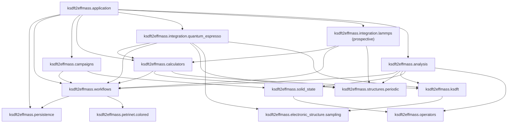

# Architecture v2

This is the current architecture for deterministic scientific operations. Selected foundations are implemented incrementally while some aggregate and scientific-execution surfaces remain prospective. Package-owned pages follow the [`ksdft2effmass` namespace](ksdft2effmass/index.md); repository-wide contracts and live issues remain at this root.

## System overview


```mermaid
flowchart TB
    application["ksdft2effmass.application"]
    persistence["ksdft2effmass.persistence"]
    workflows["ksdft2effmass.workflows"]
    petrinet["ksdft2effmass.petrinet.colored"]
    campaigns["ksdft2effmass.campaigns"]
    calculators["ksdft2effmass.calculators"]
    qe_integration["ksdft2effmass.integration.quantum_espresso"]
    lammps_integration["ksdft2effmass.integration.lammps<br/>(prospective)"]
    structures["ksdft2effmass.structures.periodic"]
    sampling["ksdft2effmass.electronic_structure.sampling"]
    ksdft["ksdft2effmass.ksdft"]
    operators["ksdft2effmass.operators"]
    solid_state["ksdft2effmass.solid_state"]
    analysis["ksdft2effmass.analysis"]

    application --> persistence
    application --> workflows
    workflows --> persistence
    application --> campaigns
    application --> calculators
    application --> qe_integration
    application --> lammps_integration
    application --> analysis
    campaigns --> workflows
    calculators --> workflows
    workflows --> petrinet
    qe_integration --> calculators
    qe_integration --> workflows
    qe_integration --> structures
    qe_integration --> sampling
    qe_integration --> ksdft
    lammps_integration --> calculators
    lammps_integration --> workflows
    lammps_integration --> structures
    calculators --> structures
    calculators --> ksdft
    analysis --> workflows
    analysis --> structures
    analysis --> ksdft
    ksdft --> sampling
    solid_state --> operators
    analysis --> solid_state
    analysis --> operators
    campaigns --> solid_state
```

The reverse `petrinet.colored → workflows` dependency is forbidden.

## Components

| Component | Subpackage | Responsibility |
|---|---|---|
| Application composition | `ksdft2effmass.application` | Assembles explicit immutable definitions, Tasks, executors, analyzers, stores, repositories, and configuration |
| Shared revision persistence | `ksdft2effmass.persistence` | Owns opaque immutable revision storage and the standard-library SQLite realization, not domain repository meaning |
| Scientific workflow | `ksdft2effmass.workflows` | Owns ResultObject/Task/Workflow contracts, TaskStartGateSet, discriminated TaskActivation, adapter, replayable WorkflowRun, dispatch envelopes, result ingress, and control |
| Generic colored Petri net | `ksdft2effmass.petrinet.colored` | Owns generic colors, places, transitions, markings, deterministic selection, and pure firing |
| Project composition definitions | `ksdft2effmass.campaigns` | Supplies project-specific composition inputs without owning generic workflow semantics |
| Calculator contracts | `ksdft2effmass.calculators` | Owns backend-neutral calculator vocabularies, including the `calculators.dft.pw` plane-wave specification, binding records, and structural port |
| Quantum ESPRESSO integration | `ksdft2effmass.integration.quantum_espresso` | Canonically owns QE-native input/output and executable contracts, grouped `pw.x` input writing, QEXSD parsing, diagnostics, and concrete anti-corruption actions |
| LAMMPS integration | `ksdft2effmass.integration.lammps` (prospective) | Owns LAMMPS-native contracts and adapters after calculator-independent QoI and atomistic requirements are defined; no LAMMPS Simulation Task is implemented |
| Structures and scientific observations | `ksdft2effmass.structures.periodic`, `.electronic_structure`, `.ksdft` | Owns neutral periodic geometry, electronic sampling, and Kohn–Sham observation invariants |
| Represented operators | `ksdft2effmass.operators` | Owns finite represented-operator records, serialization, exact compatibility, and narrowly fixed-representation operations |
| Solid-state lattice models | `ksdft2effmass.solid_state` | Owns dimension-specific direct, reciprocal, Bravais, finite-lattice, boundary-twist, scalar-hopping, localized-perturbation, and integral-operation composition contracts |
| Scientific analysis | `ksdft2effmass.analysis` | Owns higher-level deterministic scientific algorithms, tolerances, numerical policy, and findings; consumes but does not redefine the represented-operator kernel |

## Contract ownership

Each exact cross-cutting contract has one authoritative page. Package pages state
how they consume these contracts rather than redefining them.

| Contract | Authoritative page |
|---|---|
| Architecture page hierarchy and required mappings | [Architecture documentation standard](documentation/index.md) |
| Package ownership and dependency direction | [Repository layout](repository-layout.md) |
| Structure and molecular/periodic boundary | [Structures package decision](ksdft2effmass/structures-package-boundary-decision.md) |
| Cross-backend tutorial example layout and commit boundary | [Tutorial examples](tutorial-examples.md) |
| Identity, version, and failure vocabulary | [Identity, version, and failure contracts](identity-version-and-failure-contracts.md) |
| Scientific human-decision inputs | [Human decisions](human-decisions.md) |
| Shared revision storage | [Shared persistence](ksdft2effmass/persistence/index.md) |
| Scientific run aggregate | [WorkflowRun](ksdft2effmass/workflows/workflow-run.md) |
| Scientific analysis and conclusion boundary | [Scientific analysis](ksdft2effmass/analysis/analysis.md) |

The root identity/version/failure page defines shared semantics, not shared Python
ownership. Nominal runtime identities, closed results, failure codes, validators, and
serializers remain with their domain packages; v2 contains no universal contracts
package or identity/result/failure hierarchy.

## Architecture map

### Scientific workflow and generic semantics

- [Workflow overview](ksdft2effmass/workflows/index.md)
- [Task, Workflow, and colored-Petri-net adapter](ksdft2effmass/workflows/task-and-colored-petri-net-adapter.md)
- [Generic colored Petri net](ksdft2effmass/petrinet/colored/index.md)
- [WorkflowRun object model](ksdft2effmass/workflows/workflow-run.md)
- [Simulation Task model](ksdft2effmass/workflows/simulation-task-model.md)
- [DFT simulation CPN service decision](ksdft2effmass/workflows/dft-simulation-cpn-service-decision.md)
- [QE--Wannier90 CPN workflow](ksdft2effmass/workflows/qe-wannier90-cpn-workflow.md)
- [Control plane](ksdft2effmass/workflows/control-plane.md)
- [Persistence](ksdft2effmass/workflows/persistence.md)
- [Artifact and provenance model](ksdft2effmass/workflows/artifact-and-provenance-model.md)
- [Read models](ksdft2effmass/workflows/read-models.md)

### Calculators, integration, observations, analysis, and composition

- [Prospective package map](ksdft2effmass/index.md)
- [Application composition root](ksdft2effmass/application/index.md)
- [Campaign definitions](ksdft2effmass/campaigns/index.md)
- [Calculator architecture](ksdft2effmass/calculators/index.md)
- [Plane-wave QoIs and parameter studies](ksdft2effmass/plane-wave-parameter-studies.md)
- [QoI-first calculator integration and LAMMPS](ksdft2effmass/qoi-first-lammps-integration.md)
- [Quantum ESPRESSO integration contract](ksdft2effmass/calculators/quantum-espresso.md)
- [Quantum ESPRESSO diagnostic outcome and retry decision](ksdft2effmass/calculators/quantum-espresso-diagnostic-outcome-decision.md)
- [Quantum ESPRESSO local-execution implementation contract](ksdft2effmass/calculators/quantum-espresso-local-execution-contract.md)
- [Plane-wave DFT and QE package-ownership decision](ksdft2effmass/calculators/quantum-espresso-package-ownership-decision.md)
- [Integration namespace](ksdft2effmass/integration/index.md)
- [Quantum ESPRESSO integration](ksdft2effmass/integration/quantum_espresso/index.md)
- [Periodic observations](ksdft2effmass/periodic/index.md)
- [Kohn–Sham observations](ksdft2effmass/ksdft/index.md)
- [Represented operators](ksdft2effmass/operators/index.md)
- [Solid-state lattice models](ksdft2effmass/solid-state/index.md)
- [Scientific analysis architecture](ksdft2effmass/analysis/index.md)
- [Scientific analysis](ksdft2effmass/analysis/analysis.md)
- [Particle-in-a-box dimensional plan](ksdft2effmass/analysis/particle-in-box-dimensional-plan.md)
- [Repository layout and dependency direction](repository-layout.md)
- [Cross-backend tutorial examples](tutorial-examples.md)

```{toctree}
:hidden:

ksdft2effmass/qoi-first-lammps-integration
ksdft2effmass/analysis/particle-in-box-dimensional-plan
ksdft2effmass/finite-domain-solid-state-extraction-decision
ksdft2effmass/finite-domain-solid-state-extraction-inventory
ksdft2effmass/solid-state/index
ksdft2effmass/solid-state/initial-implementation-review
ksdft2effmass/structures-package-boundary-decision
ksdft2effmass/structures/index
ksdft2effmass/structures/periodic
ksdft2effmass/calculators/quantum-espresso-diagnostic-outcome-decision
ksdft2effmass/calculators/quantum-espresso-local-execution-contract
ksdft2effmass/calculators/quantum-espresso-package-ownership-decision
ksdft2effmass/calculators/quantum-espresso-task-contract-boundary-decision
documentation/index
```

### Shared contracts

- [Architecture documentation standard](documentation/index.md)
- [Shared revision persistence](ksdft2effmass/persistence/index.md)
- [Architecture principles](principles.md)
- [Identity, version, and failure contracts](identity-version-and-failure-contracts.md)
- [Human decisions](human-decisions.md)

## Reading paths

### Whole system

1. [Architecture principles](principles.md)
2. [Architecture documentation standard](documentation/index.md)
3. [Repository layout](repository-layout.md)
4. [Tutorial examples](tutorial-examples.md)
5. [Shared revision persistence](ksdft2effmass/persistence/index.md)
6. [Human decisions](human-decisions.md)
7. [Application composition root](ksdft2effmass/application/index.md)

### Scientific execution

1. [Workflow overview](ksdft2effmass/workflows/index.md)
2. [Generic colored Petri net](ksdft2effmass/petrinet/colored/index.md)
3. [Task and adapter model](ksdft2effmass/workflows/task-and-colored-petri-net-adapter.md)
4. [WorkflowRun object model](ksdft2effmass/workflows/workflow-run.md)
5. [Plane-wave QoIs and parameter studies](ksdft2effmass/plane-wave-parameter-studies.md)
6. [QoI-first calculator integration and LAMMPS](ksdft2effmass/qoi-first-lammps-integration.md)
7. [Simulation Task model](ksdft2effmass/workflows/simulation-task-model.md)
8. [DFT simulation CPN service decision](ksdft2effmass/workflows/dft-simulation-cpn-service-decision.md)
9. [QE--Wannier90 CPN workflow](ksdft2effmass/workflows/qe-wannier90-cpn-workflow.md)
10. [Quantum ESPRESSO](ksdft2effmass/calculators/quantum-espresso.md)
11. [Scientific analysis](ksdft2effmass/analysis/analysis.md)

## Related documentation

- [Live issue register](issues/index.md) records current material gaps.
- Superseded architecture and migration records remain available in Git history.

## Status

Architecture v2 is partially implemented. Exact status and residual integration
boundaries remain on the migration pages. Human-reviewed scientific conclusions remain external research records;
v2 defines no
`ScientificDisposition` subsystem or workflow acceptance state. The live issue
register contains only material contradictions or missing contracts; deferred
implementation details remain on their owning pages.

This architecture grants no implementation, scientific or protected execution,
successor activation, publication, release, verification, validation, or human
acceptance. Subordinate pages rely on this status statement rather than repeating
it.
