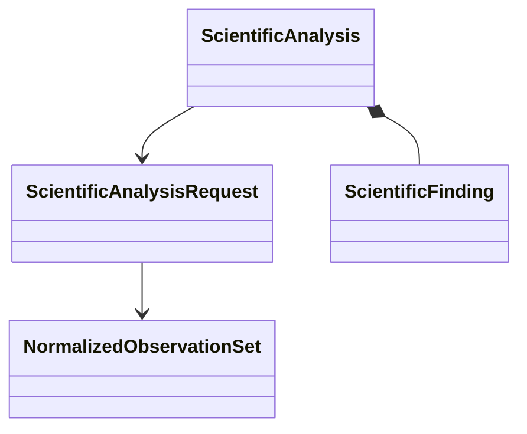

# Scientific analysis object model

## Objects

| Object | Responsibility |
|---|---|
| `ScientificAnalysisRequest` | Intended analysis, normalized input identities, analyzer identity, and explicit policy |
| `NormalizedObservationSet` | Calculator-independent observations with units, conventions, provenance, and availability |
| `ScientificFinding` | Structured derived value, status, uncertainty or limitation, and evidence references |
| `ScientificAnalysis` | Immutable analyzer result with inputs, algorithm, versions, units, tolerances, findings, and explicit claim boundary |
| QoI definition and requirement | Calculator-independent quantity meaning, required normalized observations, conventions, completeness, and evaluator identity |
| QoI value or failure | Typed evaluated quantity or represented unavailable, incomplete, incompatible, or evaluation-failure outcome |
| Parameter-study revision | Immutable study kind, fixed context, declared factors, candidates, QoIs, criteria, budget, and predecessor identity |
| Refinement result | Immutable completion, successor proposal, insufficient-information, unsupported, invalid, or error outcome |

The selected [plane-wave QoI and parameter-study architecture](../plane-wave-parameter-studies.md) assigns QoI meaning, parameter-study analysis, and refinement algorithms to this package. Project-specific campaign composition and calculator-native binding remain outside analysis.

## Analyzer protocol

Multiple analyzers are composed through a demonstrated structural protocol:

```python
class ScientificAnalyzer(Protocol):
    @property
    def analysis_identity(self) -> ScientificAnalyzerIdentity: ...

    def execute(
        self,
        request: ScientificAnalysisRequest,
    ) -> ScientificAnalysis: ...
```

The protocol supplies no discovery, mutable registry, default tolerance, automatic acceptance, scientific conclusion, or external execution.



An analyzer deterministically interprets explicit observations under explicit policy. Its result records derived values, statuses, uncertainty or limitations, and evidence references. It does not decide whether a result is scientifically acceptable for an intended use and does not create an approval, disposition, or authority record.

Human-reviewed scientific conclusions remain in applicable research records with their cited analysis identities, provenance, limitations, and evidentiary status. Architecture v2 introduces no `ScientificDisposition`, disposition recorder, disposition grant, conclusion vocabulary, supersession lifecycle, or workflow acceptance state. If a later concrete use case requires a structured scientific conclusion, that contract requires separate human authorization and must not infer acceptance from process success, terminal marking, or analyzer output.

Software verification of an analyzer does not establish numerical verification or scientific validation. Numerical verification, scientific validation, and uncertainty quantification remain explicitly classified in findings and evidence.

## Parameter-study refinement

`ParameterStudyRefiner` is the selected nominal abstract ActionObject for adaptive candidate algorithms. Concrete subclasses are explicitly constructed and injected; the abstract base performs no registration or discovery. Exact algorithm and immutable configuration identities are request/result provenance. Evolving algorithm state is immutable request/result state with explicit predecessor lineage rather than mutation of the refiner instance. A separate proposal validator independently establishes evaluation-prefix and predecessor-state closure, factor domain, fixed branch, budget, next-candidate order, correlation identities, and a distinct successor-state identity before a proposal may become a successor study revision.

Numerical convergence applies only within one fixed physical/model identity. SOC, spin treatment, exchange-correlation approximation, pseudopotential identity, and constrained magnetization changes produce model-sensitivity or physical-branch-comparison findings instead. An analyzer may recommend one tested candidate but cannot freeze a production parameter set or decide scientific acceptance.

## Deferred implementation details

- Stable public QoI value variants for each scientific domain.
- Representation of tolerance, convergence, and uncertainty policies beyond the first private probe.
- Stable analyzer identity and reproducibility requirements, and refinement-algorithm
  requirements beyond the private deterministic finite-sequence probe.
- Composition of multiple analyses with conflicting findings.
