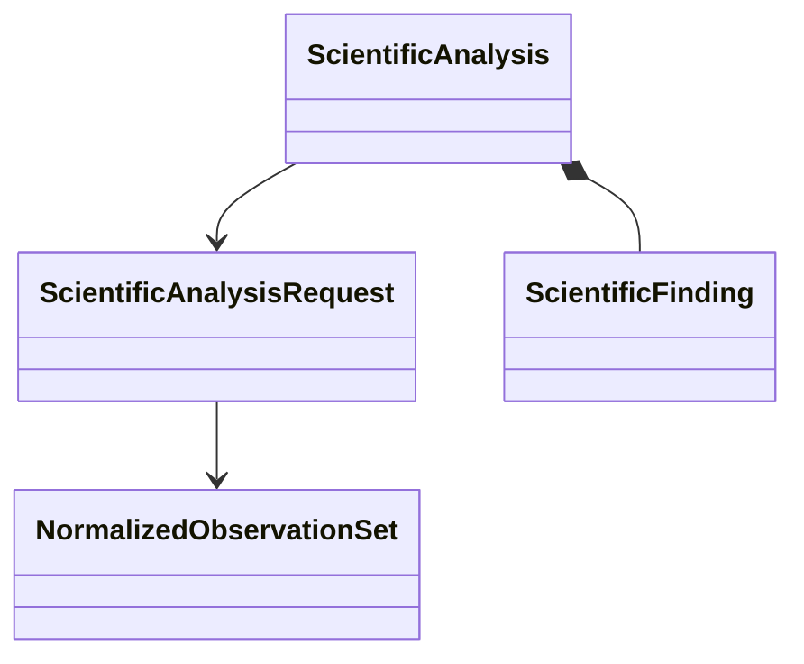

# Scientific analysis object model

## Objects

| Object | Responsibility |
|---|---|
| `ScientificAnalysisRequest` | Intended analysis, normalized input identities, analyzer identity, and explicit policy |
| `NormalizedObservationSet` | Calculator-independent observations with units, conventions, provenance, and availability |
| `ScientificFinding` | Structured derived value, status, uncertainty or limitation, and evidence references |
| `ScientificAnalysis` | Immutable analyzer result with inputs, algorithm, versions, units, tolerances, findings, and explicit claim boundary |

## Analyzer protocol

Multiple analyzers are composed through a demonstrated structural protocol:

```python
class ScientificAnalyzer(Protocol):
    @property
    def analysis_identity(self) -> ScientificAnalyzerIdentity: ...

    def execute(
        self,
        request: ScientificAnalysisRequest,
    ) -> ScientificAnalysis: ...
```

The protocol supplies no discovery, mutable registry, default tolerance, automatic acceptance, scientific conclusion, or external execution.



An analyzer deterministically interprets explicit observations under explicit policy. Its result records derived values, statuses, uncertainty or limitations, and evidence references. It does not decide whether a result is scientifically acceptable for an intended use and does not create an approval, disposition, or authority record.

Human-reviewed scientific conclusions remain in applicable research records with their cited analysis identities, provenance, limitations, and evidentiary status. Architecture v2 introduces no `ScientificDisposition`, disposition recorder, disposition grant, conclusion vocabulary, supersession lifecycle, or workflow acceptance state. If a later concrete use case requires a structured scientific conclusion, that contract requires separate human authorization and must not infer acceptance from process success, terminal marking, or analyzer output.

Software verification of an analyzer does not establish numerical verification or scientific validation. Numerical verification, scientific validation, and uncertainty quantification remain explicitly classified in findings and evidence.

## Unresolved issues

- Representation of tolerance, convergence, and uncertainty policies.
- Analyzer version identity and reproducibility requirements.
- Composition of multiple analyses with conflicting findings.
