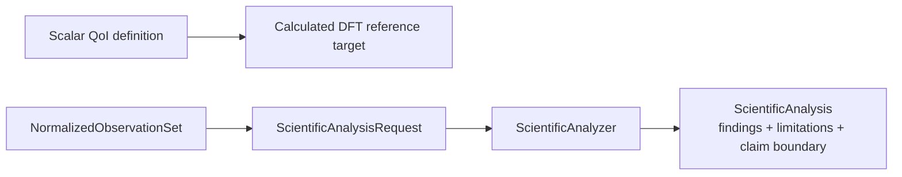

# `ksdft2effmass.analysis` package

## Responsibility

`ksdft2effmass.analysis` owns deterministic interpretation of normalized observations and controlled scientific model systems. It owns algorithms, units, tolerances, numerical policy, findings, analysis versions, and explicit claim boundaries. It does not execute calculators or decide scientific acceptance.

## Pages

- [Scientific analysis](analysis.md)
- [Particle-in-a-box dimensional plan](particle-in-box-dimensional-plan.md)

`NormalizedObservationSet` is calculator-independent and workflow-owned. Its implemented first contract retains exact immutable extracted Kohn–Sham ResultObjects through `NormalizedObservationSource`; it does not copy integration-owned identities or perform scientific normalization. Analysis implementations may import workflows, periodic, Kohn–Sham, and represented-operator contracts, but never calculator packages. The selected [plane-wave QoI and parameter-study architecture](../plane-wave-parameter-studies.md) assigns calculator-independent QoI meaning, study analysis, and nominal refinement-algorithm contracts to analysis. The [QoI-first LAMMPS direction](../qoi-first-lammps-integration.md) now exposes the initial public scalar definition, successful/failed evaluation ResultObjects, and calculated DFT reference-target records while leaving evaluator execution, comparisons, and LAMMPS contracts deferred; outward campaign composition may consume both analysis and calculator contracts without reversing this boundary. The retained `ksdft2effmass.operators` owner supplies records and narrowly fixed-representation operations; analysis owns alignment selection, model fitting, continuum reduction, structured learning, evidence-bearing findings, and other higher-level scientific policy without redefining that inward kernel. Human-reviewed conclusions remain in research records citing exact analysis identities and provenance; Architecture v2 defines no software disposition or acceptance subsystem.

## Public model systems

`ksdft2effmass.analysis.model_systems` owns public analyses for controlled quantum
model systems. The first supported domain represents one physical harmonic oscillator
through three immutable public mathematical software models:
`HarmonicOscillatorAnalytical`, `HarmonicOscillatorFiniteDifference`, and
`HarmonicOscillatorLadderOperators`. The analytical model owns exact energies and
Hermite states; the finite-difference model applies oscillator physics to a reusable
Dirichlet interval; and the ladder model owns retained creation, annihilation, number,
and Hamiltonian matrices with the finite highest-state commutator defect documented.
Reusable representation inputs remain independent of the oscillator:
`UniformCartesianGrid1D`, `UniformCartesianGrid2D`, and
`UniformCartesianGrid3D` own unit-aware uniform axes and fixed tensor-product ordering,
`DirichletBoundaryCondition` owns a prescribed boundary value, and
`DirichletInterval` composes those records without selecting a physical model or
Hamiltonian. Reusable represented operator construction belongs to
`ksdft2effmass.operators`: `LadderOperator1D` owns the
generic retained occupation-number algebra,
`SecondOrderCentralDifferenceLaplacian1D` owns the homogeneous-Dirichlet stencil,
`SchrodingerKineticEnergy1D` applies action and mass scaling,
`SampledPotential1D` correlates energy values to one exact interior grid, and
`FiniteDifferenceHamiltonian1D` composes compatible kinetic and potential matrices.
`HarmonicOscillatorFiniteDifference` consumes the generic interval,
finite-difference, kinetic, and sampled-potential components, while
`HarmonicOscillatorLadderOperators` composes the generic ladder basis and applies the
oscillator energy scale.
`HarmonicOscillatorComparator` owns sampling, Gram orthonormalization, pullback, and
diagnostic policy across the three oscillator models. Represented comparison state is
an immutable ResultObject. Public scalar, vector, and matrix values carry immutable
operator-owned quantity records; Pint owns parsing, dimensional compatibility, and
conversion. `Unitless` is a first-class unit, and the historical normalized study
uses an explicit `HarmonicOscillatorNondimensionalizer` rather than treating physical
quantities as intrinsically dimensionless. The model system is idealized but is not
described as a toy.

The initial public particle-in-a-box slice similarly separates
`ParticleInBoxAnalytical`, `ParticleInBoxFiniteDifference`, and the reusable
`DirichletInterval`. Its implemented campaign is one-dimensional. Orthogonal and
non-orthonormal 2D/3D coordinate and basis work remains proposed in the linked
[dimensional plan](particle-in-box-dimensional-plan.md), not implemented capability.

Exact research-monograph sweeps, retained wire formats, and source-identity conventions
remain in `ksdft2effmass.campaigns.research_monograph`; retained artifacts and thin CLI
adapters remain under `calculations/research-monograph/`. New model-system and
research-monograph implementation packages, modules, classes, and methods are public;
underscore-prefixed implementation names are prohibited except for Python-required
special methods. Numerical verification of a model system does not establish
semiconductor relevance or scientific validation.

## Public finite-domain channel results

`ksdft2effmass.analysis.finite_domains` owns immutable scalar ResultObjects for ordered
measure sequences, fixed-measure shape contrasts, separate same-parent orientation and
transformed-parent covariance outcomes, and twist-resolved boundary-phase summaries.
Each instance retains one identified metric and explicit unit. Boundary-phase records
retain below-edge counts and represent unavailable state-only values as `None` only
when the corresponding count is zero. The four channels cannot be pooled into one
convergence status. These records do not construct operators, enumerate campaign cases,
or authorize calculation execution.

`ksdft2effmass.analysis.finite_domain_locality` separately owns periodic minimum-image
Chebyshev partitions and nondensifying sparse locality residual analysis. The analyzer
requires exact represented compatibility and reports global maximum/Frobenius,
core-only, exterior-only, combined bidirectional coupling, and nonoverlapping row-shell
Frobenius values. This exact shell metric is not reused as hopping-support policy and
does not establish physical locality.

`ksdft2effmass.analysis.finite_domain_spectra` owns explicit host-edge and thresholded
below-edge classification for retained lowest complex-Hermitian eigenpairs with a
correlated passing algebraic-residual result. A count is
complete only when the selected window contains an unbound state or spans the complete
represented dimension; an all-bound truncated window remains explicitly incomplete.
Binding energies are host-edge referenced. The module does not solve eigensystems or
identify a host edge from defect data.

`ksdft2effmass.analysis.bound_subspaces` requires complete below-edge spectral coverage
before constructing the dense in-memory bound projector. Its normalized projector
diagonal defines a gauge-invariant equal-subspace-weight site distribution used for
core probability, inverse participation ratio, and unsigned minimum-image axis RMS
radii in lattice-coordinate index units. A complete empty selection retains unavailable metrics rather than zeros.
Signed centers and quadrupole conventions remain deferred because even-size
minimum-image ties require an explicit convention.

## Initial public QoI reference slice

`ScalarQuantityOfInterestDefinition` is the public calculator-independent scalar
contract. `ScalarQuantityOfInterestValue` and
`ScalarQuantityOfInterestEvaluationFailure` are disjoint successful and failed
ResultObjects correlated to one evaluator and normalized-observation-set identity.
`DftScalarQuantityOfInterestReferenceTarget` retains one successful calculated DFT
evaluation and its exact method, source result, provenance, artifact,
parent-model-assessment, and numerical-error-assessment identities. It is not a convergence, physical-truth,
validation, UQ, or acceptance claim. See the public
[QoI reference-target concept](../../../../concepts/qoi-reference-targets.rst).

## Initial private comparison slice

The human-selected [DFT simulation CPN service decision](../workflows/dft-simulation-cpn-service-decision.md)
introduces a private `_band_comparison` module. Its explicit specification owns
comparison-grid, pseudopotential-alignment, energy-alignment, units, and tolerance
policy. The comparator returns structured rejection when those prerequisites or
complete spectra are absent. The first stabilization probe also supplies two complete
aligned synthetic spectra whose four exact binary-fraction differences have a
hand-derived maximum of `0.25 Ha`; numerical verification checks that the comparator
returns that maximum and admits equality at the explicit `0.25 Ha` test tolerance.
This large tolerance and all alignment identities are synthetic test policy, not
physical evidence or production policy. The bounded private analysis-contract result
is human-accepted and administratively closed. The comparison surface is not exported
from the package root and makes no parent-model-equivalence or scientific-validation
claim.

## Deferred implementation details

- Additional public scientific-domain subdivisions beyond model systems and finite-domain channel results.
- Shared numerical-policy representation across analyzers.
- Whether analyzers operate on immutable in-memory records, artifact references, or both.
- Public registration and composition mechanism; mutable registries remain forbidden.
