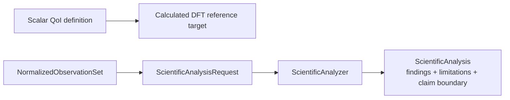

# `ksdft2effmass.analysis` package

## Responsibility

`ksdft2effmass.analysis` owns deterministic interpretation of normalized observations. It owns algorithms, units, tolerances, numerical policy, findings, analysis versions, and explicit claim boundaries. It does not execute calculators or decide scientific acceptance.

## Pages

- [Scientific analysis](analysis.md)

`NormalizedObservationSet` is calculator-independent and workflow-owned. Analysis implementations may import workflows, periodic, Kohn–Sham, and represented-operator contracts, but never calculator packages. The selected [plane-wave QoI and parameter-study architecture](../plane-wave-parameter-studies.md) assigns calculator-independent QoI meaning, study analysis, and nominal refinement-algorithm contracts to analysis. The [QoI-first LAMMPS direction](../qoi-first-lammps-integration.md) now exposes the initial public scalar definition, successful/failed evaluation ResultObjects, and calculated DFT reference-target records while leaving evaluator execution, comparisons, and LAMMPS contracts deferred; outward campaign composition may consume both analysis and calculator contracts without reversing this boundary. The retained `ksdft2effmass.operators` owner supplies records and narrowly fixed-representation operations; analysis owns alignment selection, model fitting, continuum reduction, structured learning, evidence-bearing findings, and other higher-level scientific policy without redefining that inward kernel. Human-reviewed conclusions remain in research records citing exact analysis identities and provenance; Architecture v2 defines no software disposition or acceptance subsystem.

## Initial public QoI reference slice

`ScalarQuantityOfInterestDefinition` is the public calculator-independent scalar
contract. `ScalarQuantityOfInterestValue` and
`ScalarQuantityOfInterestEvaluationFailure` are disjoint successful and failed
ResultObjects correlated to one evaluator and normalized-observation-set identity.
`DftScalarQuantityOfInterestReferenceTarget` retains one successful calculated DFT
evaluation and its exact method, source result, provenance, artifact,
parent-model-assessment, and numerical-error-assessment identities. It is not a convergence, physical-truth,
validation, UQ, or acceptance claim. See the public
[QoI reference-target concept](../../../../concepts/qoi-reference-targets.rst).

## Initial private comparison slice

The human-selected [DFT simulation CPN service decision](../workflows/dft-simulation-cpn-service-decision.md)
introduces a private `_band_comparison` module. Its explicit specification owns
comparison-grid, pseudopotential-alignment, energy-alignment, units, and tolerance
policy. The comparator returns structured rejection when those prerequisites or
complete spectra are absent. The first stabilization probe also supplies two complete
aligned synthetic spectra whose four exact binary-fraction differences have a
hand-derived maximum of `0.25 Ha`; numerical verification checks that the comparator
returns that maximum and admits equality at the explicit `0.25 Ha` test tolerance.
This large tolerance and all alignment identities are synthetic test policy, not
physical evidence or production policy. The bounded private analysis-contract result
is human-accepted and administratively closed. The comparison surface is not exported
from the package root and makes no parent-model-equivalence or scientific-validation
claim.

## Deferred implementation details

- Analysis package subdivision by scientific domain.
- Shared numerical-policy representation across analyzers.
- Whether analyzers operate on immutable in-memory records, artifact references, or both.
- Public registration and composition mechanism; mutable registries remain forbidden.
